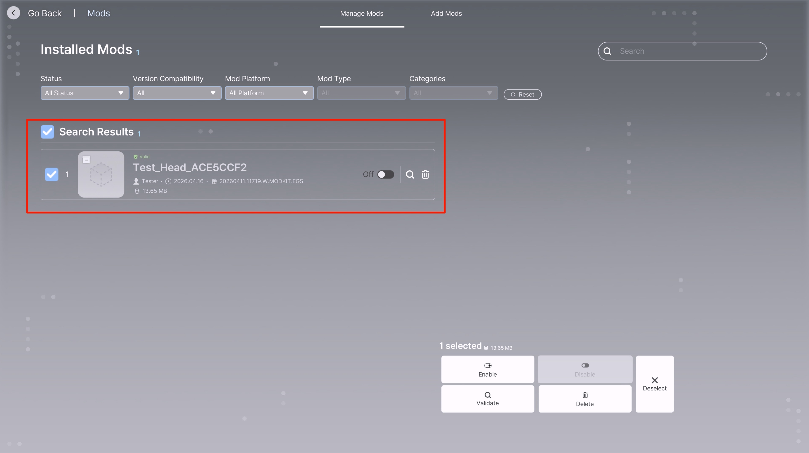
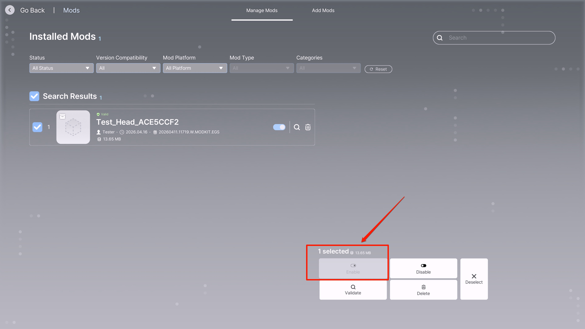

# Mod Management

A step-by-step guide to installing and managing mods in inZOI.

---

**1. Accessing the Mod Management Screen**

Click **Mod** under the **Creative Mode** section on the left side of the main screen to enter the mod management screen.

- Left menu on the main screen: located under `Continue` > `New Game` > `Creative Mode`
- Select **Mod** below **Architecture Studio** and **Character Studio**

---

**2. Viewing Installed Mods**

Once you enter the mod management screen, you can see the list of currently installed mods.

**Screen Layout**

| Area | Description |
|:-----|:------------|
| **My Mod Management / Add Mod** | Toggle between managing installed mods and adding new mods via the top tabs |
| **Filters** | Filter by activation status, version compatibility, mod platform, mod type, and category |
| **Search** | Search for mods by name using the search bar in the top right |
| **Search Results** | Displays the list of installed mods |

**Mod Information Fields**

Each mod card displays the following information:

| Field | Example | Description |
|:------|:--------|:------------|
| Mod Name | `Test_Head_ACE5CCF2` | Unique name of the mod |
| Author | `Tester` | Mod creator |
| Install Date | `2026.04.16` | Date the mod was installed |
| Build Version | `20260411.11719.W.MODKIT.EGS` | ModKit build version info |
| Size | `13.65 MB` | Mod file size |
| Status Badge | `Validation Required` / `Normal` | Current mod inspection status |
| Activation Toggle | Disabled / Enabled | Toggle mod application on/off |

!!! warning "Validation Required"
    When a mod is first installed or after a game update, the **Validation Required** status is displayed. The mod cannot be activated in this state and must undergo validation first.

---

**3. Activating and Managing Mods**

Select the checkbox on the left side of a mod card to reveal the management panel at the bottom.

**Management Panel Functions**

| Function | Description |
|:---------|:------------|
| **Activate** | Applies the selected mod to the game |
| **Deactivate** | Removes the selected mod from the game |
| **Validate** | Performs a compatibility check (inspection) on the mod |
| **Delete** | Completely removes the selected mod |
| **Cancel Selection** | Deselects the current selection |

!!! tip "Activate After Validation"
    Once validation is complete, the status badge changes to **Normal**, and you can turn on the activation toggle to apply the mod to the game.

!!! note "Bulk Management"
    Selecting checkboxes on multiple mods allows you to activate, deactivate, validate, or delete them all at once. The number of selected mods and total size are shown in the bottom panel.