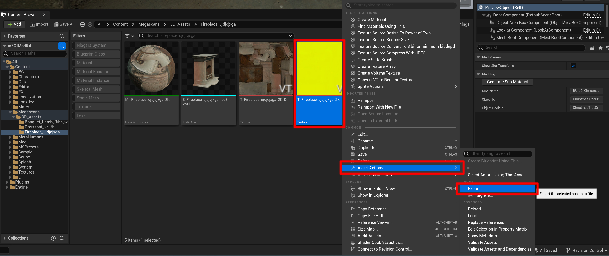

# Texture Channel Editing

Texture Channel Editing (or **Channel Packing**) is an advanced optimization technique that combines multiple grayscale textures into a single color image file (using the RGB channels).

!!! info "Why Edit Texture Channels?"
    A computer uses a similar amount of memory to process a single grayscale image as it does a single color image. Therefore, instead of using three separate grayscale textures like **Ambient Occlusion**, **Roughness**, and **Metallic**, combining them into the R, G, and B channels of a single color image can **reduce memory usage by approximately 1/3** and significantly improve performance.

---

## Channel Overview

Before you begin channel packing, it's important to understand what property of the material each grayscale texture controls.

!!! note "inZOI's Default Texture Channel Format (AOMRD)"
    inZOI basically uses an efficient format that combines four grayscale texture maps—**AO, Metallic, Roughness, and Displacement**—into a single `RGBA` image. The role of each channel is as follows:
    
    * **R Channel**: Ambient Occlusion
        - Adds depth and realism by creating soft shadows in crevices and corners. **White (1)** represents areas that receive light, while **black (0)** represents shadowed areas.
    * **G Channel**: Metallic
        - Determines if a surface is metallic or non-metallic. **White (1)** looks like a **pure metal**, while **black (0)** looks like a **non-metal** such as plastic or wood. Intermediate values are used only in special cases.
    * **B Channel**: Roughness
        - Controls how rough or smooth a surface is. Values closer to **white (1)** scatter light, making the surface look **rough (matte)**, while values closer to **black (0)** reflect light, making it look **smooth (glossy)**.
    * **Alpha Channel**: Displacement
        - Creates genuine three-dimensionality by actually pushing or pulling the model's surface using the texture's grayscale values. White (1) pushes the surface out the maximum amount, and black (0) results in no change.

!!! info "Need More Information?"
    For more in-depth technical information about each property, please refer to the official Unreal Engine documentation below.
    
    - [Unreal Engine: Physically Based Materials](https://dev.epicgames.com/documentation/en-us/unreal-engine/physically-based-materials-in-unreal-engine?application_version=5.4)

---

## Plugin

To handle the ModKit's textures (`.EXR`, `.DDS`, etc.) smoothly in Photoshop, you must install the following essential plugins beforehand.

!!! note "Prerequisites: Photoshop Plugin Installation"
    * **1. EXR-IO (EXR File Support)**
        * This plugin is required to open `.EXR` files exported from the Content Browser in Photoshop.
        * **Installation**: Go to the [EXR-IO Download Page](https://www.exr-io.com/) to download and install the plugin.

    * **2. NVIDIA Texture Tools Exporter (DDS File Support)**
        * This plugin is necessary for saving modified textures in the game-optimized `.DDS` format.
        * **Installation**: Go to the [NVIDIA Texture Tools Exporter Download Page](https://developer.nvidia.com/nvidia-texture-tools-exporter) to download and install the plugin.

---
## Practical Guide

Textures from assets received from Quixel Bridge may have a different channel configuration than the inZOI ModKit standard. This guide walks you through the entire process of reconfiguring a `_DpR` mixed map from Quixel Bridge into an `R=AO, G=Metallic, B=Roughness` channel map that conforms to the inZOI standard, using Photoshop.

---

### 1. Preparing 

Typically, files downloaded from Quixel Bridge that include `_DpR` in their name are **mixed maps** where multiple data types are combined into a single image.

!!! note "Quixel's Default Texture Channel Format (DpR)"
    This texture is usually composed as follows:

    * **R Channel**: Displacement
    * **G Channel**: Roughness
    * **B Channel**: Not used

{ width="1000" loading="lazy" }

!!! example "Example: Preparing a _DpR Texture for Editing"

    1.  Find the `_DpR` texture you need to work on (e.g., `T_Fireplace_..._DpR`) in the Content Browser.
    2.  Right-click on the texture and select **[Asset Actions] > [Export]** to save it to your computer as an `.EXR` file.

---

### 2. Channel Map

This process explains how to reconfigure a texture where the Roughness information is in the G channel (like a _DpR map from Quixel Bridge) into a channel map that conforms to the inZOI standard. The final goal is to create a texture in the **R=AO, G=Metallic, B=Roughness** format.

**Reference Video**

You can see the actual process in the video below:

  
  <video controls muted width="720" style="border-radius: 4px;">
    <source src="../../../media/mp4/TextureChange.mp4" type="video/mp4">
    Your browser does not support the video tag.
  </video>
  

!!! example "Example: Creating a Channel Map in Photoshop"
    1.  Open the **EXR texture prepared in Step 1** in Photoshop.
    2.  Create a new RGB color image and open the **[Channels]** panel.
    3.  Select the **Green** channel, select all (`Ctrl+A`), and then copy it to the **Blue** channel (`Ctrl+V`).
    4.  Go back to the **Green** channel and fill it with **Black**.
    5.  Click the top **RGB** channel again to activate all channels, and save the image in `PNG` or `TGA` format.

!!! info "Why Fill the Green Channel with Black?"
    In PBR rendering, the Metallic property is defined by a grayscale value where **black (0)** means **non-metal** (cloth, wood, plastic, etc.). Since this example is for creating a non-metallic material, the G channel (the Metallic channel) is filled with black. If you were making a metallic material, you would place a Metallic map in this channel.

---

### 3. Importing

Now it's time to import the channel-packed texture you completed in Photoshop into your ModKit project.

!!! tip "Import Methods"

    **Method 1: Using the Import Button**

    1.  Click the **[Import]** button at the top of the Content Browser.
    2.  When the file explorer opens, select the texture file and click **[Open]**.

    **Method 2: Using Drag and Drop**

    * Simply **drag and drop** the texture file from Windows Explorer into an empty space in the Content Browser for an automatic import.