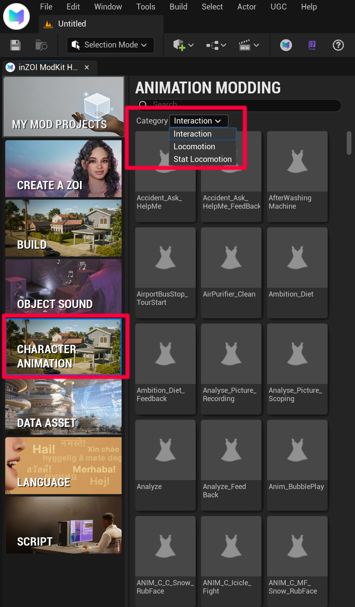

# Character Animation

This category is used to select the type of animation used in Animation Modding.

{ width="450" loading="lazy" }

---

**Interaction**

Defines **interaction-based animations** between characters or with objects.

- Primarily used for event-driven actions  
- Examples:
  - Dialogue
  - Gestures
  - Specific action triggers  
- Built using **Animation Montages**

---

**Locomotion**

Defines animations related to the character’s basic movement.

- Always used in the default state  
- Examples:
  - Idle
  - Walk
  - Run  
- Based on **Animation Sequences**

---

**Stat Locomotion**

Defines movement animations that change based on the character’s state (needs, condition, etc.).

- State-driven animations integrated with inZOI systems  
- Examples:
  - Tired → Slower movement  
  - Drunk → Unsteady movement  
  - Specific emotional state → Special idle  
- Based on **Animation Sequences**  
- Automatically applied depending on stat values

---

!!! tip
    The Animation Category defines the **purpose of an animation**.  
    Even the same animation can behave differently depending on which category it is assigned to.