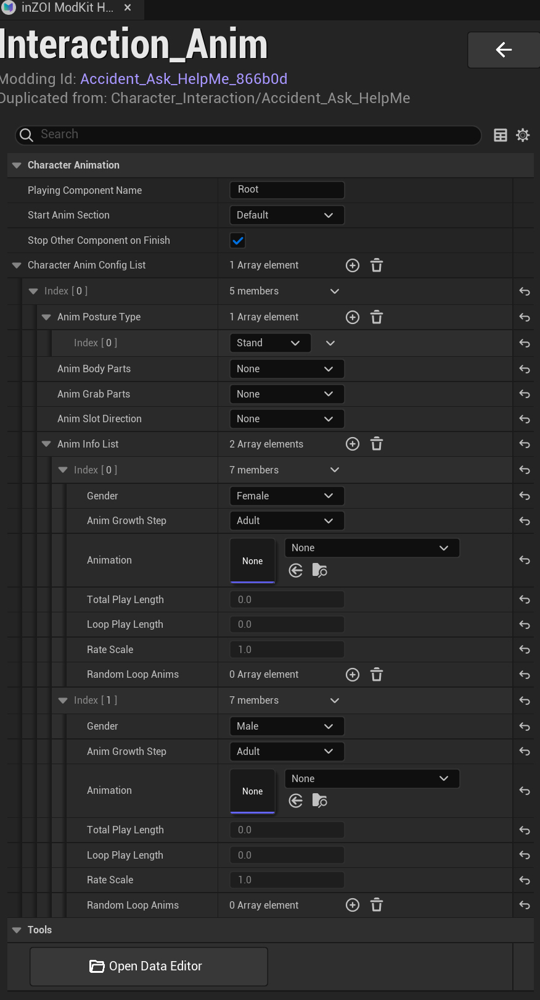

# Interaction

This section defines how **character interaction animations (Animation Montages)**  
are configured and executed in-game.

{ width="450" loading="lazy" }

---

**Character Animation**

- **Playing Component Name**
  - Specifies the component that will play the animation  
  - Default: `Root`

- **Start Anim Section**
  - Defines the starting section of the animation  
  - Default: `Default`

- **Stop Other Component on Finish**
  - Stops other animation components when this animation finishes

---

**Character Anim Config List**

This is the core configuration area that defines animation behavior.

Each element represents an animation setup based on specific conditions  
(e.g., posture, character state).

---

**Anim Posture Type**

- Defines the posture in which the animation will be executed  
- Example:
  - `Stand`

- **Anim Body Parts / Grab Parts / Slot Direction**
  - Optional interaction condition settings  
  - Set to `None` if not used

---

**Anim Info List**

Defines which animations to use based on character conditions such as  
gender and age.

---

**Parameter Description**

Each element includes the following settings:

- **Gender**
  - `Male` / `Female`

- **Anim Growth Step**
  - Growth stage such as `Adult`, `Child`

- **Animation**
  - The actual animation asset to be played

- **Total Play Length**
  - Total duration of the animation

- **Loop Play Length**
  - Loop duration (used for looping animations)

- **Rate Scale**
  - Playback speed multiplier  
  - Default: `1.0`

- **Random Loop Anims**
  - Optional random animation variations

---

**Multiple Configurations**

- Multiple conditions (e.g., Male / Female) can be configured simultaneously  
- The appropriate animation is automatically selected based on character conditions

---

**Tools**

- **Open Data Editor**
  - Opens the data editor for advanced configuration

---

!!! tip
    Make sure to configure all required conditions (e.g., Male / Female).  
    Missing settings may cause the animation to not play in-game.