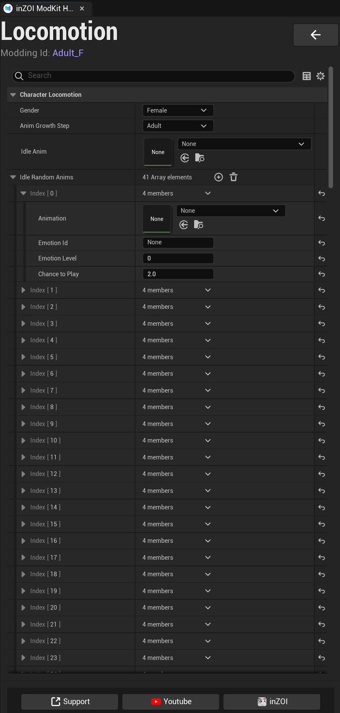

# Locomotion

This section defines the character’s **basic movement and idle animations**,  
using **Animation Sequences**.

{ width="450" loading="lazy" }

---

**Character Locomotion**

- **Gender**
  - Sets the character’s gender  
  - Example: `Female`, `Male`

- **Anim Growth Step**
  - Defines the character’s growth stage  
  - Example: `Adult`, `Child`

- **Idle Anim**
  - Assigns the default idle animation  
  - Played when the character is not performing any action

---

**Idle Random Anims**

A list of animations that will play randomly during the idle state.

- Multiple animations can be registered  
- Played randomly based on defined probabilities

---

**Index Parameters**

Each Index represents a single random animation setup:

- **Animation**
  - Specifies the animation asset to play

- **Emotion Id**
  - Optional emotional state  
  - Used to match animations with specific emotions

- **Emotion Level**
  - Defines the intensity of the emotion  
  - Default: `0`

- **Chance to Play**
  - Determines how often the animation is played  
  - Higher values increase the probability

---

**Multiple Animation Setup**

- You can add multiple Index entries to create a variety of idle animations  
- Helps achieve more natural character behavior

---

!!! tip
    Using multiple Idle Random Anims makes character behavior more natural.  
    Make sure to balance the **Chance to Play** values for proper distribution.