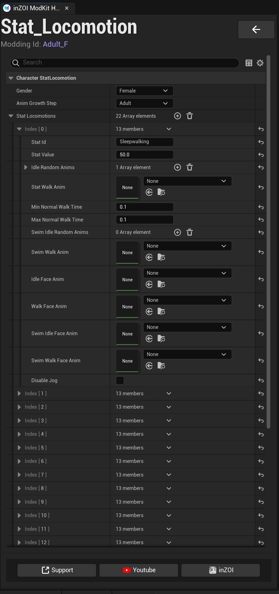

# Stat Locomotion

This system applies different movement animations based on the character’s **state (needs, condition, etc.)**,  
using **Animation Sequences**.

{ width="450" loading="lazy" }

---

**Character StatLocomotion**

- **Gender**
  - Sets the character’s gender  
  - Example: `Female`, `Male`

- **Anim Growth Step**
  - Defines the character’s growth stage  
  - Example: `Adult`, `Child`

---

**Stat Locomotions**

A list of movement configurations for each state.

- Multiple states can be added to create diverse behavior patterns

---

**Index (State Setup)**

Each Index represents a single state configuration.

---

**Basic Properties**

- **Stat Id**
  - Name of the state  
  - Example: `Sleepwalking`

- **Stat Value**
  - Threshold value for the state  
  - Determines when the state becomes active

---

**Movement Animations**

- **Stat Walk Anim**
  - Walking animation used in this state

- **Min Normal Walk Time / Max Normal Walk Time**
  - Duration range for normal walking animations

---

**Idle / Random Animations**

- **Idle Random Anims**
  - Idle animations played randomly in this state

---

**Swimming Animations**

- **Swim Idle Random Anims**
- **Swim Walk Anim**

→ Defines animations used during swimming

---

**Facial Animations (Face Anim)**

- **Idle Face Anim**
- **Walk Face Anim**
- **Swim Idle Face Anim**
- **Swim Walk Face Anim**

→ Defines facial expressions based on the current state

---

**Additional Options**

- **Disable Jog**
  - Disables jogging when enabled

---

**Multiple State Setup**

- Multiple Index entries can be added to define different states  
- Each state can have unique movement, facial expressions, and random animations

---

!!! tip
    Stat Locomotion allows you to create completely different movement behaviors based on character states.  
    (e.g., slow movement when tired, staggering when drunk, etc.)