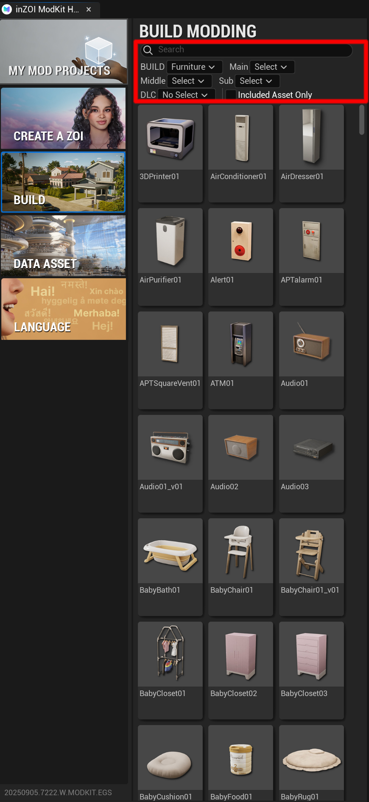

# Overview

**Build Modding** is a feature that allows you to create mods for object assets, including furniture, props, and construction materials. You can select the desired objects from the vast item library to create new mods.

{ width="450" loading="lazy" }

---

**Category Filters**

At the top of the screen, dropdown menus allow you to select item categories in detail.

* **BUILD: Furniture**: Selects the largest category (e.g., furniture, construction).  
* **Main Select / Middle Select / Sub Select**: Hierarchical filters organized into main, middle, and sub categories.  
* **Example**: By filtering in order such as **`Furniture`** > **`Beds`** > **`Children's Beds`**, you can narrow down to specific types of chairs.  

---

**Search and Additional Filters**

* **Search**: Search directly by typing the name of the item.  
* **Included Asset Only**: This option displays only assets that include models, textures, and thumbnails used in INZOI.  
* **DLC**: Filters assets based on the selected downloadable content pack.

---

**Asset Grid**

The filtered objects are displayed in a grid with thumbnail images. Here, you can visually check and select the items you want to turn into mods.

---

[Next ›](02steps.md){ .md-button .md-button--primary .next-btn }