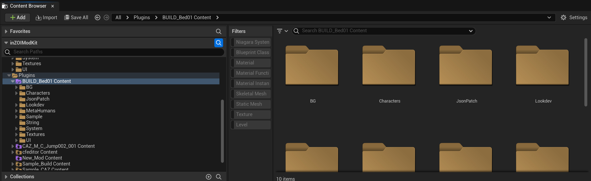
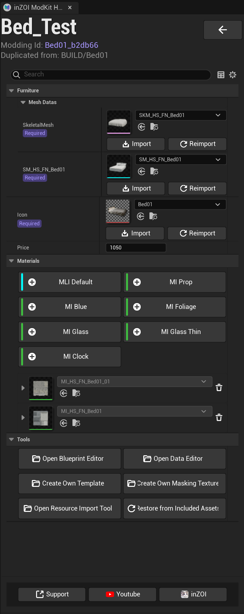

# Asset Editor

---
**Checking the Generated Files**

When you create a mod project, the ModKit generates the actual asset files for that mod inside the Unreal Engine's `Plugins` folder. You can see the generated file structure at the path `Content > Plugins > [Mod Name] Content` through the Content Browser as shown below.

{ width="450" loading="lazy" }

!!! info "Folder Purpose Guide"
    1.  When you create a mod, ModKit automatically creates several folders. Each folder has the role of storing a specific type of data, so it is important to organize files in the correct location.
    2.  Compatibility issues with existing mods can be resolved by referring to the Fix Up guide below.

    [Go to Fix Up Guide](../../utility/Fixup.md){ .md-button }

---

This is the main editor screen that appears when you open a specific project from 'MY MOD PROJECTS'. Here, you can manage 3D assets (meshes, materials) for object mods like furniture and props, and configure various properties that determine their in-game behavior.

{ width="450" loading="lazy" }

---

**Furniture**

All of the asset's properties are managed within the **Furniture** panel. This panel is composed of several sub-sections such as Mesh Datas, Price, Materials, and Tools.

[Go to Detailed Build Guide](../../project/Build/01.%20build.md){ .md-button }

---

### Mesh Datas

This is a required section for setting up the object's 3D model and icon. You can import or replace external files using the **[Import]** / **[Reimport]** button for each slot.

!!! info "Meshes Data"
    * **SkeletalMesh**: A 3D model with a skeleton, used for parts that need to move when interacting with a character (e.g., a blanket on a bed).
    * **Static Mesh**: A 3D model for fixed parts that do not move (e.g., a bed frame). The name of the slot may vary depending on the asset.
    * **Icon**: Specifies the icon image to be displayed in the UI, such as the build mode catalog.
    * **Price**: Sets the price of the item to be sold in the in-game build catalog.

---

### Materials

Defines the surface of the 3D model (color, texture, pattern, etc.).

* **Add Material Type**: You can add types of materials to apply to the object from a library by pressing the buttons at the top, such as `MLI Default`, `MI Prop`, `MI Glass`, etc.
* **Applied Materials List**: The list below shows the materials currently applied to the object, and you can edit or delete (trashcan icon) materials from this list.

[Go to Build Material Guide](../../project/Build/01.%20build.md#02-material){ .md-button }

---

### Tools

Launch various auxiliary tools and functions for mod creation.

* **Open Blueprint Editor**: Opens the Unreal Engine Blueprint Editor to directly modify complex interactions or logic for the object. (Advanced feature)
* **Open Data Editor**: Opens the text-based detailed data editor for modifying the item's name, description, etc.
* **Create Own Template**: Creates a reusable custom template based on the current asset settings.
* **Create Own Masking Texture**: Generates a masking texture used when the object overlaps with other objects or body parts.
* **Open Resource Import Tool**: Opens the tool for importing meshes and textures.
* **Restore from Included Asset**: Restores modified content back to the project's initial state at the time of creation.

    

      <video controls muted width="720" style="border-radius: 4px;">
        <source src="../../../media/mp4/Restore.mp4" type="video/mp4">
        Your browser does not support the video tag.
      </video>
    

---

[< Previous](02steps.md){ .md-button .md-button--primary .prev-btn }
[Next ›](04advanced.md){ .md-button .md-button--primary .next-btn }