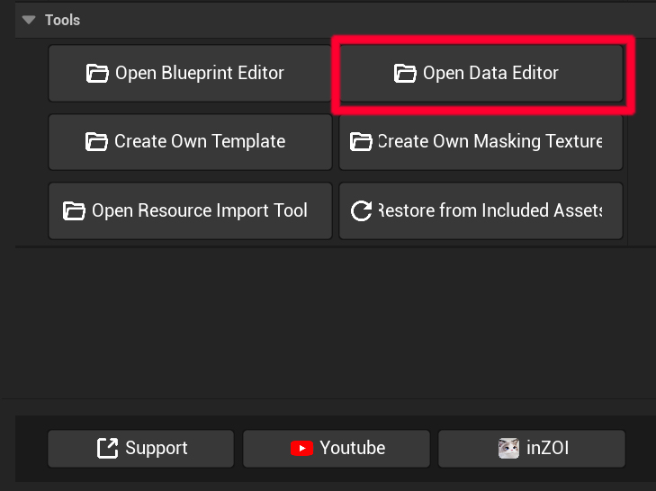
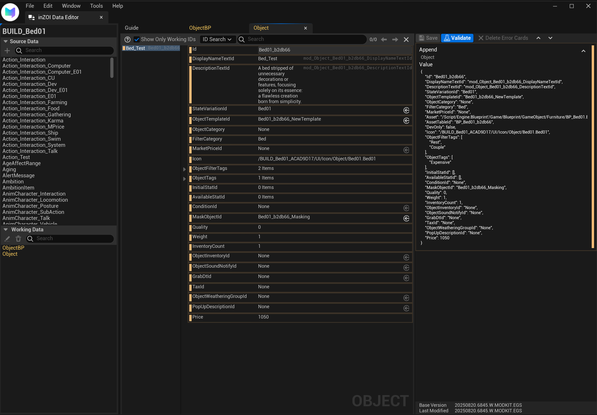
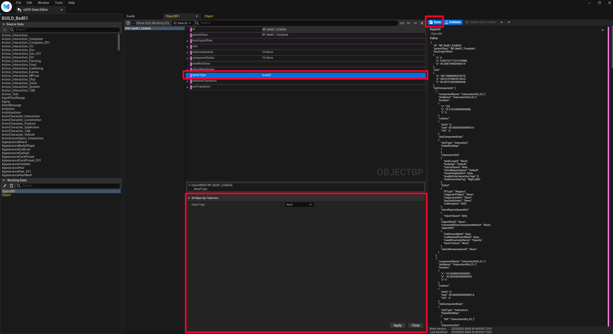

# Edit

Once the project has been created, it is time to directly edit the core data of the mod.  
This guide explains how to use the Data Editor to analyze and modify the asset data included in your mod.

---

## Launch Data Editor

First, select **[Open Data Editor]** for the mod project you created in the previous step.

{ width="450" loading="lazy" }

---

## ObjectBP

This guide covers how to edit the core data of an object, called **`ObjectBP`** (Object Blueprint), in the Data Editor.  
`ObjectBP` is like a "blueprint" that defines almost everything about an object—its name, price, category, and interactions.

{ width="1000" loading="lazy" }

* **Working Data (Left Panel)**  
  A list of data available for editing. When you select the core asset data **`ObjectBP`**, the details are shown in the middle and right panels.

!!! info "Source Data vs Working Data"
    * **Source Data**: The large library of original inZOI game data.  
    * **Working Data**: A copy of Source Data that you have pulled for editing.  

---

* **Properties Panel (Middle Panel)**  
  * The main editing space where all properties of `ObjectBP` are displayed for easy modification.  
  * **Key Properties**  
    * **ID**: Unique identifier of the data.  
    * **DisplayName / DescriptionTextId**: IDs for the object’s display name and description shown in-game. (Actual text is linked via String data.)  
    * **ObjectTemplateId**: Specifies which base template this object uses.  
    * **ObjectCategory / FilterCategory**: Defines the category under which the object is listed in the build catalog (e.g., `Bed`).  
    * **MarketPriced**: Determines if the item is tradable in the store (checked = tradable).  
    * **Icon**: Specifies the icon image displayed in the UI.  
    * **ObjectUseTags**: Tags that define conditions or types of interactions with the object.  
    * **Quality / Weight / InventoryCount**: Defines quality, weight, and inventory count of the object.  
    * **Price**: Base price of the object.  

* **Value Panel (Right Panel)**  
  * Shows how the changes you make in the middle panel are stored in the actual data file (JSON format).  
  * Mainly used by developers to check the data structure.  

* **Editing & Saving**  
  1. Select `ObjectBP` from the **Working Data** list.  
  2. Modify the desired property (e.g., `Price`) in the **Properties Panel**.  
  3. Click the **[Save]** button in the top right to save changes.  

---

## Modify Data

Now let’s change some values in practice. This section explains how to edit list-type data.

1. Click the data you want to edit in the **Working Data** list.  
2. In the **Details** panel on the right, click the property you want to edit (e.g., `detailType`).  
3. A **Detailed Edit Window** appears at the bottom of the screen.  
4. Modify the value or list in the detailed edit window, then click **[Apply]**.  
5. Once applied, the **[Save]** button at the top of the screen will be enabled.  
6. Click the enabled **[Save]** button to finalize your changes.  

{ width="1000" loading="lazy" }

---

[Watch on YouTube](https://youtu.be/eKVeRV9Zupg){ .md-button }

---

[‹ Previous](03guide.md){ .md-button .md-button--primary .prev-btn }
