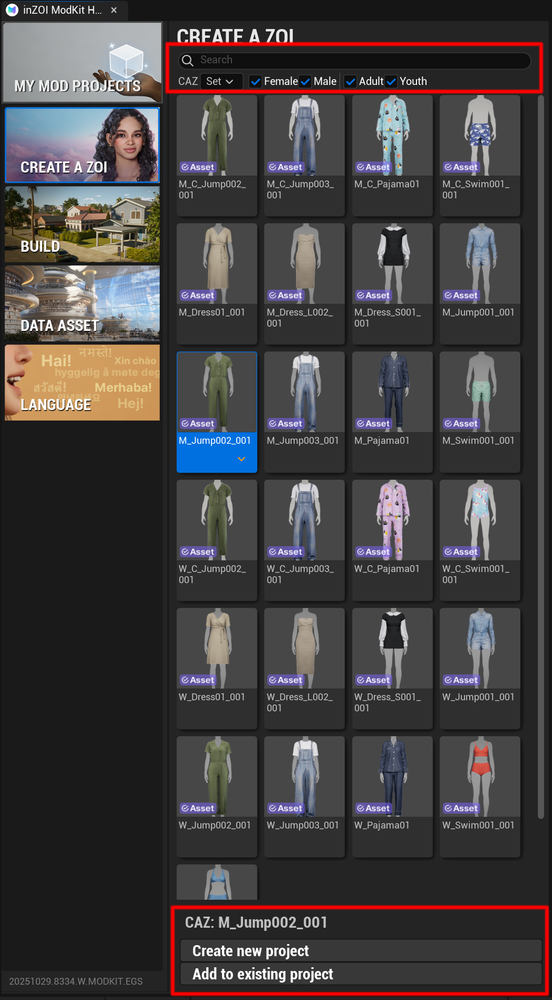

# Overview

CREATE A ZOI (CAZ) is one of the core features of the inZOI ModKit.  
It allows you to browse various character assets, select the ones you want, and either create a new mod or add them to an existing mod.

!!! tip "Basic Usage"
    1. Use the filters at the top (e.g., `Female`, `Adult`) to select the type of asset you want.  
    2. Click the orange downward arrow under a thumbnail to reveal the **[Create New Mod]** or **[Add to Existing Mod]** buttons, and proceed to the next step.

---

**Screen Layout**

The CAZ screen is divided into three main sections: search & filter, asset grid, and mod creation/addition features.

{ width="450" loading="lazy" }

---

**Search & Filter**

* **Search**: Search directly by typing the name of the asset.  
* **CAZ**: A filter that lets you group assets by specific sets.  
* **Filter**: Use checkboxes such as `Female`, `Male`, `Adult`, `Youth` to filter and view only the desired categories of assets.  

!!! tip "참고"
    * Create new project는 완전히 새로운 .pak 파일을 생성할 때 사용합니다.
    * Add to existing project는 이미 제작 중인 모드에 새로운 에셋을 덧붙이고 싶을 때 유용합니다.

---

[Next ›](02steps.md){ .md-button .md-button--primary .next-btn }