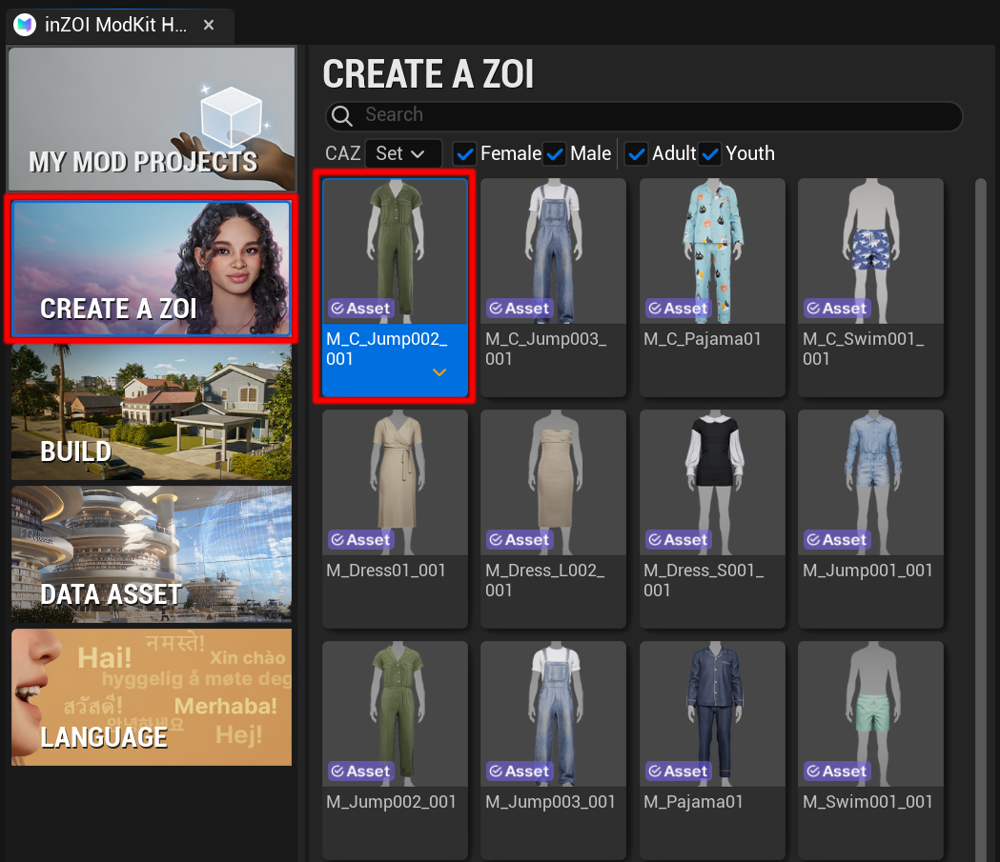
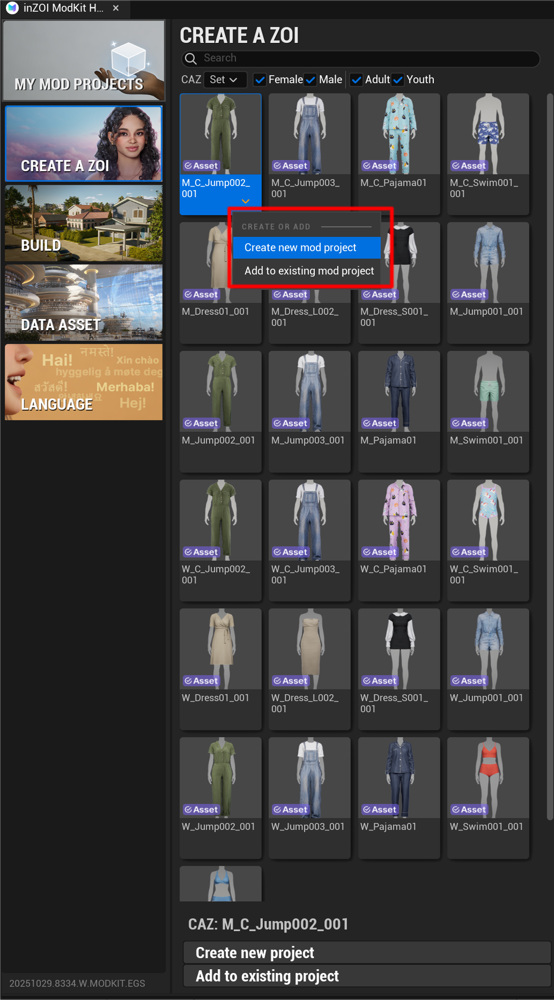
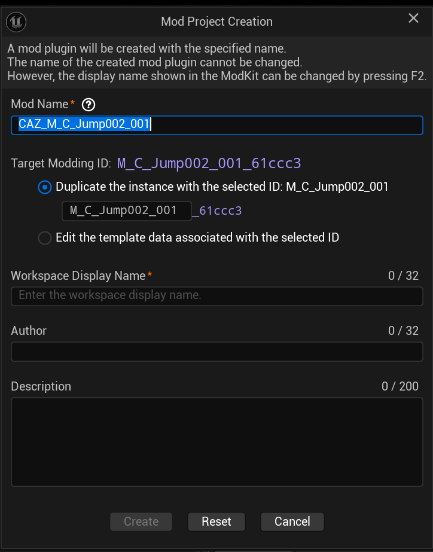

# Create

This guide walks you through the practical, step-by-step process of creating a new mod project by selecting an asset on the CREATE A ZOI (CAZ) screen.

---

## Select Asset

First, choose the asset you want to turn into a mod.

{ width="450" loading="lazy" }

* Go to the **[CREATE A ZOI]** menu.  
* In the asset grid, find and click the asset you want (e.g., clothing, hair). The selected asset will be highlighted with a border as shown.

!!! tip "Quick Asset Search"
    Use the filter checkboxes at the top—`Female`, `Male`, `Adult`, `Youth`—to quickly narrow down the type of asset you need.

---

## Mod Creation

After selecting an asset, a popup menu appears to let you decide what to do with it.

{ width="450" loading="lazy" }

* In the **[CREATE OR ADD]** menu, click **[Create new Project]** to start creating a new mod.

!!! info "Add to Existing Mod"
    If you want to add the selected asset to a mod you are already working on, choose **[Add to Existing Mod]** instead.

---

## Mod Information

Enter the detailed information required to create the mod.

{ width="450" loading="lazy" }

When the **[Mod Project Creation]** window appears, fill in the fields as described below.

* **Mod Name**: The unique ID (file name) for the mod. It is auto-generated from the selected asset and **cannot be changed later**.  
* **Duplicate/Edit Selection**:
    * `Duplicate the instance...`: **(Recommended)** Duplicates the source asset to create a brand-new item. Use this in most cases.  
    * `Edit the template data...`: Edits the source asset’s data directly. Use with caution as it may affect the entire game.  
* **Workspace Display Name**: The name shown within ModKit for your reference. You can edit it freely.  
* **Author**: Enter the creator’s name.  
* **Description**: Provide a short description of the mod (within 200 characters).  

---

## Creation

After entering all information, click **[Create]** at the bottom of the window.

Your new mod project is now created. You can find it under **[MY MOD PROJECTS]** on the left and begin editing.

---

[‹ Previous](01overview.md){ .md-button .md-button--primary .prev-btn }
[Next ›](03guide.md){ .md-button .md-button--primary .next-btn }
