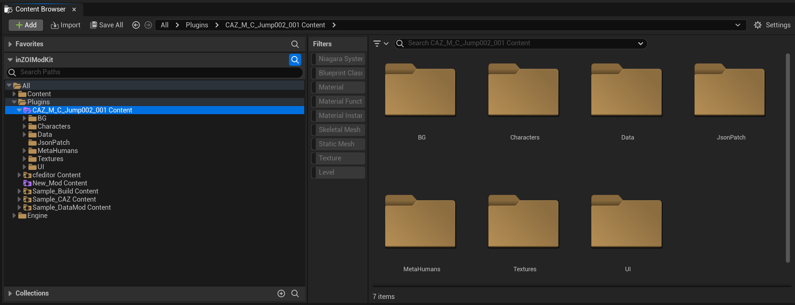
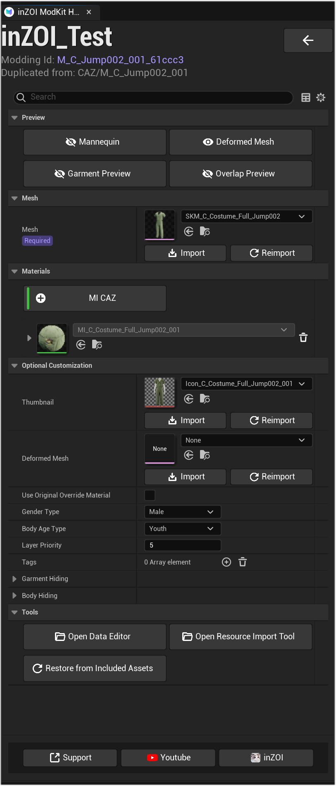
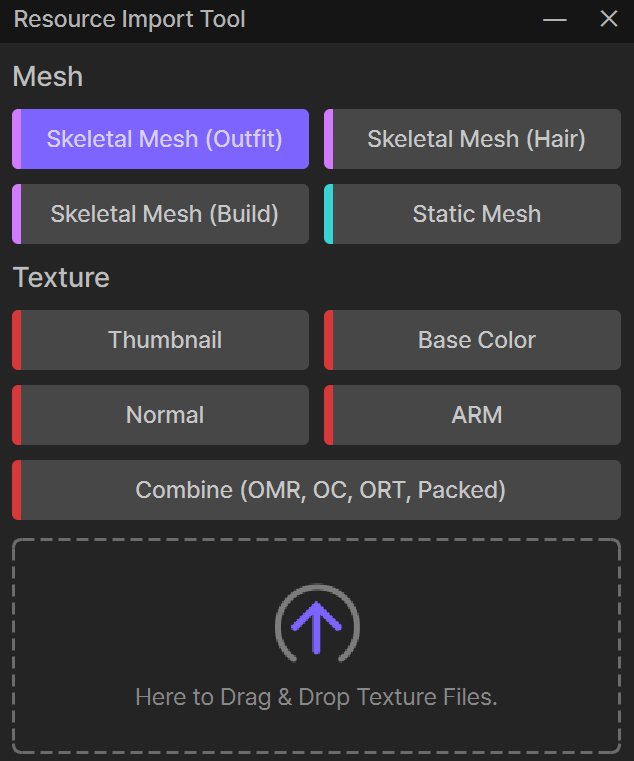

# Asset Editor

---

**Check Generated Files**

When you create a mod project, ModKit generates actual asset files for the mod inside the Unreal Engine `Plugins` folder.  
You can view the generated file structure in the Content Browser under `Content > Plugins > [Mod Name] Content`.

{ width="450" loading="lazy" }

!!! info "Folder Usage Guide"
    1. When a mod is created, ModKit automatically generates several folders. Each folder stores a specific type of data, so organizing files in the correct location is important.  
    2. If you encounter version compatibility issues with an existing mod, refer to the Fix Up guide below.  

    [Go to Fix Up Guide](../../utility/Fixup.md){ .md-button }

---

When you open a specific project from 'MY MOD PROJECTS', the main editor screen appears.  
Here, you can manage the mod’s 3D assets (meshes, materials) and configure various properties that determine how it behaves in-game.

{ width="450" loading="lazy" }

---

## Preview

Located at the top of the editor, this feature lets you preview the current asset from different angles.

[CAZ Detailed Guide](../../project/CAZ/Guide/01.%20Skeletal%20Mesh.md){ .md-button }

* **Mannequin**: Shows the outfit worn on a mannequin.  
* **Deformed Mesh**: Displays how the mesh (3D model) deforms with body shape or movement.  
* **Garment Preview**: Shows the clothing asset independently, without other elements.  
* **Overlap Preview**: Shows how the asset looks when layered with other clothing.  

---

## Mesh

This section defines the 3D model data that forms the backbone of the mod.  
As marked "Required," it is an essential component of the mod.

* **SKM\_... Dropdown**: Indicates the currently applied 3D mesh file.  
* **Import / Reimport**: Import new model files (e.g., `FBX`) created in external tools (Blender, 3ds Max, etc.), or replace an existing file with a new version.  

---

## Materials

Defines the "skin" of the mesh, including surface texture, color, and patterns.

* **MI CAZ**: Refers to the currently applied material.  
* **[+] Button**: Adds a new material so that different parts of the asset can use different textures.  
* **Trash Icon**: Deletes an applied material.  

---

## Optional Customization

This section lets you configure detailed properties of the mod to determine how it looks and behaves in-game.

* **Thumbnail**: The icon image shown in the in-game UI.  
* **Deformed Mesh**: Allows you to add a separate deformed mesh for special body shapes or poses.  
* **GenderType**: Defines which gender can use the item (e.g., `Male`, `Female`).  
* **BodyAgeType**: Defines which body type can use the item (e.g., `Adult`, `Child`).  
* **LayerPriority**: Determines which outfit is shown on top when layered. Higher numbers display on top (e.g., `Outer: 10`, `Top: 8`, `Bottom: 6`).  
* **Drawing Regions**: Specifies body regions (Region IDs) to be hidden (masked) for this outfit.  
* **Covering Regions**: Hides specific parts of lower-layer outfits when this outfit is worn over them.  
* **Body Regions**: Defines which body mesh parts are hidden when this outfit is worn.  
* **Tags**: Adds tags to control special behaviors. (e.g., Adding a `NoOuter` tag prevents another outer layer from being worn over this outfit.)  

---

## Tools

A collection of useful tools to assist with mod creation.

* **Open Data Editor**: Opens an editor to modify text-based data such as item name, description, and price.  
* **Restore from Included Assets**: Restores the asset to its original state when the project was created, if changes were made incorrectly.  
* **Open Resource Import Tool**: A specialized tool for converting and importing external 3D models (meshes) or images (textures) into a ModKit project. Clicking this button opens the Resource Import Tool window.  

{ width="450" loading="lazy" }

!!! info "Resource Import Tool Detailed Guide"
    * **Mesh Section**: For importing 3D model files.  
        * **Skeletal Mesh (Outfit/Hair/Build)**: Imports clothing, hair, or building models that deform with character movement.  
        * **Static Mesh**: Imports static, non-moving objects (e.g., props, furniture).  
    * **Texture Section**: For importing image files used as textures (surface details, colors, icons).  
        * **Thumbnail**: Icon image displayed in the UI.  
        * **Base Color**: Texture that defines the base color and pattern of the model.  
        * **Normal**: Texture that adds detail by simulating bumps and surface relief.  
        * **ARM**: An optimized texture that combines three properties into one image: Ambient Occlusion, Roughness, and Metallic.  
    * **Drag & Drop Area**: Select the type of resource you want to import by clicking its button, then drag and drop the actual file (`FBX`, `PNG`, etc.) into the dotted area to start the import.  

---

[‹ Previous](02steps.md){ .md-button .md-button--primary .prev-btn }
[Next ›](04advanced.md){ .md-button .md-button--primary .next-btn }