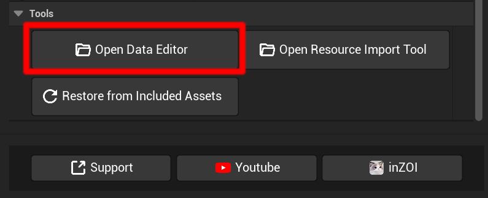
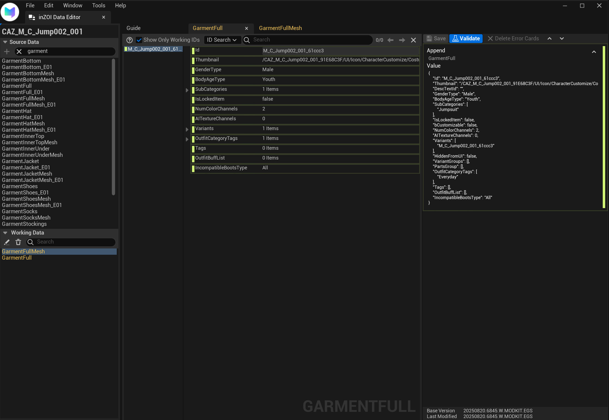
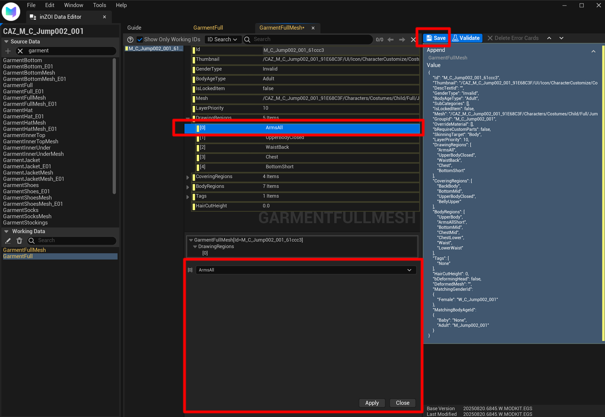

# Edit

Once the project has been created, it is time to directly edit the core data of the mod.  
This guide explains how to use the Data Editor to analyze the asset data included in the mod and modify it to the desired values.

---

## Launch Data Editor

First, select **[Open Data Editor]** from the mod project you created in the previous step.

{ width="450" loading="lazy" }

---

## Check Working Data

When the Data Editor opens, you can directly view and edit the detailed data of the mod assets.  
This is the "editing space," and the screen is divided into three panels.

{ width="1000" loading="lazy" }

* **Working Data (Left Panel)**  
    * A list of data currently available for editing.  
    * If you created a project using a CAZ asset (e.g., `M_C_Jump002_001`), the core data of that asset—**`GarmentFullMesh`** and **`GarmentFull`**—will be automatically registered here.  

* **Properties Panel (Middle Panel)**  
    * Displays the properties of the selected `Working Data` in an easy-to-read editing space.  
    * You can directly edit various property values such as `Thumbnail`, `GenderType`, `BodyAgeType`, and `Tags`.  

* **Value Panel (Right Panel)**  
    * Shows how the properties from the middle panel are stored in the actual data file, in their original JSON format.  
    * The values modified here are what ultimately apply to the mod.  

!!! info "Source Data vs Working Data"
    * **Source Data**: The large library of original inZOI game data.  
    * **Working Data**: A copy of Source Data that you have pulled for editing.  

---

## Modify Data

Now let’s actually change some values.  
This example shows how to edit list-type data.

1. Click the data you want to edit in the **Working Data** list.  
2. In the **Details** panel on the right, click the property you want to edit (e.g., `DrawingRegions`).  
3. A **Detailed Edit Window** will appear at the bottom of the screen.  
4. Modify the value or list in the detailed edit window, then click **[Apply]**.  
5. Once you click **[Apply]**, the **[Save]** button at the top of the screen will be enabled.  
6. Click the enabled **[Save]** button to finalize your changes.  

{ width="1000" loading="lazy" }

!!! tip "Editing Various Properties"
    Simple text or numeric values can be edited directly in the Details panel,  
    but more complex list or structured properties can be edited through the detailed edit window at the bottom.

---

[Watch on YouTube](https://youtu.be/qLuduFlNp-8){ .md-button }

---

[‹ Previous](03guide.md){ .md-button .md-button--primary .prev-btn }