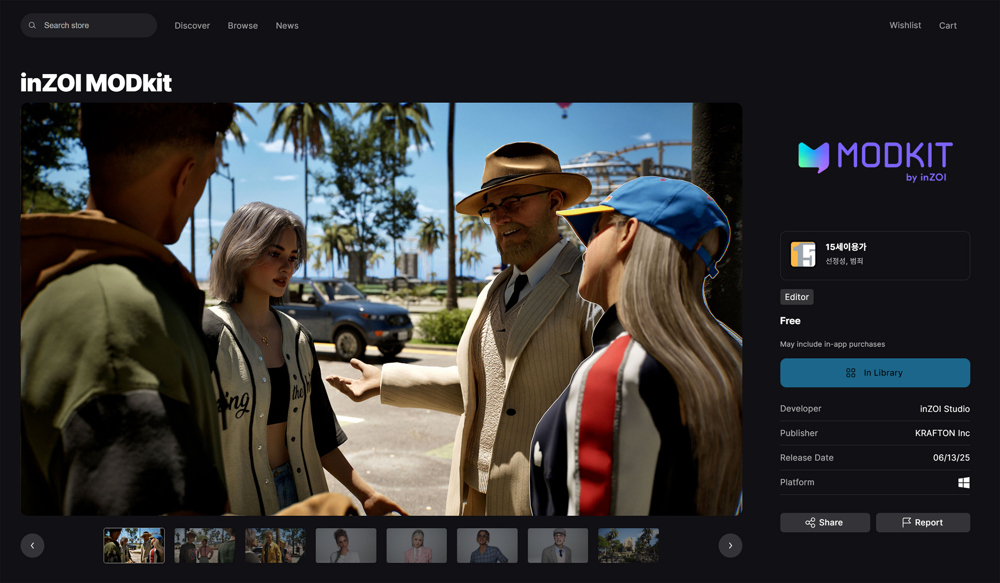
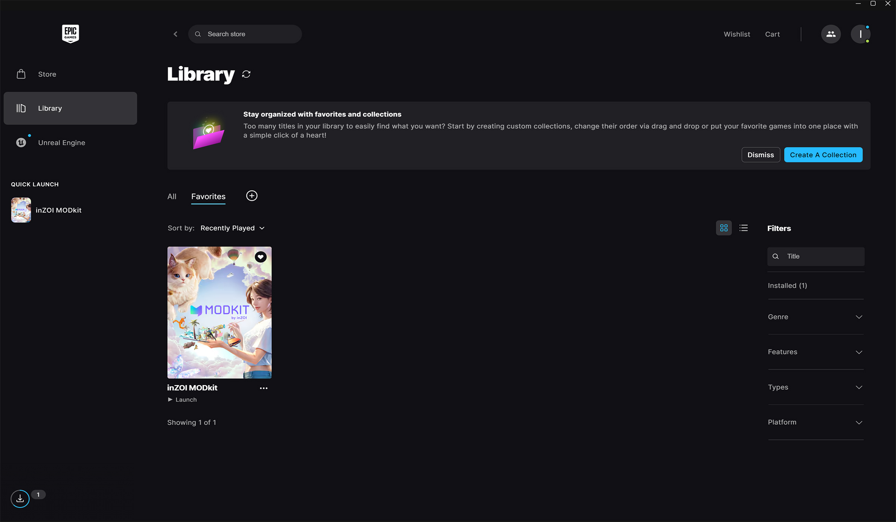

# Installation

The inZOI ModKit can be downloaded for free from the **Epic Games Store**.  
Before installing, make sure you are prepared with the following:

[Download inZOI ModKit](https://store.epicgames.com/en-US/p/inzoi-modkit){ .md-button }

!!! tip "Pre-Installation Checklist"
    - Check your operating system and available storage space  

---

## Epic Store

{ width=800 loading=lazy }

On the Epic Games Store, you can view the inZOI ModKit detail page.

- View the game description, screenshots, reviews, and developer information.  
- Click the **Library** button to add it to your library.  

??? info "When it doesn’t show up in your Library"
    - Log back in to confirm you’re using the correct account.  
    - If you added it via a browser, restart the **Epic Games Launcher** and check again.  

---

## Launcher

{ width=800 loading=lazy }

In the Epic Games Launcher, open your library to confirm that **inZOI ModKit** has been added.

- Use the **Quick Launch** menu on the left to start it quickly.  
- After installation, click the **Launch** button to start the ModKit.  

!!! warning "If it won’t launch"
    - Check whether security software is blocking it  

---

[Next >](02setup.md){ .md-button .md-button--primary .next-btn }