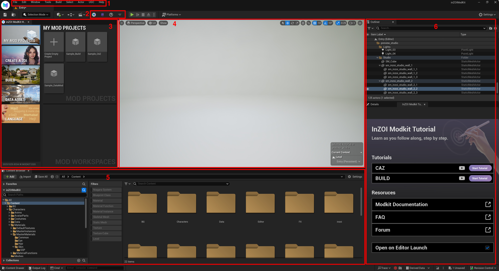

# Exploring the UI

Below is a guide that explains the main UI areas of the inZOI ModKit by number.

{ width=1000 }

---

### 1. Top Menu Bar
Provides access to project-wide functions and settings, such as saving/loading projects, changing preferences, building, and switching selection modes.

- **Menus** - File / Edit / Window / Tools / Build / Select / Actor / UGC / Help  

---

### 2. Toolbar Icons

The toolbar provides quick access to frequently used features. 

- **inZOI ModKit Home** - Opens the **ModKit Hub** inside the editor. This is the starting point for creators to manage mods, access tools, and easily explore modding features.  
- **ModKit Documentation in Browser** - Opens the official **inZOI ModKit documentation** in your default web browser. This includes detailed guides, reference materials, and examples for mod creators.  
- **Upload UGC to CurseForge** - Opens the upload interface to publish **User-Generated Content (UGC)** directly to CurseForge, making it easier to distribute your content to other players.  
- **Open Mod Tutorials Widget** - This button opens the InZOI Modkit tutorial panel. Click it to start step-by-step CAZ and BUILD tutorials that guide you through the process interactively.

---

### 3. My Mod Projects
Create a new project, view the list of existing projects, open example projects, or quickly access core creation features such as `Create a ZOI`, `Build`, or `Data Asset`.

---

### 4. Viewport
The workspace for scene editing and object placement.  
You can move the camera, change perspectives, select/move/rotate objects, and preview changes in real time.

---

### 5. Content Browser
Manages all resources included in the project (models, textures, sounds, data, etc.).  
Provides folder structure, file listings, filters, and search functionality. Resources can be dragged and dropped into the viewport.

!!! info "**How it works**"
    When a user creates a mod (such as CAZ, Build, or DataAsset), a dedicated content folder is automatically generated at the following path:  
    Inside this folder, you will find all the resources used for actual mod development:
    - Skeletal Meshes  
    - Static Meshes  
    - Textures  
    - Blueprints  
    - Data Assets (`.uasset`, `.json`)  
    - UI elements  

---

### 6. Outliner & Details
Lets you view the scene structure at a glance and edit property values in real time.

- **Outliner** - Displays all objects currently placed in the scene.  
- **Details** - Allows you to edit the properties of the selected object.  
- **InZOI Modkit Tutorial** - Learn as you follow along, step by step. 
---

!!! tip "UI Operation Tips (Unreal Editor Basics)"
    - **Viewport Navigation**: `RMB` + `W/A/S/D` to fly, `MMB` drag to pan, **wheel** to zoom. Hold `RMB` + scroll to adjust **camera speed**.  
    - **Orbit/Pan/Dolly**: `Alt` + `LMB` = Orbit, `Alt` + `MMB` = Pan, `Alt` + `RMB` = Dolly.  
    - **Select/Focus**: `LMB` to select, `F` to focus on the selected object.  
    - **Transform Tools**: `W` = Move, `E` = Rotate, `R` = Scale, `Space` = Cycle transform tools.  
    - **Find Asset**: `Ctrl` + `B` highlights the selected asset in the **Content Browser**.  

!!! note "Note"
    Key bindings can be changed in **Edit → Editor Preferences → Keyboard Shortcuts**.  
    inZOI ModKit follows the **default Unreal Editor shortcuts**, but some may vary depending on your environment.  

---

[‹ Previous](01install.md){ .md-button .md-button--primary .prev-btn }
[Next ›](03project.md){ .md-button .md-button--primary .next-btn }