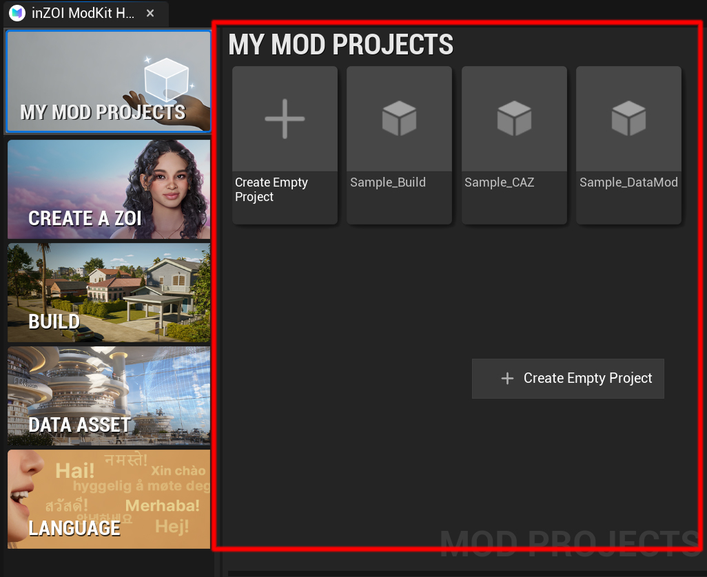
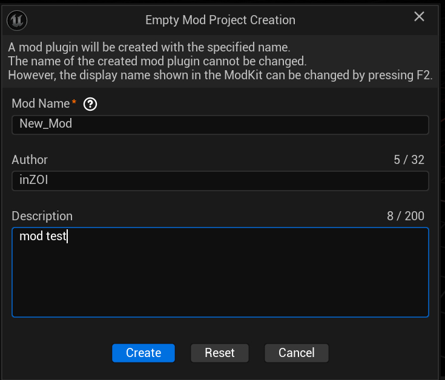
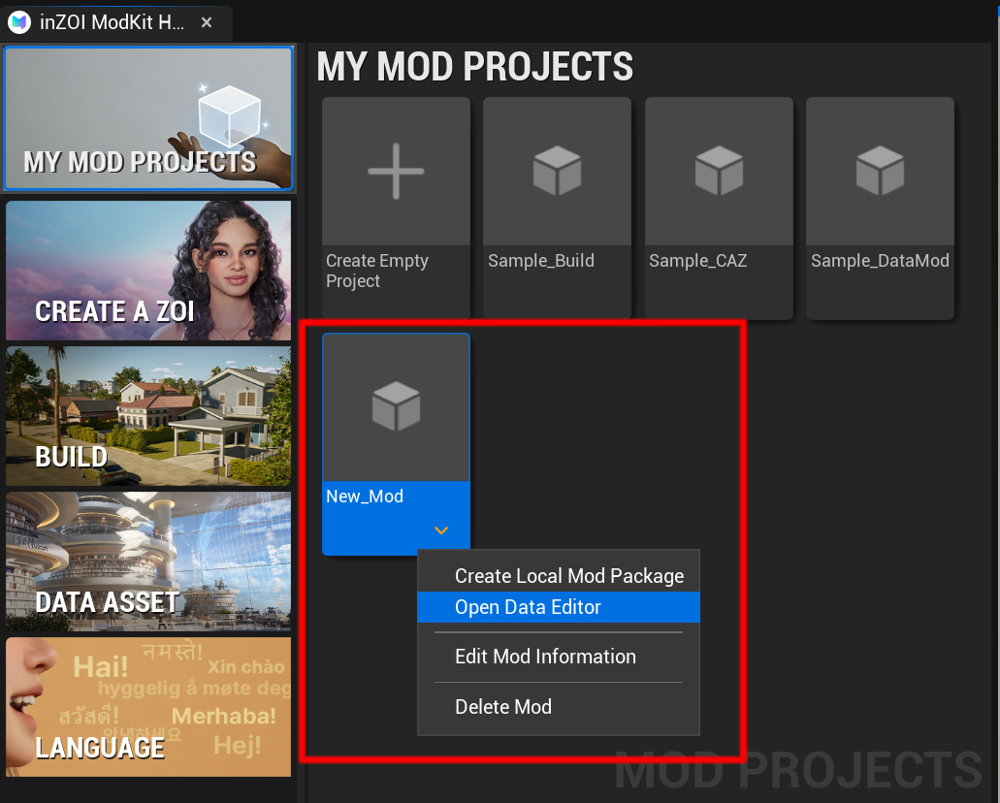
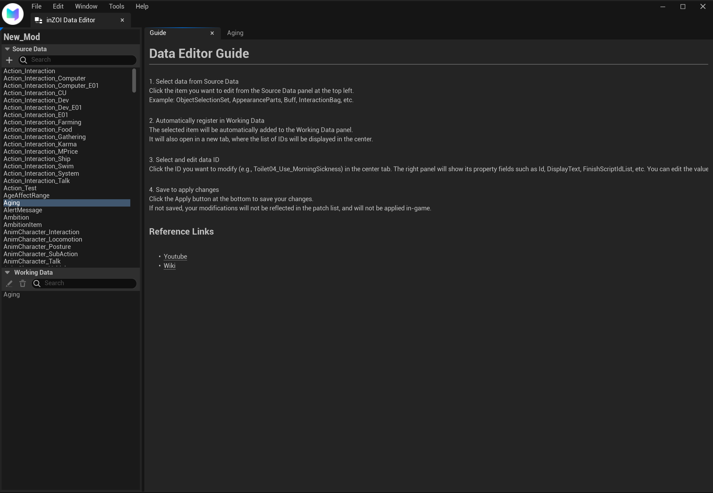

# Creating a Project

Once you’ve installed the inZOI ModKit and explored the basic UI, it’s time to create your first project.  
This guide walks you through creating a new empty project and opening the Data Editor.

---

## Step 1: Creating

First, create a new empty project.

{ width="400" loading="lazy" }

1. Right-click in the **My Mod Projects** area.  
2. From the menu, click `Create Empty Project`.

---

## Step 2: Project Information

Next, enter the basic information for the project, such as its name and author.

{ width="400" loading="lazy" }

1. Specify the **Project Name** and save path.  
2. Enter the **Author** (creator’s name) and **Description**.  
3. Once finished, click **[Create]** to generate the project.

---

## Step 3: Check

After creation, you can see the project in the My Mod Projects list.

{ width="400" loading="lazy" }

1. The created project appears under **My Mod Projects**.  
2. Right-click the project to access additional options such as **Open Data Editor, Edit Mod Information, Delete Mod**.

---

## Step 4: Open Data Editor

The Data Editor is the core tool in inZOI ModKit for loading, editing, and managing project data.

{ width="1000" loading="lazy" }

* **Source Data**  
  Contains data items used in inZOI.  
  * **Examples**: `ObjectSelectionSet`, `AppearanceParts`, `Buff`, `InteractionBag`  
  * Select items from here to load into **Working Data**.  

* **Working Data**  
  The editable data space where selected items from Source Data are automatically registered.  
  * When you click an item in Source Data, it is added to Working Data.  
  * Working Data can be freely edited.  
  * Modified values are applied in-game via **MY MOD PROJECTS**.  

* **Guide**  
  A help panel that provides instructions on how to use the Data Editor.  

---

## Step 5: Reference Links

For more details, check the links below:

[Go to Wiki](../../../Wiki/StructGuide/index.md){ .md-button }  [Watch on YouTube](https://www.youtube.com/watch?v=g2iaUMlrJtk){ .md-button }

---

[‹ Previous](02setup.md){ .md-button .md-button--primary .prev-btn }
[Next ›](04usingexternalassets.md){ .md-button .md-button--primary .next-btn }