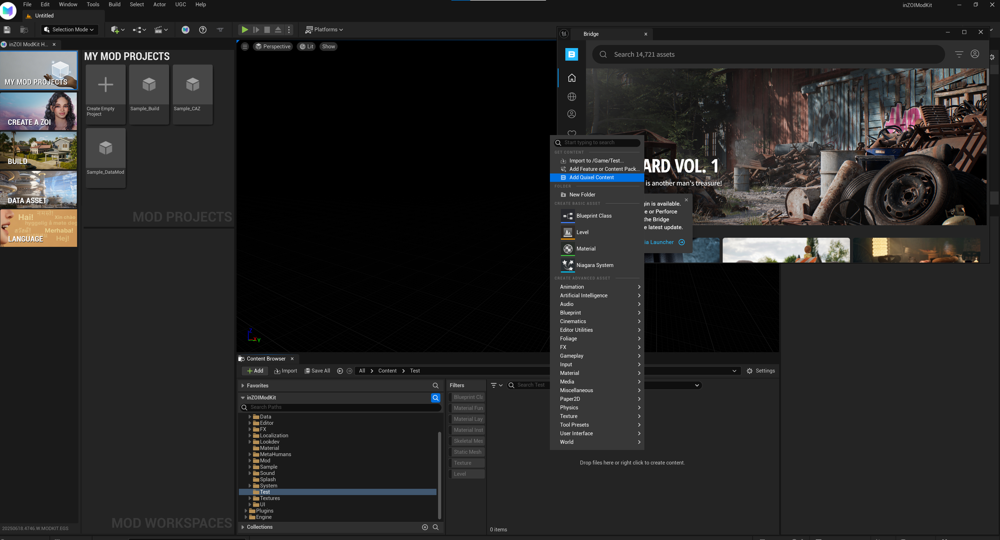
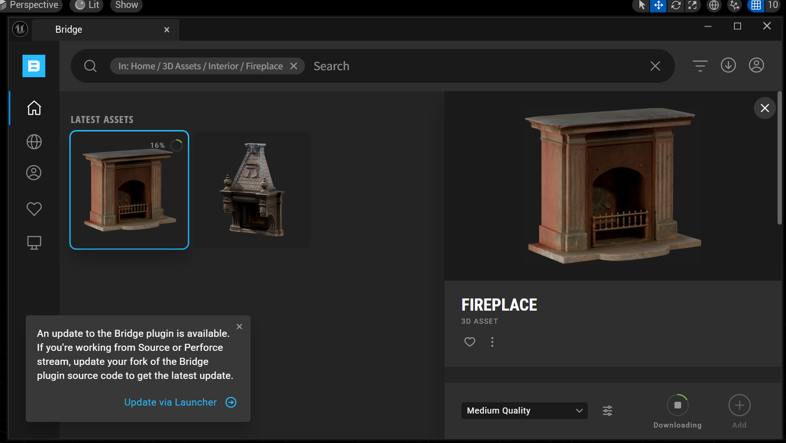
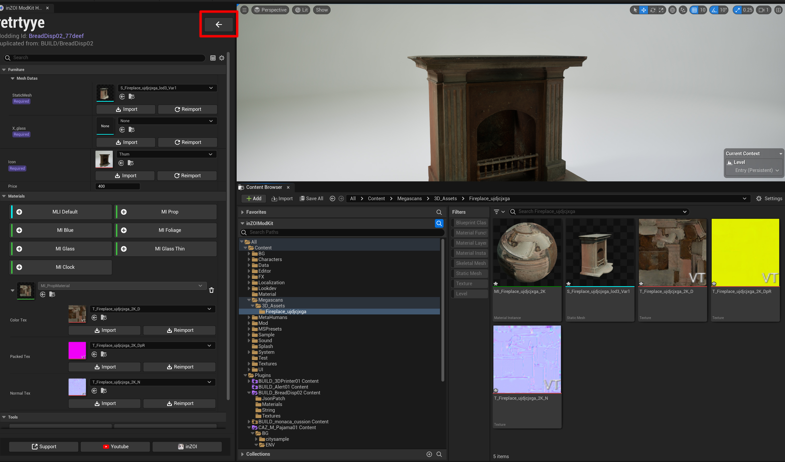
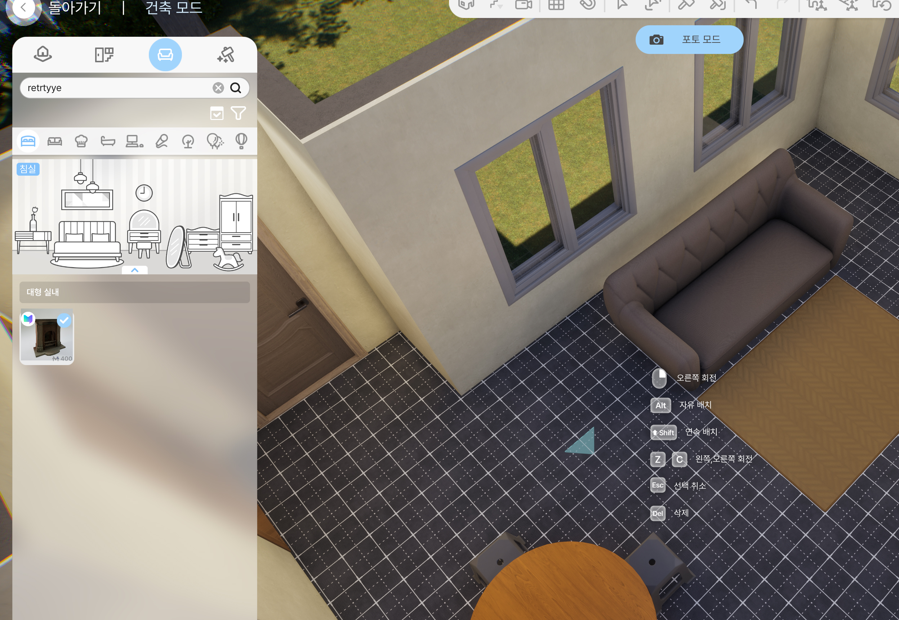

# Using External Assets

!!! warning
    The **Megascan** materials referenced in this document may be subject to copyright.  
    Any legal responsibilities arising from unauthorized distribution, commercial use, or secondary redistribution rest **solely with the user**.  
    Please ensure you review the relevant copyright and license terms before using such materials.  

    ⚠️ This document is provided **solely as an example for practice purposes**.  
    No example files are included, and only the documentation is provided. For any real project usage, you must carefully review and comply with official licenses and copyright requirements.

This guide covers the process of importing high-quality assets from external sources like Quixel Bridge for use in the inZOI ModKit.

---

## 1. Create Folder & Download Content

First, you need to create a new folder to hold the external assets and download the desired asset from Quixel Bridge.

{ width="1000" loading="lazy" }

1.  **Create Folder**: Create a new project or open an existing one in `My Mod Projects`. Right-click in the Content Browser to create a new folder for organizing external assets.
2.  **Launch Quixel Bridge**: Click the **[Content]** button at the top of the Content Browser to open **[Quixel Bridge]**.
3.  **Download Asset**: Find and download the desired asset (e.g., a fireplace) in Bridge.

---

## 2. Import Files

Bring the downloaded assets into the ModKit's Asset Editor to perform the basic setup.

{ width="1000" loading="lazy" }

1.  Click the **Add** button in Bridge to import the downloaded asset into the **Content Browser**.
2.  Double-click the imported asset to open the **Asset Editor**. Here, you can verify that the mesh and materials have been applied correctly and modify any necessary properties.

---

## 3. Texturing

Once the asset is set up, you must apply textures to the Static Mesh, Thumbnail, and Materials appropriately.

If the texture's channel values differ from the MI Prop standard, the channels must be changed. If they are the same as the standard, you can apply it in-game to finish.

!!!tip "Changing Texture Channels"

    For downloaded textures, the G channel of the mixed map is often set to the Roughness value. Therefore, you may need to change the channels to match the standard used by the MI Prop material: AOMRD (R: AO, G: Metallic, B: Roughness).
    
    [Change Texture Channels](../AdvancedGuides/texturechannel.md){ .md-button }

---

## 4. Packaging the Mod

Once all work is complete, click the back arrow at the top left of the editor to return to the main screen, then proceed with the packaging (build) steps below.

{ width="1000" loading="lazy" }

!!! info "Packaging"
    
    Use one of the following options to package your mod and make it available in the game or share it with others.

    [CurseForge](../../export/curseforge.md){ .md-button } [Local](../../export/local.md){ .md-button }

## 5. Organize Asset Files

!!! warning "Creating Folders and Moving Files"

    These folders are not generated automatically, so you must create them yourself and move the corresponding files. Since the material uses MI_Prop, the Materials folder is created automatically.

    * **`Images` folder**: Store 2D image files like **thumbnails** or icons that will be displayed in the UI.
    * **`Meshes` folder**: Store the mod's 3D model data, such as **Static Meshes** and **Skeletal Meshes** (`.fbx` files, etc.).
    * **`Textures` folder**: Store the **texture** files (`.png`, `.tga`, `.dds`, etc.) that are applied to the surface of the 3D models.

**Reference Video**

You can see the actual process in the video below:

  
  <video controls muted width="720" style="border-radius: 4px;">
    <source src="../../../media/mp4/Folder.mp4" type="video/mp4">
    Your browser does not support the video tag.
  </video>
  

!!! tip "Optimization"

    - It is recommended to enable the Nanite option by double-clicking the mesh file.
    - Smaller texture sizes and lower mesh triangle counts are better for optimization.

---

## 6. In-Game Confirmation

Finally, apply the packaged mod to the game and confirm that it works correctly.

{ width="1000" loading="lazy" }

1. Set the path to `This PC > Documents > inZOI > Mods`
2. Launch the game and open the **Build Mode** catalog to confirm that the added asset is displayed and can be placed properly.  

---

[< Previous](03project.md){ .md-button .md-button--primary .prev-btn }