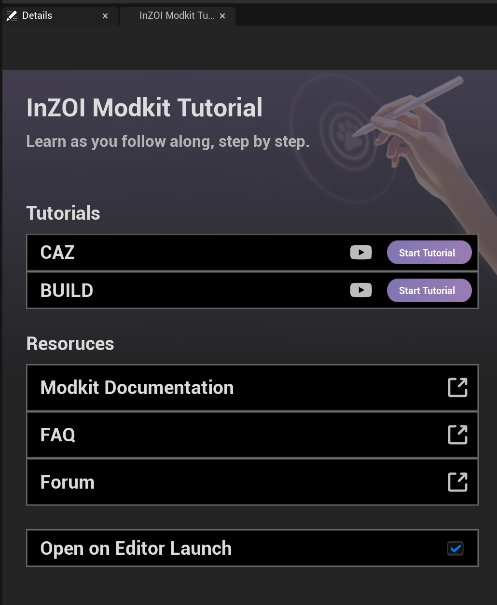

# Overview

This panel is a **step-by-step guide interface** designed for users who are new to **InZOI Modkit**.  
You can run tutorials directly within the tool to learn how to use **CAZ (Character Editor)** and **BUILD (Construction Mode)** features.

{ width="400" loading="lazy" }

---

**CAZ**
- A **customization-focused tutorial** for creating characters, outfits, and accessories.

**BUILD**
- A tutorial for learning how to **create and design architectural or environmental objects**.  

**Start Tutorial**
- When clicked, a **step-by-step interactive guide** appears, allowing users to follow along with on-screen prompts.

---

**Resources**
A collection of **official reference materials** available alongside the tutorials.

| Item | Description |
|------|--------------|
| **Modkit Documentation** | Official documentation page |
| **FAQ** | Frequently asked questions |
| **Forum** | User community |

> Click the 🔗 icon on the right side of each button to open the corresponding webpage.

---

**Open on Editor Launch**
- ✅ **Checked:** The tutorial panel will **automatically open** each time the editor launches.

---

!!! note "Note"
    This panel serves as the **central tutorial hub of InZOI Modkit**, providing a **beginner-friendly guide** through the **CAZ** and **BUILD** tutorials.  
    Users can efficiently learn how to use Modkit through interactive tutorials and official reference resources.
