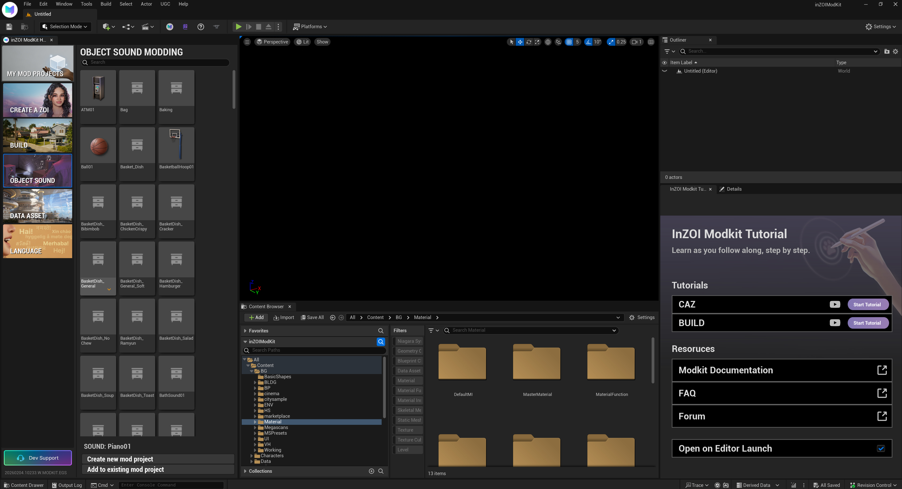
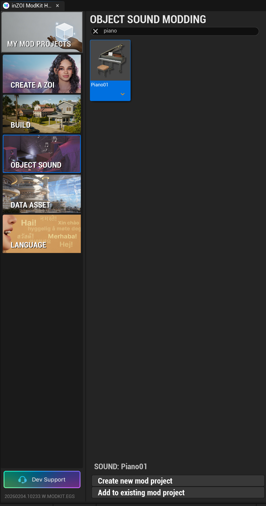
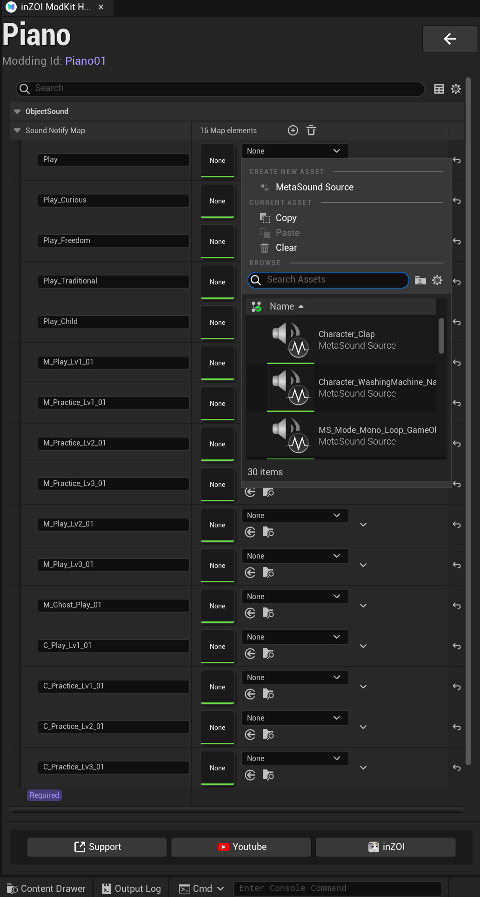

# Overview

This panel is an **interface for Object Sound modding**.  
Users can **assign sounds for different interaction states** of a specific object (e.g., a piano).

This screen is designed to allow users to **step-by-step configure how sound resources are linked to object behaviors**.

{ width="1000" loading="lazy" }

---

**OBJECT SOUND**
- A **sound modding category defined per object**.
- Allows configuration of sounds for **interactive objects** such as furniture, instruments, and daily-life objects.

**Search**
- Quickly find a specific sound modding target (e.g., `Piano01`) by entering the object name.

---

**Piano (e.g., Piano01)**

For the selected object, you can configure a **Sound Notify Map**.  
Each entry represents a **sound slot mapped to a specific interaction or state**.

{ width="500" loading="lazy" }

---

**Sound Asset Assignment**

By clicking each sound slot, you can select a **MetaSound Source asset** to be used.

[MetaSounds Documentation (Unreal Engine 5.4)](https://dev.epicgames.com/documentation/en-us/unreal-engine/metasounds-the-next-generation-sound-sources-in-unreal-engine?application_version=5.4){ .md-button }

{ width="500" loading="lazy" }

**Sound Notify Map**
- A list of **sound events defined per object action**.
- Examples include:
  - `Play`
  - `Play_Curious`
  - `Play_Freedom`
  - `Play_Traditional`
  - `Play_Child`
  - Practice stages (`Practice Lv1–3`)
  - Performance stages (`Play Lv1–3`), etc.

Each slot can be assigned a **MetaSound Source**.

---

!!! note "Note"
    Object sound modding is **closely integrated with animations, interaction states, and progression levels**.  
    By assigning appropriate MetaSound Sources to each sound slot, you can achieve **natural, progressive, and context-aware sound playback** in-game based on the object’s behavior.