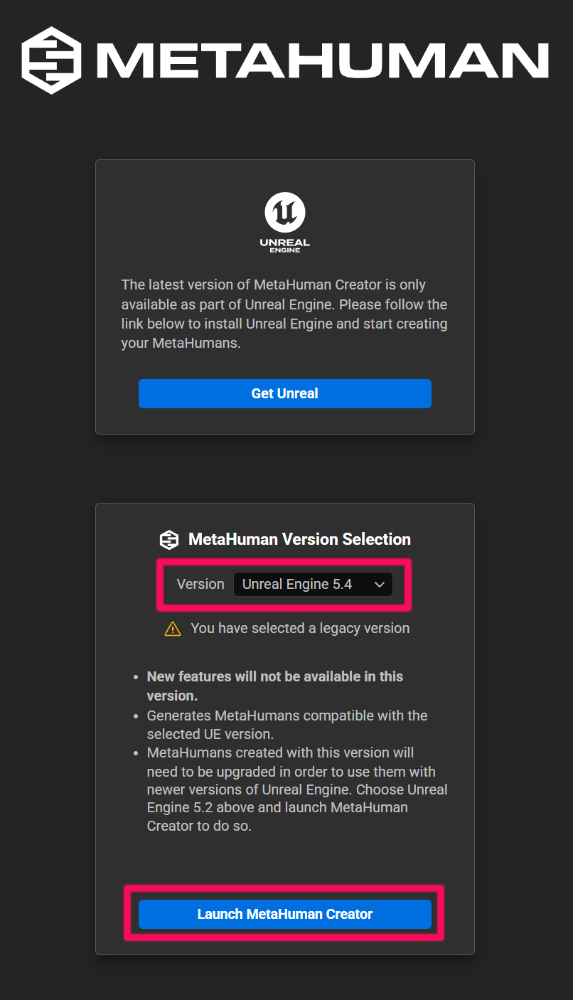
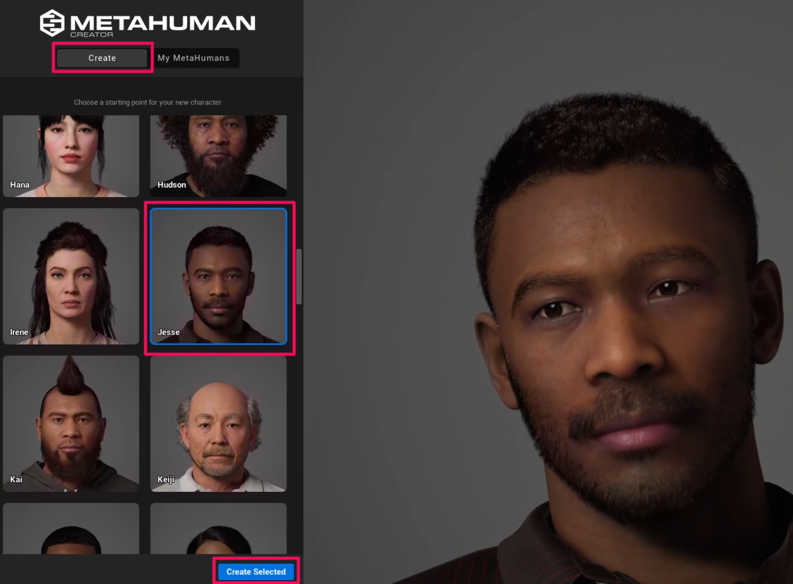
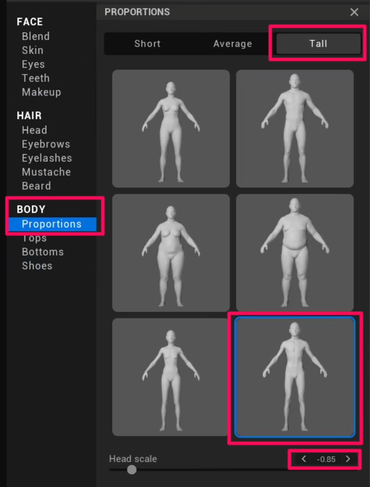
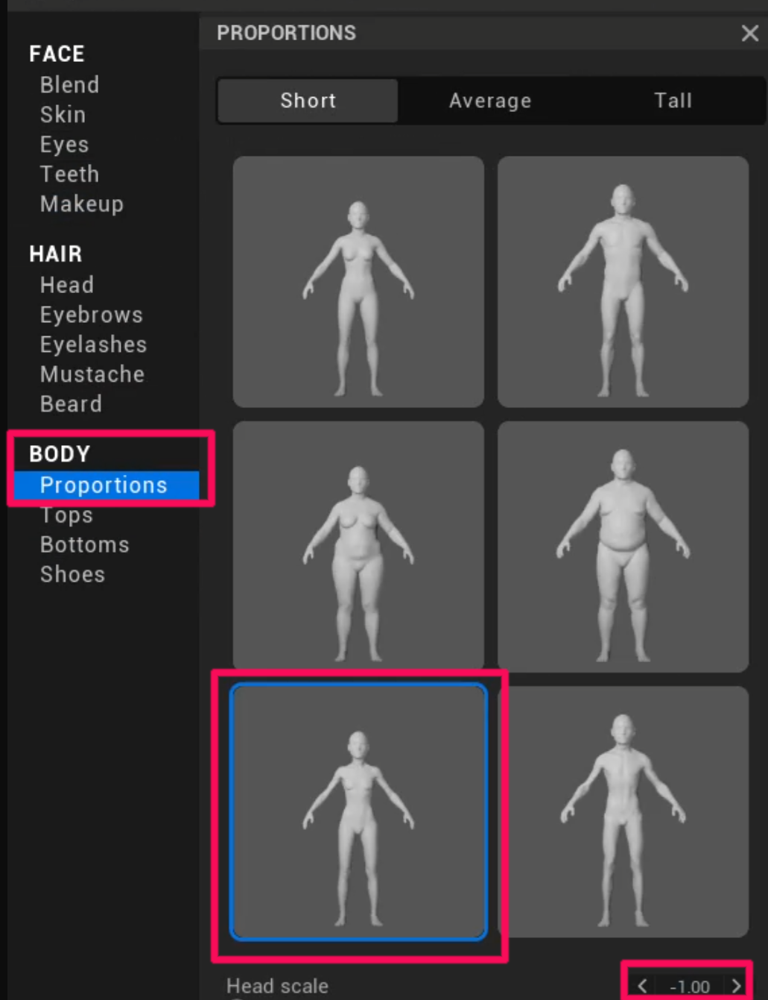
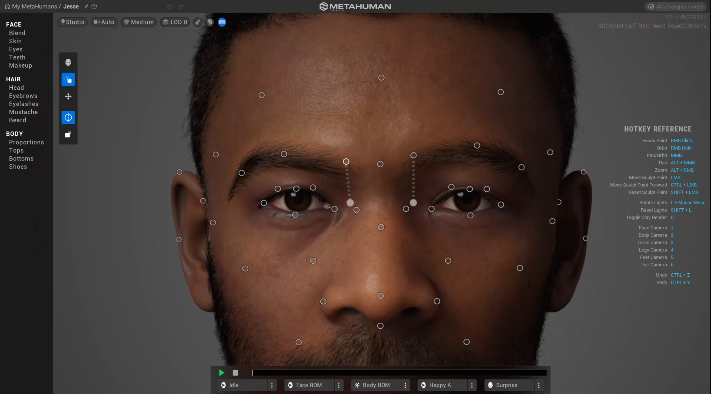
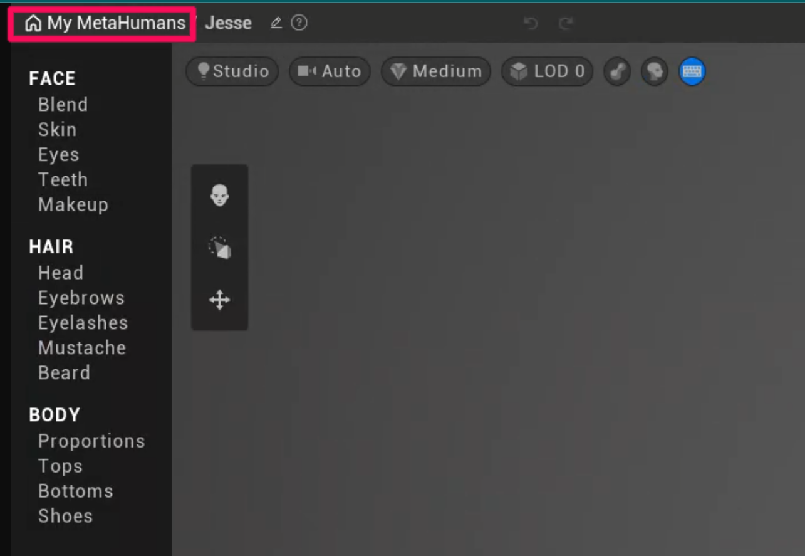

# Overview

!!! note
    MetaHuman-related files required for this workflow are included in the ModKit installation directory.

    Path:
    `\inZOIModKit\Extras\Maya\MetaHuman`

    This folder contains the necessary scripts and resources used in the following MetaHuman → Maya export process.

**1.1 Launch MetaHuman Creator**

Start the creator using **UE 5.4**.

[MetaHuman Creator](https://metahuman.unrealengine.com/){ .md-button }

{ width="600" loading="lazy" }

---

**1.2 Create a Base Face**

Click the **Create** button to enter the MetaHuman creation screen.
Select a base face and click **Create Selected** to generate it.

{ width="600" loading="lazy" }

---

**1.3 Recommended Proportions for inZOI**

If the proportions differ from the inZOI character standard, **errors may occur during later stages of the workflow.**

> Since the body used in-game is applied directly, it is recommended to match the following proportions.  
> (Tall / Slot 6 / -0.85 / Short / Child Slot 5 / -1.00)

Recommended settings

- **Same for Adult Male and Female**  
  - Tall  
  - Slot 6  
  - Head scale **-0.85**

{ width="600" loading="lazy" }

- **Same for Children (Male/Female)**  
  - Short  
  - Slot 5  
  - Head scale **-1.00**

{ width="600" loading="lazy" }

---

**1.4 Edit the Face**

Edit the face in the **Face** tab.

!!! warning
    Currently, when working with MetaHuman, eyebrows, beards, and hair are not applied, and only the face is used.

{ width="600" loading="lazy" }

---

**1.5 MetaHuman Creation Complete**

Return to **My MetaHumans**. If the new face appears in the list, the creation was successful.

{ width="600" loading="lazy" }

---

[Next ›](02Export.md){ .md-button .md-button--primary .next-btn }