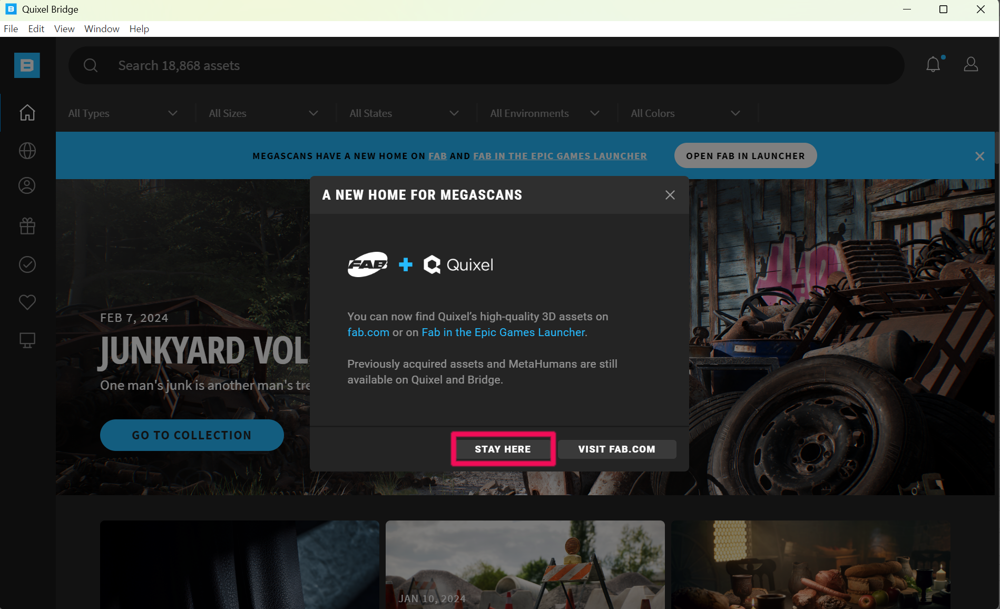
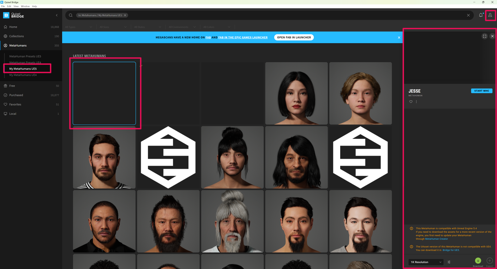
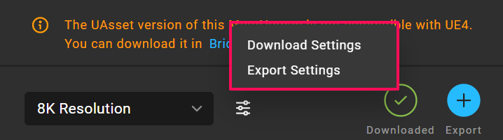
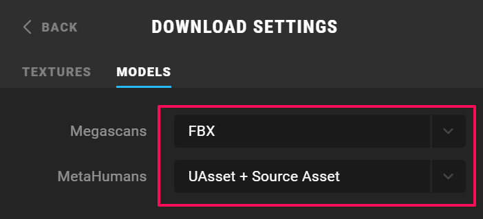
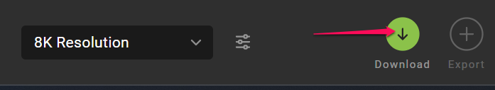
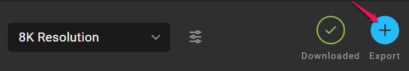
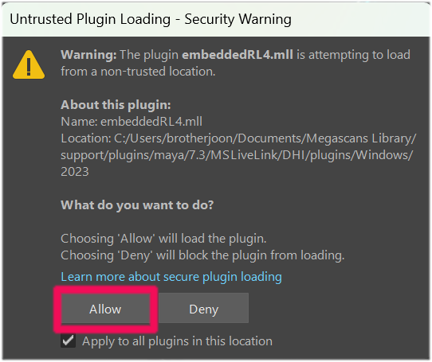
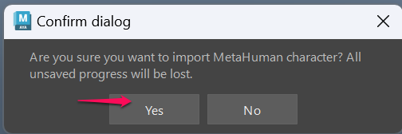
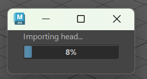
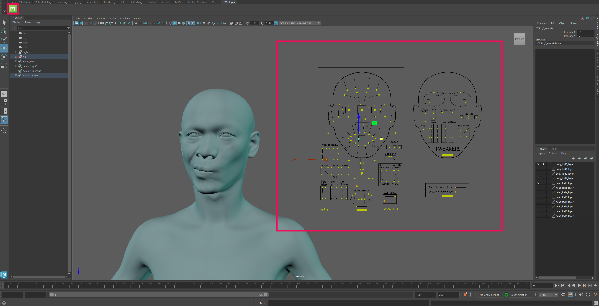

# Export

**2.1 Launch Quixel Bridge**

Install and launch **Quixel Bridge**.

[Quixel Bridge](https://quixel.com/bridge){ .md-button }
[Download Link](https://d2shgxa8i058x8.cloudfront.net/bridge/win/Bridge.exe){ .md-button }

!!! warning
    If the official address changes due to Quixel policy, you may also use the temporary download link below.

**2.2 Open My MetaHumans**

Once Bridge launches, open the **My MetaHumans** tab.
Select the MetaHuman face you created earlier.

{ width="600" loading="lazy" }
{ width="600" loading="lazy" }

---

**2.3 Configure Download / Export Settings**

Select the character and open **Download Settings** and **Export Settings**.

{ width="600" loading="lazy" }

For inZOI, texture assets are not required.  
Only configure the following options.

**Download Settings**

- **FBX**
- **UAsset + Source Asset**

{ width="600" loading="lazy" }

**Export Settings**

- Set the export target to **Maya**

---

**2.4 Download and Export**

After setting the configuration, press **Download**.

{ width="600" loading="lazy" }

Once the download is complete, launch **Maya** and press **Export**.

{ width="600" loading="lazy" }

---

**2.5 Install the Maya Plugin**

If a plugin installation prompt appears during this process, allow the installation.

In Maya:

- **Untrusted Plugin → Allow**
- **Confirm dialog → Yes**

This only needs to be done **once**.

{ width="600" loading="lazy" }

{ width="600" loading="lazy" }

---

**2.6 Import Progress**

If everything runs correctly, Maya will begin importing the head data.

{ width="600" loading="lazy" }

---

**2.7 Verify the Imported Character**

When the import is finished:

- The MetaHuman character appears in the Maya scene.
- The **MetaHuman controller panel** appears on the side.

If both appear correctly, the export process was successful.
It is recommended to open a **new scene** to verify that everything loads properly.

{ width="600" loading="lazy" }

---

[‹ Previous](01overview.md){ .md-button .md-button--primary .prev-btn }
[Next ›](03DNAViewer.md){ .md-button .md-button--primary .next-btn }