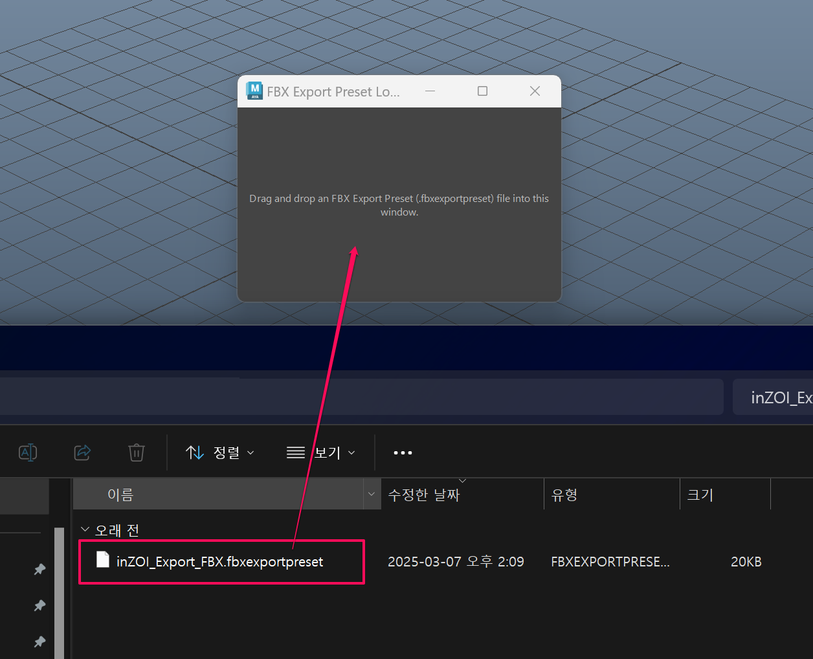
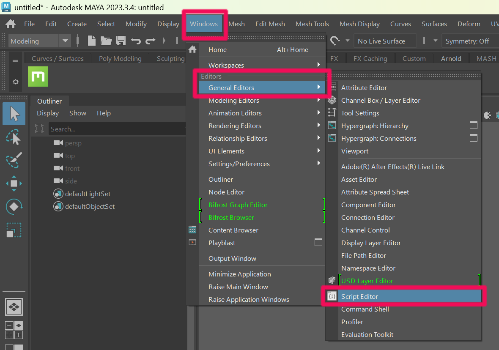
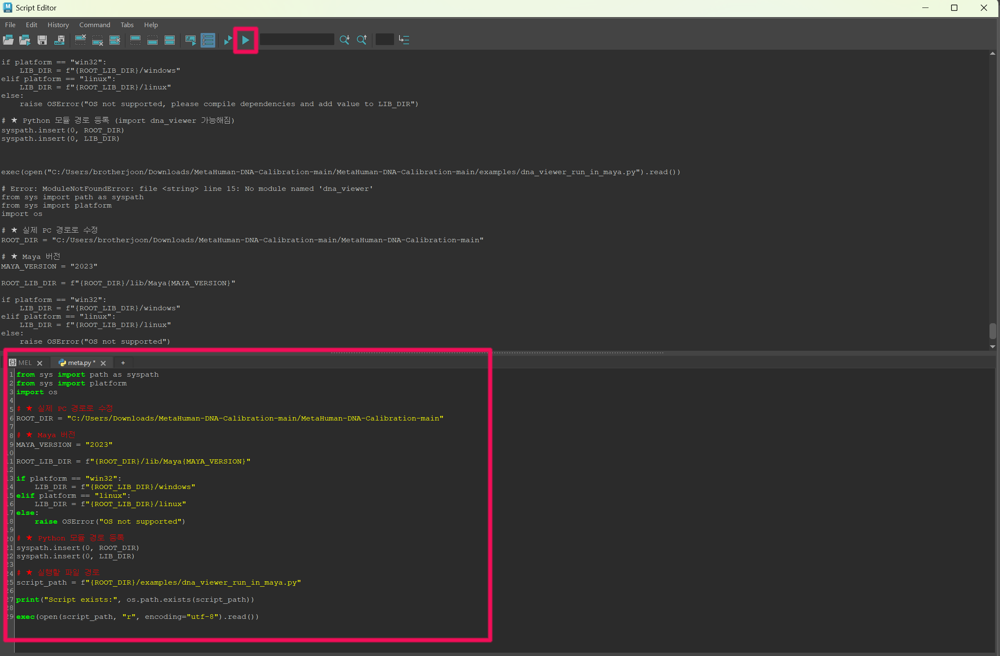
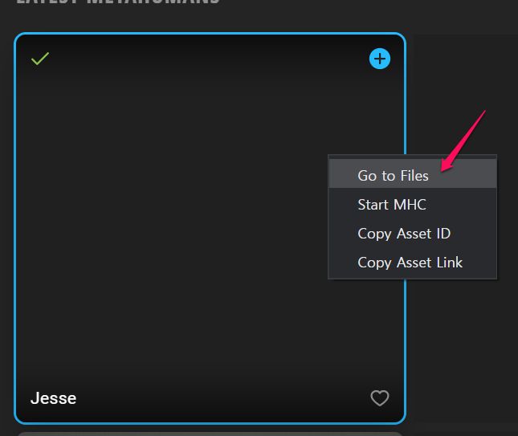
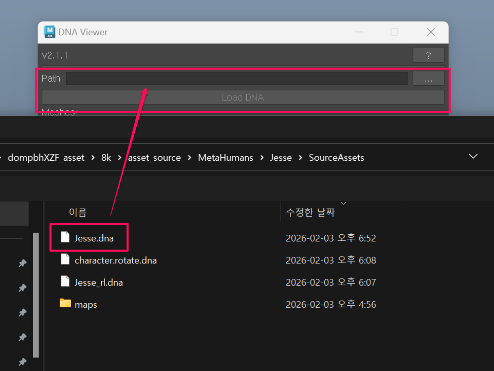
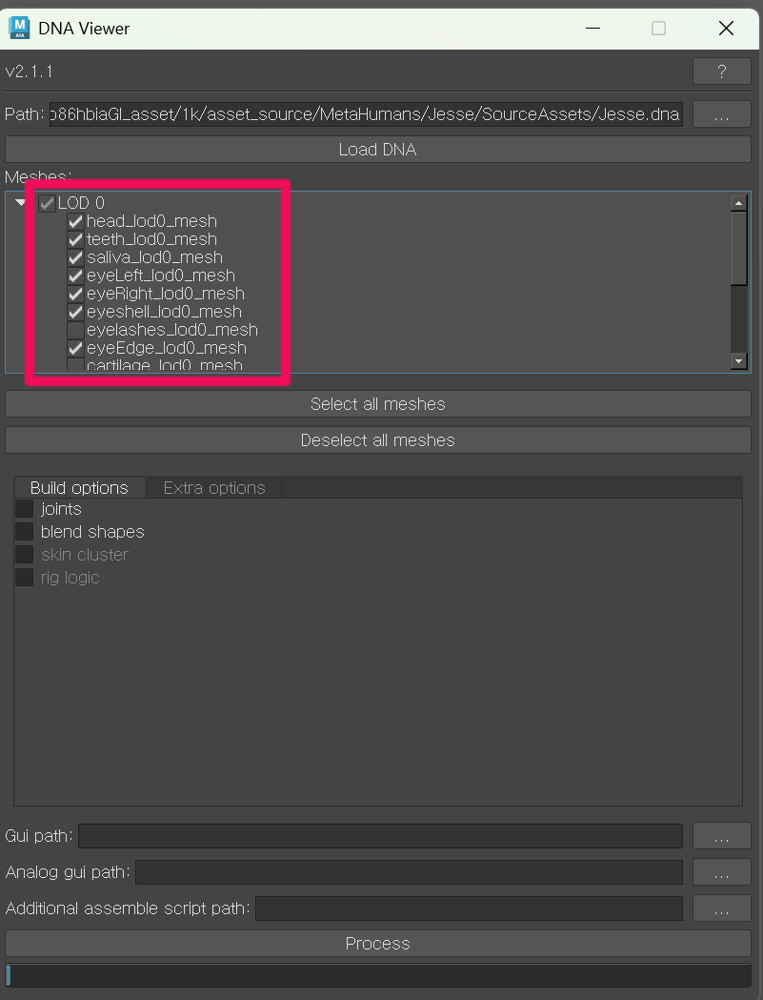
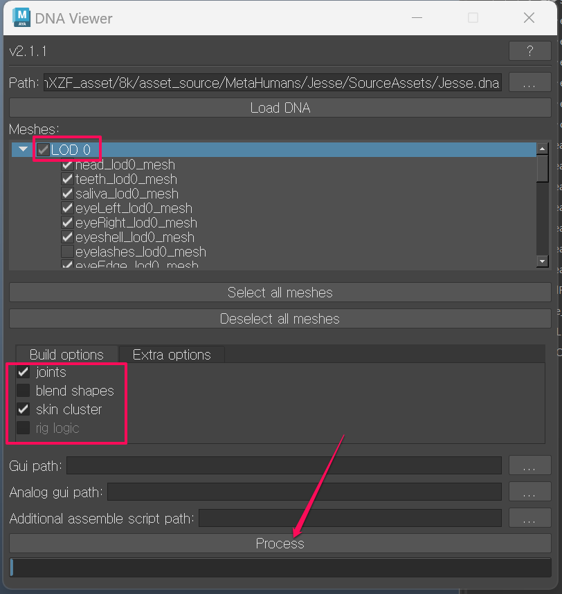

# DNA Viewer

**3.1 Download MetaHuman-DNA-Calibration**

Download **MetaHuman-DNA-Calibration** provided by Epic.

[GitHub - EpicGames/MetaHuman-DNA-Calibration](https://github.com/EpicGames/MetaHuman-DNA-Calibration){ .md-button }

---

**3.2 Extract the Archive**

Extract the downloaded folder to your desired location.  
(In this example, it is extracted to the **C:** drive.)

Then copy the following file:

`C:\...\Downloads\MetaHuman-DNA-Calibration-main\MetaHuman-DNA-Calibration-main\lib\Maya2023\embeddedRL4.dll`

and overwrite it here:

`C:\Program Files\Autodesk\Maya2023\bin\plug-ins\embeddedRL4.dll`

In a new Maya scene, execute the script `fbx_preset_loader.py` or drag it into the scene.
Then drag the file from `inZOI_Export_FBX.zip` into the window.

{ width="600" loading="lazy" }

---

**3.3 Open Script Editor in Maya**

In Maya, go to:

**Windows → General Editors → Script Editor**

{ width="600" loading="lazy" }

---

**3.4 Run the DNA Viewer Script**

In **Maya Script Editor (Python)**, run the following code to launch **DNA Viewer**.

Update the following values before running:

- `ROOT_DIR` → set this to your actual **MetaHuman-DNA-Calibration** folder path
- `MAYA_VERSION` → set this to your Maya version (`2023` in this guide)

{ width="600" loading="lazy" }

```python
from sys import path as syspath
from sys import platform
import os

# ★ Change this to your actual PC path
ROOT_DIR = "C:/.../MetaHuman-DNA-Calibration-main/MetaHuman-DNA-Calibration-main"

# ★ Maya version
MAYA_VERSION = "2023"

ROOT_LIB_DIR = f"{ROOT_DIR}/lib/Maya{MAYA_VERSION}"

if platform == "win32":
    LIB_DIR = f"{ROOT_LIB_DIR}/windows"
elif platform == "linux":
    LIB_DIR = f"{ROOT_LIB_DIR}/linux"
else:
    raise OSError("OS not supported")

# ★ Register Python module paths
syspath.insert(0, ROOT_DIR)
syspath.insert(0, LIB_DIR)

# ★ Path to the script to run
script_path = f"{ROOT_DIR}/examples/dna_viewer_run_in_maya.py"

print("Script exists:", os.path.exists(script_path))

exec(open(script_path, "r", encoding="utf-8").read())
```

---

**3.5 Return to Bridge and Open SourceAssets**

Go back to **Bridge**, select the character you created, right-click it, and choose **Go to Files**.

{ width="600" loading="lazy" }

When the folder opens, go to the following path:

`%USERPROFILE%\Documents\Megascans Library\Downloaded\DHI\[asset_name]\8k\asset_source\MetaHumans\[character_name]\SourceAssets`

In **DNA Viewer - Path**, load the `.dna` file from the folder above, then click **Load DNA**.

In this example, use:

- `Jesse.dna`

{ width="600" loading="lazy" }

---

**3.6 Process with LOD0 Only**

Only use **LOD0**.

Before processing:

- Uncheck `eyelashes_lod0_mesh`
- Uncheck `cartilage_lod0_mesh`

Then, in the lower section:

- Check **joints**
- Check **skin cluster**

After that, click **Process**.

{ width="600" loading="lazy" }

{ width="600" loading="lazy" }

---

[‹ Previous](02Export.md){ .md-button .md-button--primary .prev-btn }
[Next ›](04Rigging.md){ .md-button .md-button--primary .next-btn }