# Rigging

**4.1 Open the Processed MetaHuman Rig**

After running **Process**, the configured MetaHuman rig opens in Maya.

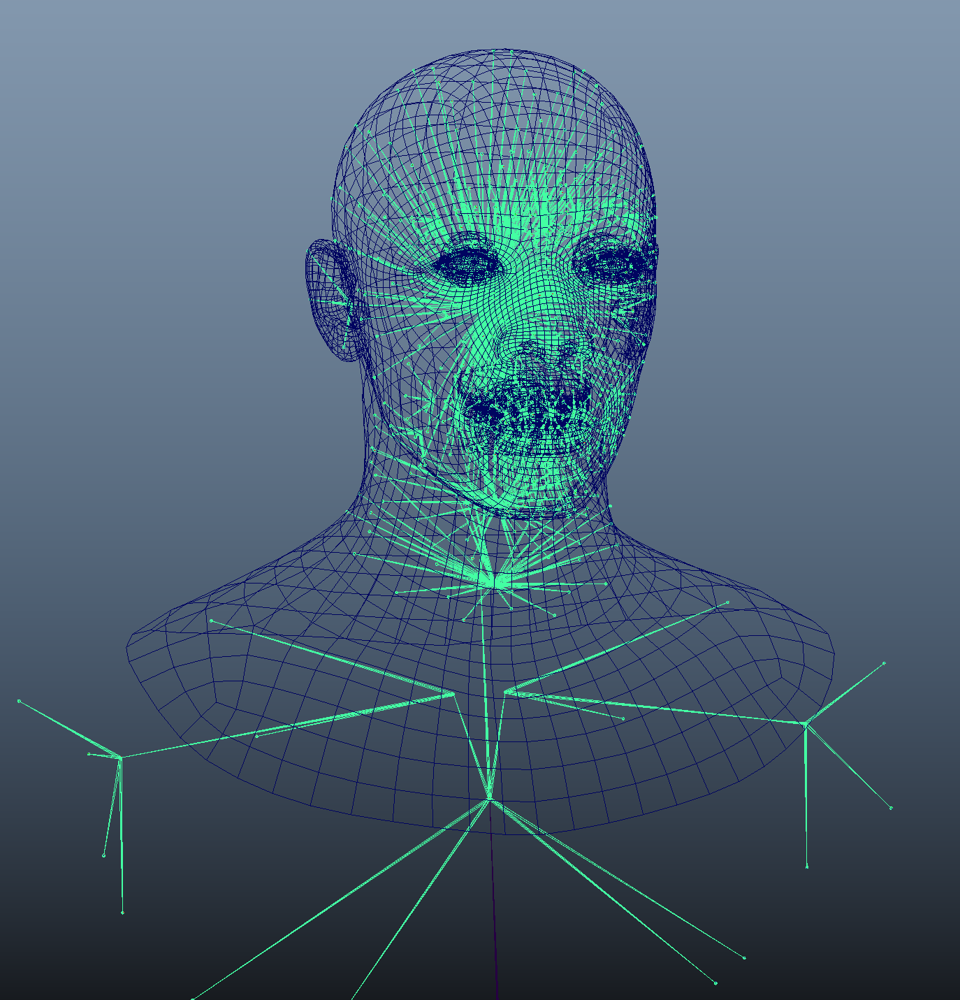{ width="600" loading="lazy" }

---

**4.2 Change Animation Preferences**

If the file is processed correctly, go to:

**Animation Preferences → Settings**

Set the axis to **Y**, then click **Save**.

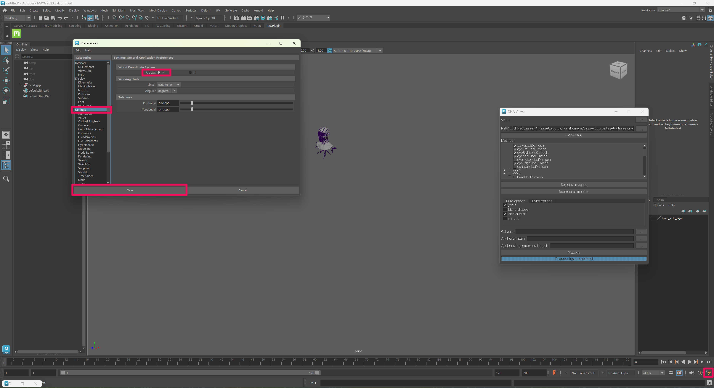{ width="600" loading="lazy" }

---

**4.3 Export the Current Skin Weights**

First, save the skin weights of all related objects.

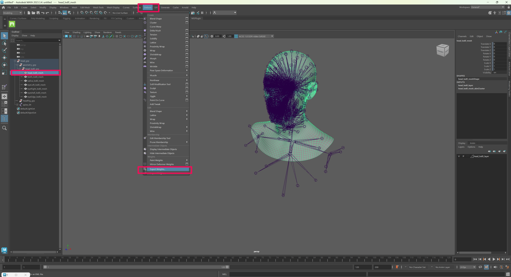{ width="600" loading="lazy" }

Save the file and export the skin weights.

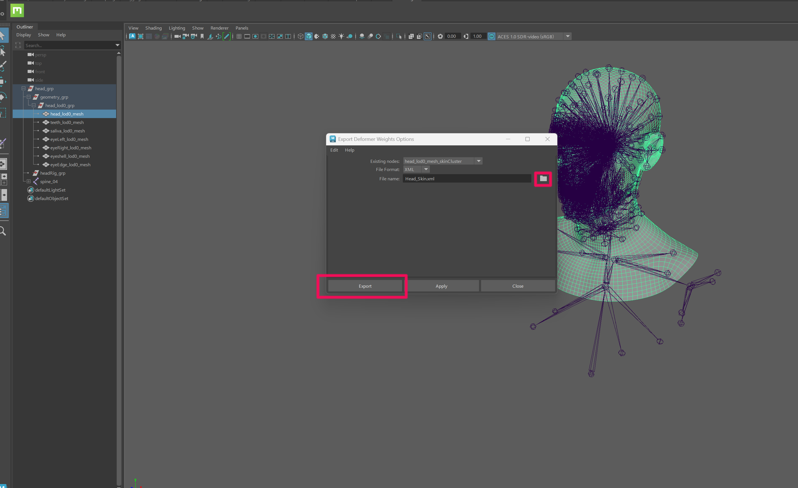{ width="600" loading="lazy" }

---

**4.4 Export Skin Weights for All Related Head Meshes**

Export the skin weights for all of the following meshes:

- `head_lod0_mesh`
- `teeth_lod0_mesh`
- `saliva_lod0_mesh`
- `eyeLeft_lod0_mesh`
- `eyeRight_lod0_mesh`
- `eyeshell_lod0_mesh`
- `eyeEdge_lod0_mesh`

Save all related files as shown below using **Skin Weight Export**.

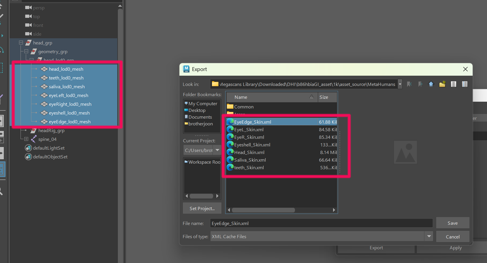{ width="600" loading="lazy" }

---

**4.5 Import the Base Mesh Used In-Game**

Load the base mesh used by the in-game character.

Go to:

**File → Reference Editor → Add**

Use the file inside:

`MetaHuman_Base.zip`

Choose the FBX file that matches the target gender / age.

For example, for an **adult male**, reference:

- `Male_Base.FBX`

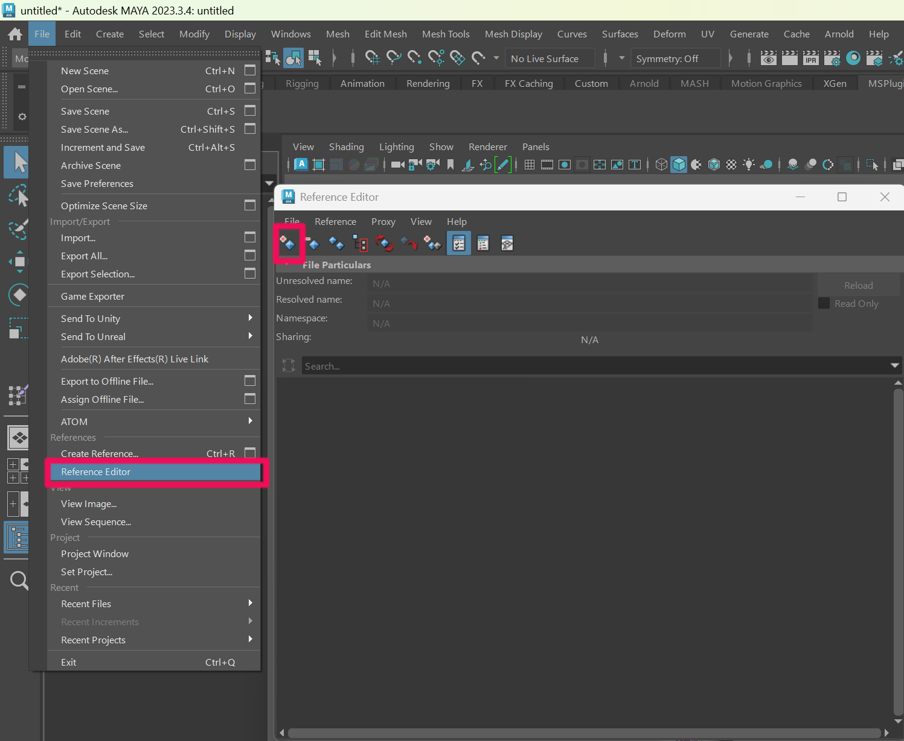{ width="600" loading="lazy" }

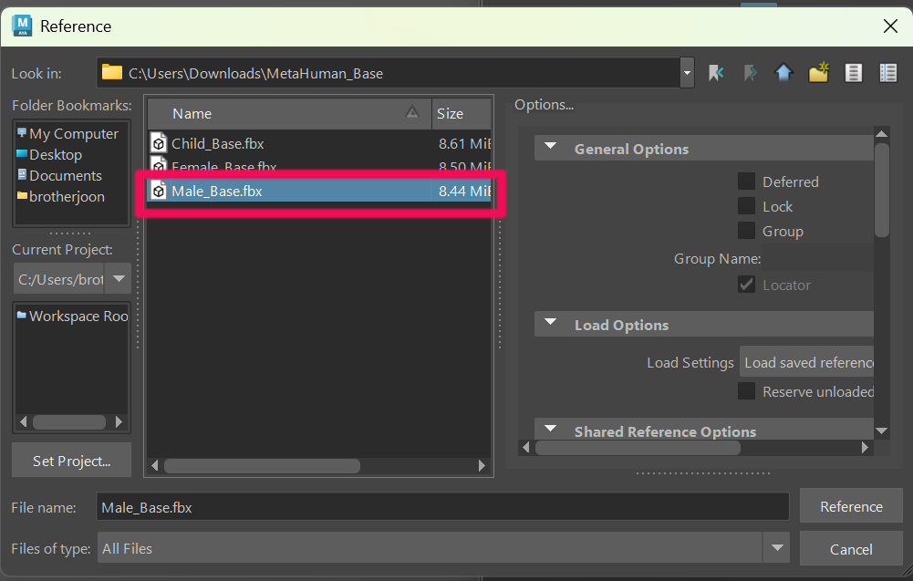{ width="600" loading="lazy" }

---

**4.6 Hide the Body-Related Meshes**

Once the base mesh is loaded as shown below, hide all body-related parts first so you can focus on head work.

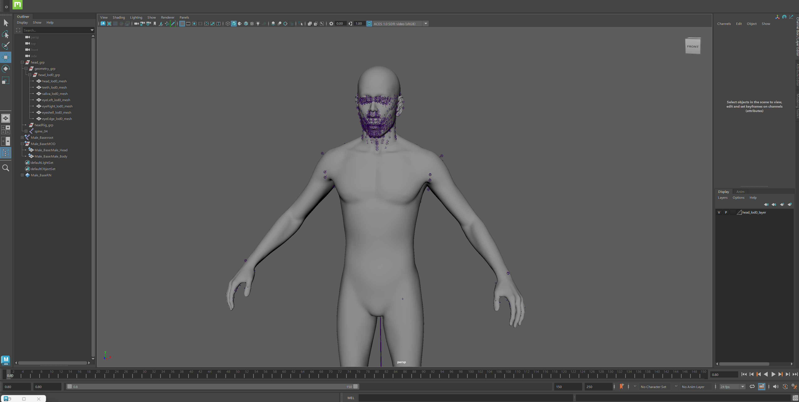{ width="600" loading="lazy" }

---

**4.7 Align the New Head to the Base Mesh**

Match the new head to the base mesh as closely as possible.

Use:

- `head_lod0_mesh`
- `spine_04`

Move the new head until it matches the base mesh as closely as possible.

The front alignment is already mostly correct, so adjust primarily in the **Left** or **Right** view.

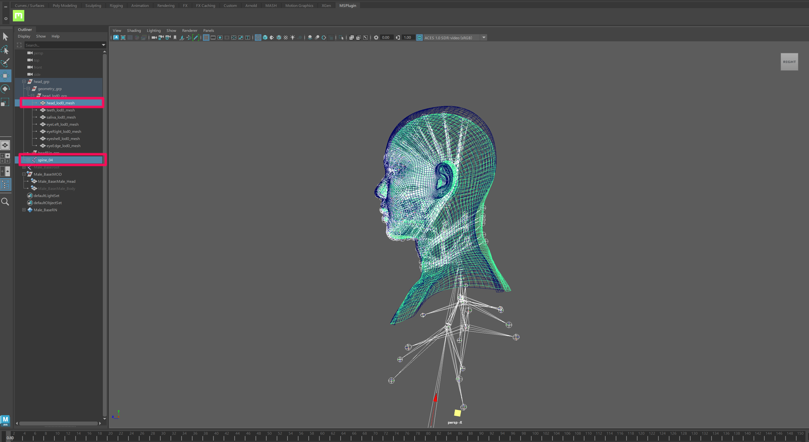{ width="600" loading="lazy" }

---

**4.8 Delete History from the New Head Objects**

Select all objects inside:

`head_lod0_grp`

Then delete history:

**Shift + Alt + D**

> Skin weights will be removed at this stage.  
> In other words, even if you move the joints, the mesh will no longer deform.

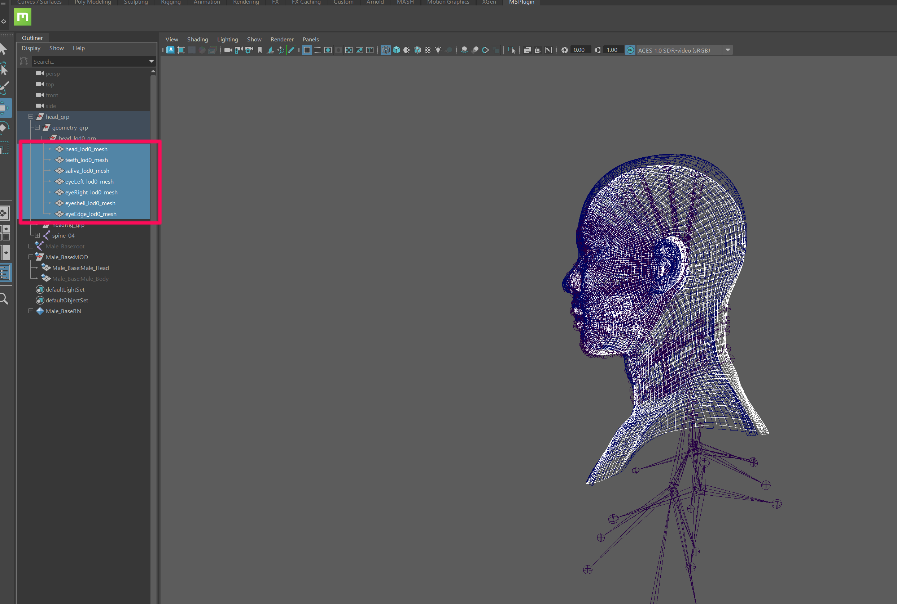{ width="600" loading="lazy" }

---

**4.9 Detach FACIAL_C_FacialRoot and Remove the Existing Upper Hierarchy**

First select:

`head_grp → spine_04 → Spine_05 → neck_01 → neck_02 → FACIAL_C_FacialRoot`

Set its value to **0, 0**, then delete the keyed values stored on the frame.

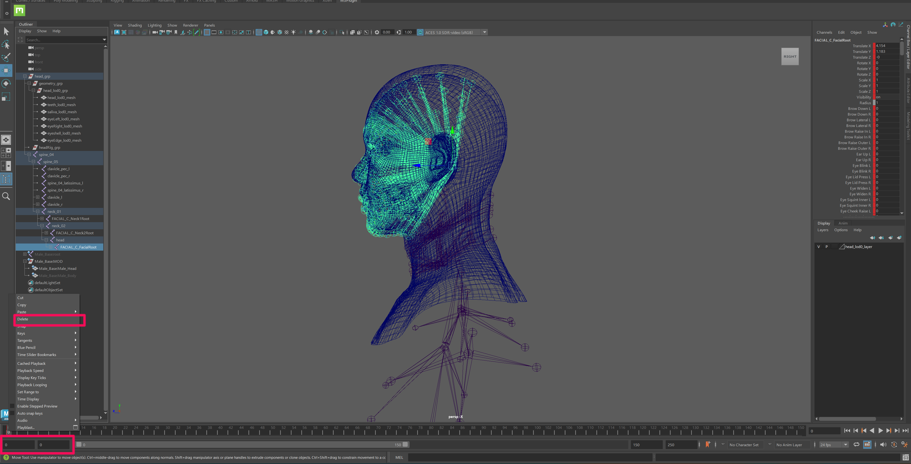{ width="600" loading="lazy" }

After that, remove **FACIAL_C_FacialRoot** from the hierarchy using:

**Shift + P**

This is done to keep **FACIAL_C_FacialRoot** fixed.

Then delete the entire hierarchy including:

- `spine_04`

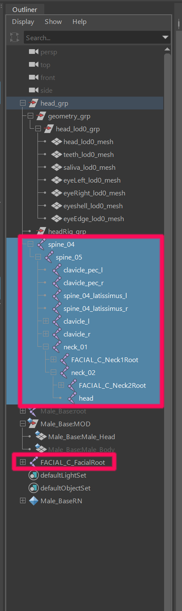{ width="600" loading="lazy" }

---

**4.10 Import the Target Skeleton and Reattach FACIAL_C_FacialRoot**

Import the FBX file that matches the target gender / age from:

`MetaHuman_Skeleton_01.zip`

For example, for an **adult male**, import:

- `Male_Skeleton_01.FBX`

Then place:

`FACIAL_C_FacialRoot`

under the following hierarchy:

`spine_04 → Spine_05 → neck_01 → neck_02 → head`

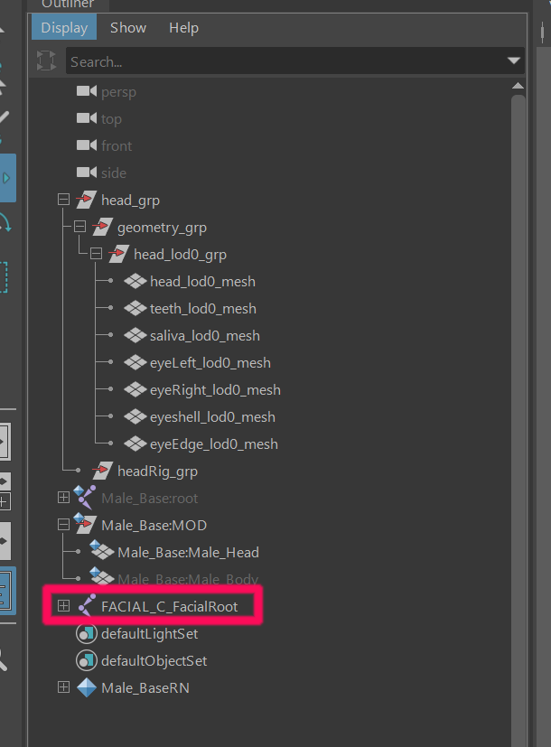{ width="600" loading="lazy" }

Result:

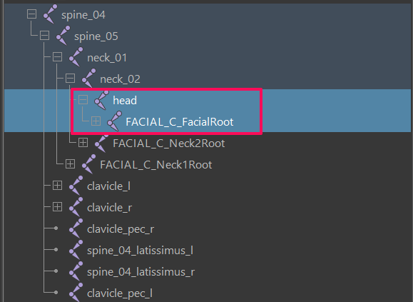{ width="600" loading="lazy" }

---

**4.11 Neckline Matching**

Because the inZOI body mesh and the newly extracted MetaHuman head cannot be combined directly,  
the neckline must be manually aligned in Maya.

• **Neckline Matching**

From the referenced base mesh, select the **Head mesh**,  
then select the new head **head_lod0_mesh** and apply a **Blend Shape**.

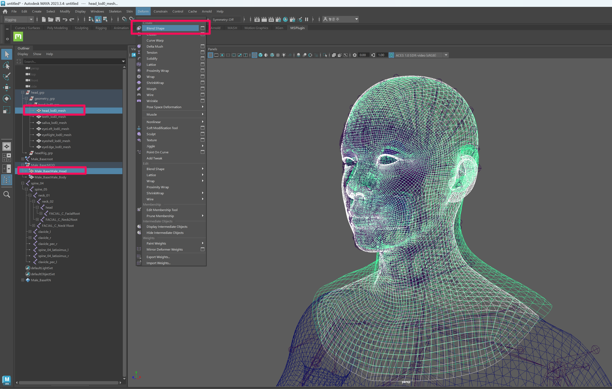{ width="600" loading="lazy" }

---

After applying the blend shape, the new head will align with the base head mesh.

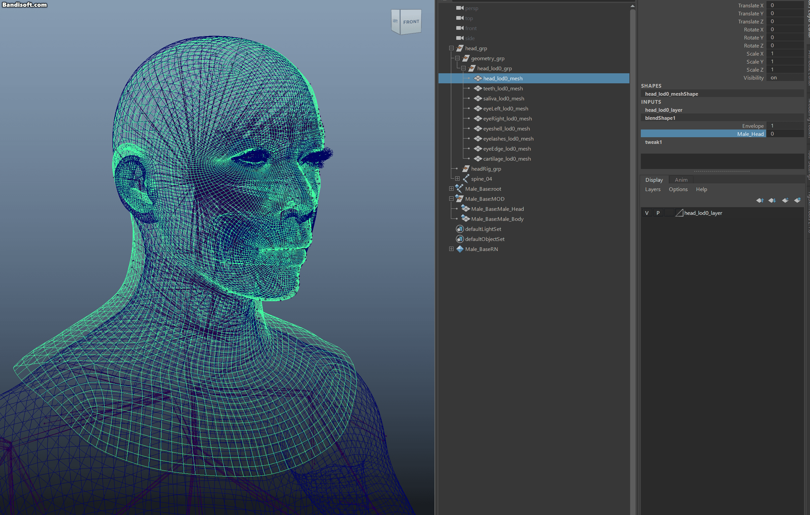{ width="600" loading="lazy" }

---

The blend shape should only affect the **neckline area**.  
Remove blend shape weights from the rest of the mesh except the neck area.

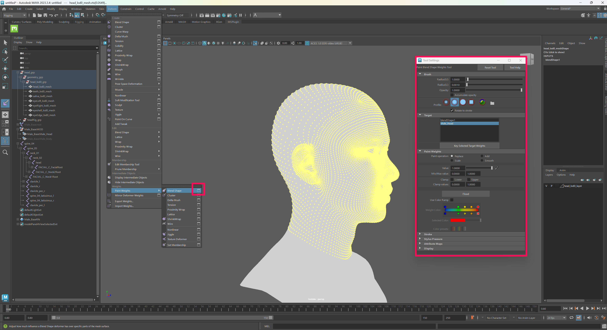{ width="600" loading="lazy" }

---

In **Paint Weights → Blend Shape**, change the value from **1 → 0** and press **Flood**.

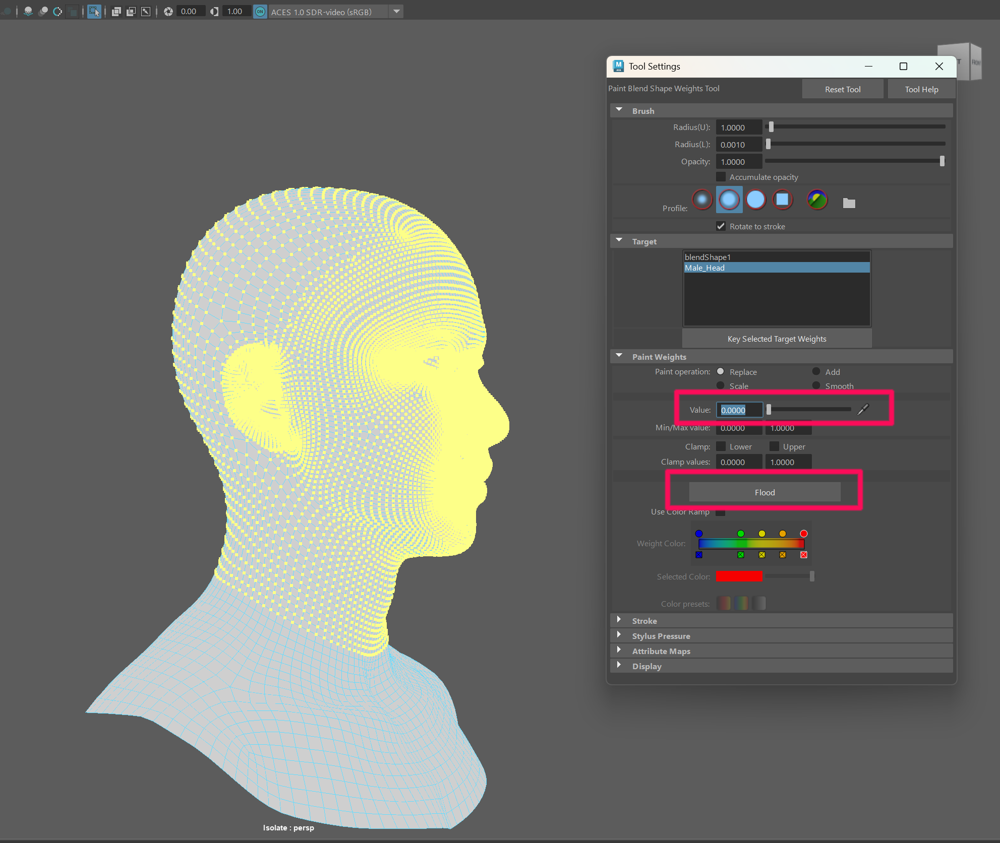{ width="600" loading="lazy" }

---

Next, select the protruding neck area and return to **Paint Weights → Blend Shape**.  
Change **Paint operation → Replace → Smooth**, then press **Flood**.

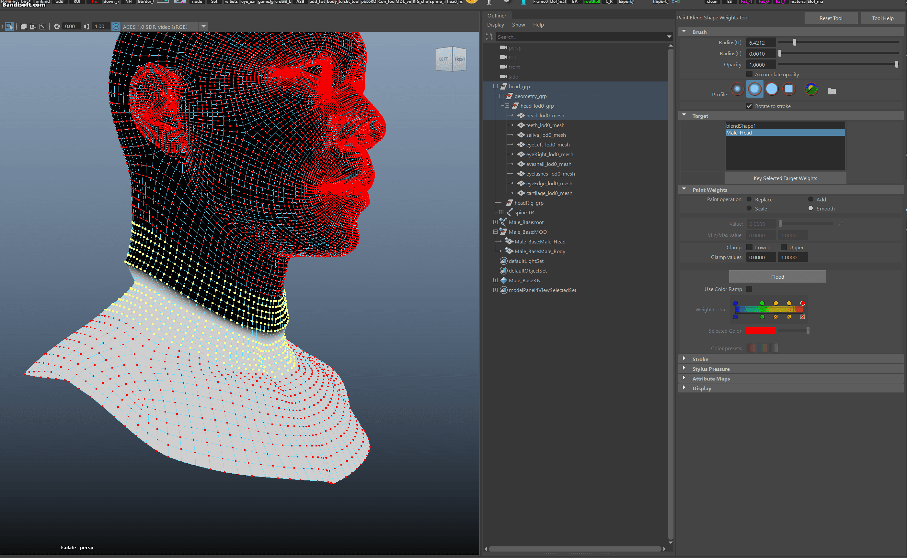{ width="600" loading="lazy" }

---

When the neckline is properly aligned, delete the history of **head_lod0_mesh** once more.

Select the mesh and press:

```
Shift + Alt + D
```

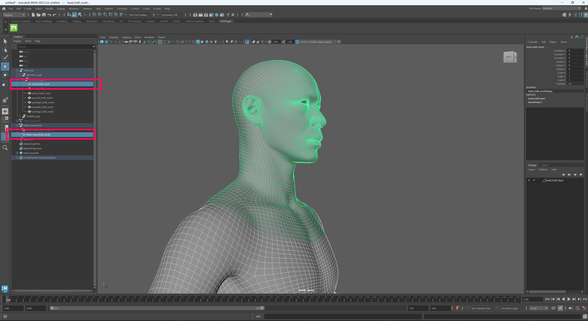{ width="600" loading="lazy" }

SHAPES: 
head_lod0_meshShape

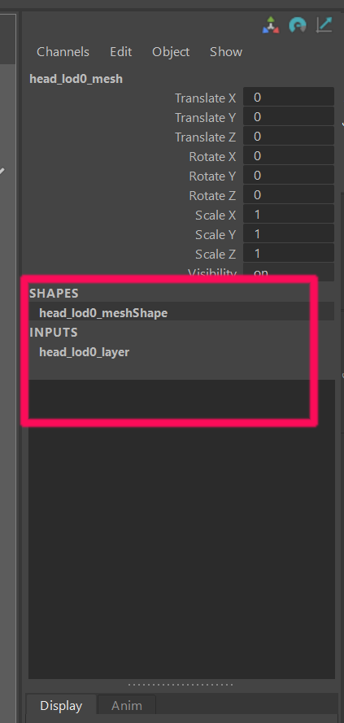{ width="600" loading="lazy" }

---

**4.12 Remove Base Mesh Reference**

Remove the previously imported base mesh from the reference.

**File → Reference Editor → Select File → Remove Reference**

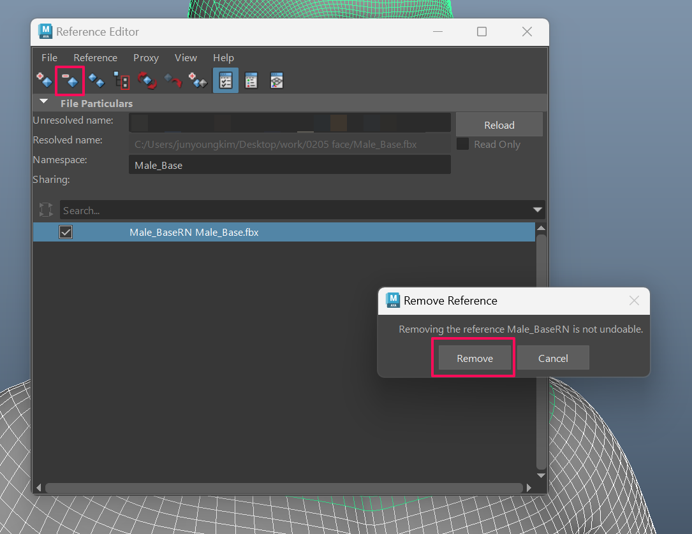{ width="600" loading="lazy" }

---

**4.13 Export the Head**

Select the group **head_lod0_grp** and export it as FBX.

**File → Export Selection**

Change the preset to:

```
inZOI_Export_FBX
```

If the preset does not exist, refer back to the **DNA Setup step**.

Save the file as:

```
MOD.FBX
```

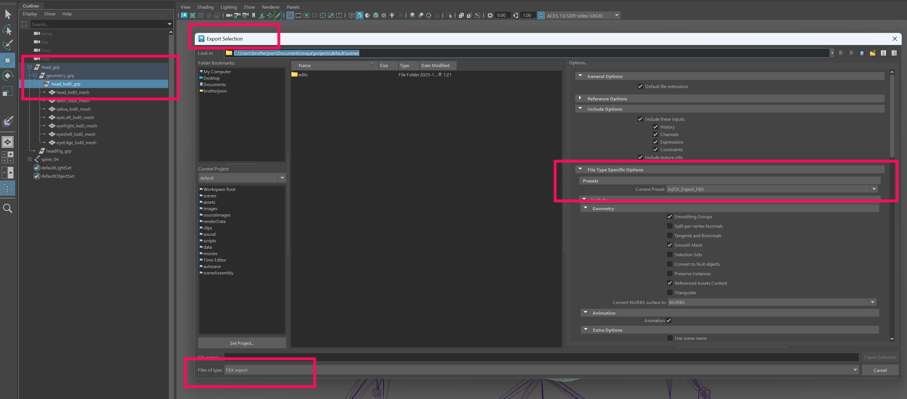{ width="600" loading="lazy" }

---

**4.14 Run the DNA Update Script**

After exporting, run the following script.

This extracts a new DNA so that the MetaHuman rig can be updated based on the modified joint positions.

```python
# Force define __file__
__file__ = "C:/.../MetaHuman-DNA-Calibration-main/examples/dna_viewer_grab_changes_from_scene_and_propagate_to_dna.py"

# Execute the script
exec(open(__file__).read())
```

---

[‹ Previous](03DNAViewer.md){ .md-button .md-button--primary .prev-btn }
[Next ›](05FinalExport.md){ .md-button .md-button--primary .next-btn }