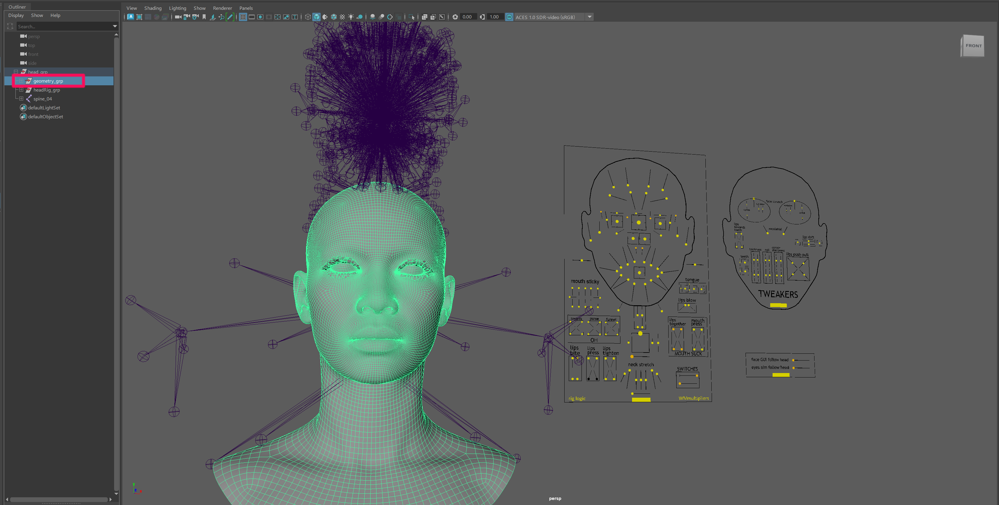
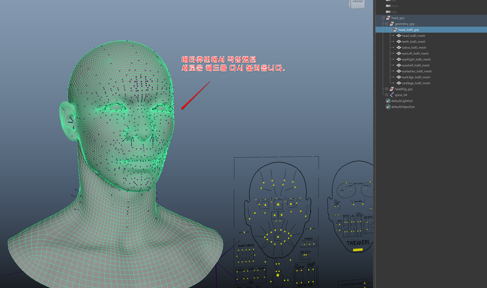
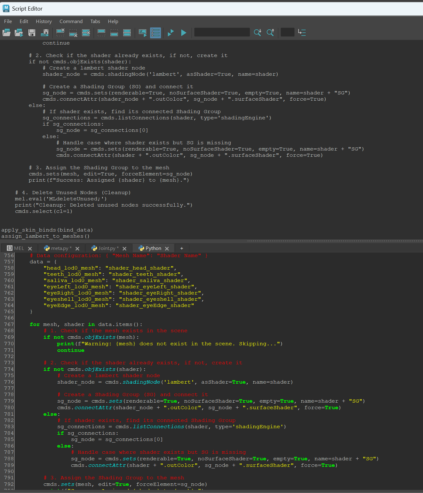
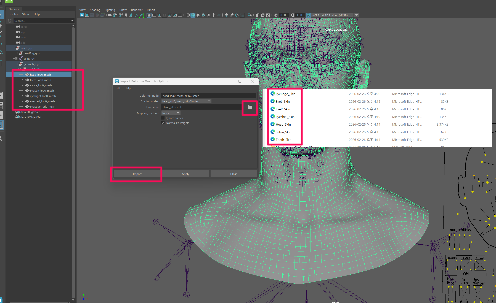
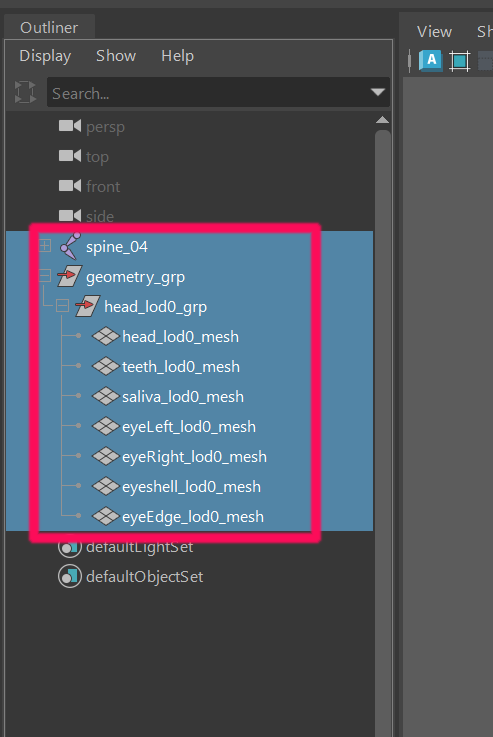
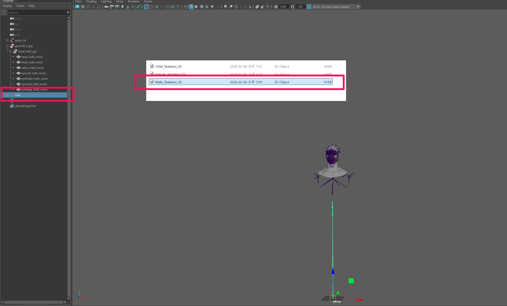
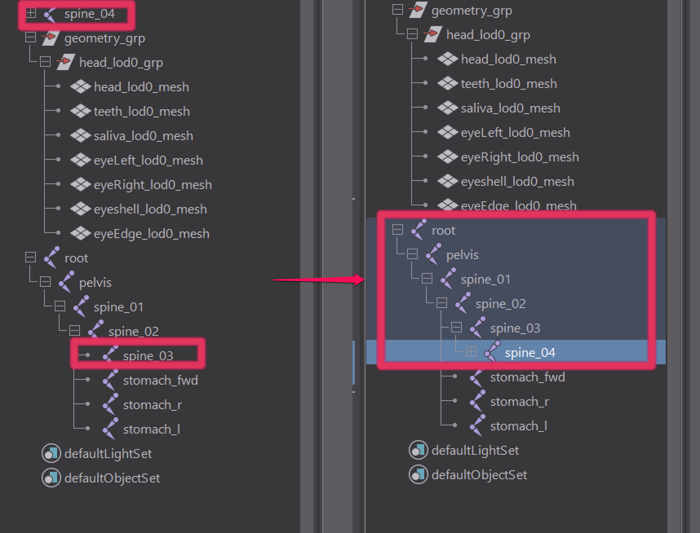
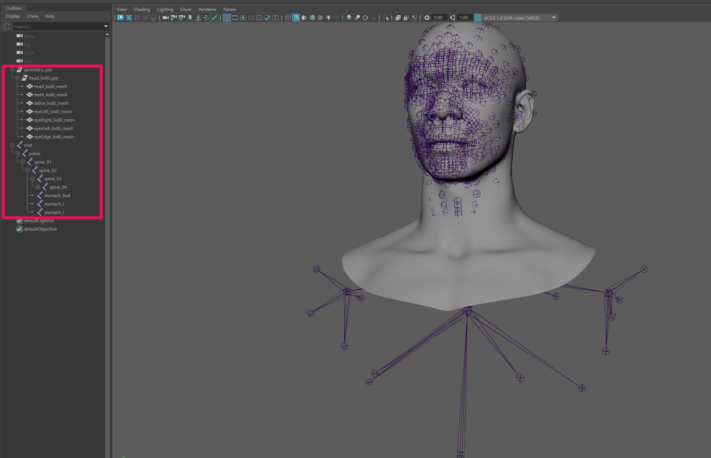
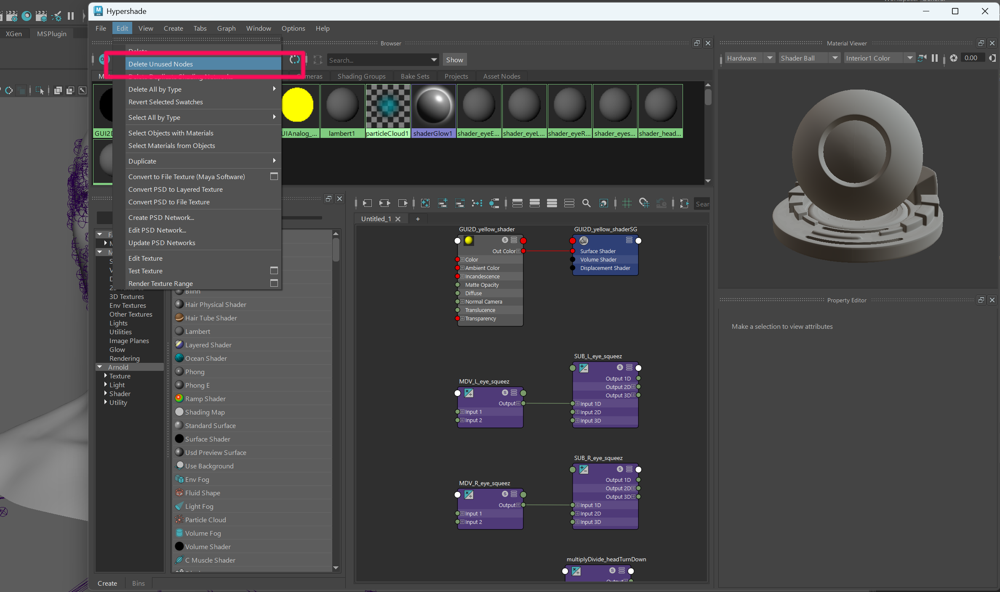

# Final Export

**5.1 Scene Reset After Script Execution**

After running the previous script, the MetaHuman rig will be rebuilt in a new scene based on the modified joint positions.

The **geometry_grp** can be removed since it is no longer used.

{ width="600" loading="lazy" }

---

**5.2 Import the Edited Head Mesh**

Import the FBX file exported in the previous step.

Example file:

```
MOD.fbx
```

{ width="600" loading="lazy" }

---

**5.3 Run the Binding Script**

Run the following script first.

This script automatically performs:

- Joint binding
- Material assignment

Copy the contents of:

```
bind_material_setup.py
```

and paste it into the **Python Script Editor** in Maya.

{ width="600" loading="lazy" }

---

**5.4 Import the Saved Skin Weights**

Load the skin weight files saved in the previous step and apply them.

Apply the skin weights to all objects inside:

```
head_lod0_grp
```

{ width="600" loading="lazy" }

---

**5.5 Clean the Scene**

After rigging is complete, clean up the scene so that only the meshes and joints required for the engine remain.

{ width="600" loading="lazy" }

---

**5.6 Import the Final Skeleton**

Import the appropriate skeleton file from:

```
MetaHuman_Skeleton_02.zip
```

Example:

```
Male_Skeleton_02.fbx
```

{ width="600" loading="lazy" }

Place spine_04 as a child of spine_03 in the hierarchy.

{ width="600" loading="lazy" }

---

**5.7 Clean Unused Nodes**

Open **Hypershade** and remove unused nodes.

```
Hypershade → Edit → Delete Unused Nodes
```

{ width="600" loading="lazy" }

---

**5.8 Export Final FBX**

Select only:

- **MOD (mesh group)**
- **root (skeleton joint)**

Then export the final FBX.

```
File → Export Selection
```

Settings:

```
Preset : inZOI_Export_FBX
```

Example filename:

```
SKM_Head_MOD.fbx
```

{ width="600" loading="lazy" }

---

The final FBX is now ready for use in **inZOI ModKit**.

---

[‹ Previous](04Rigging.md){ .md-button .md-button--primary .prev-btn }
[Next ›](06Modkit.md){ .md-button .md-button--primary .next-btn }
