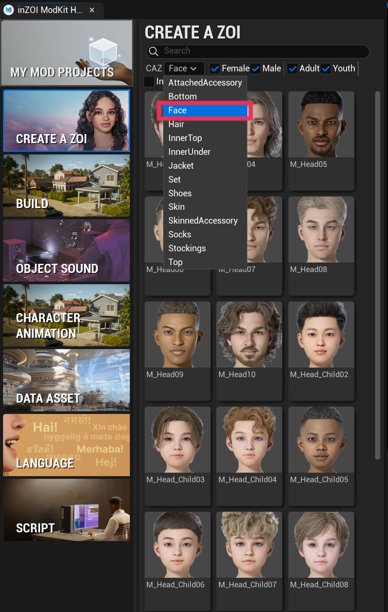
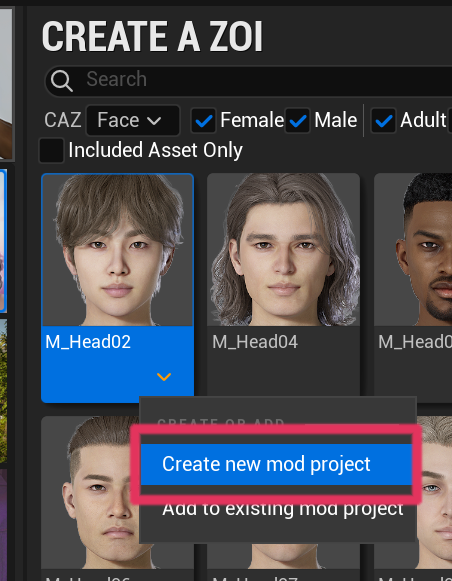
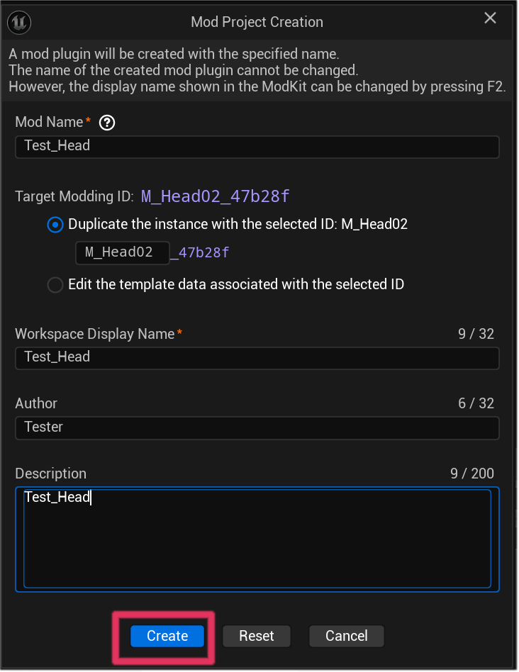
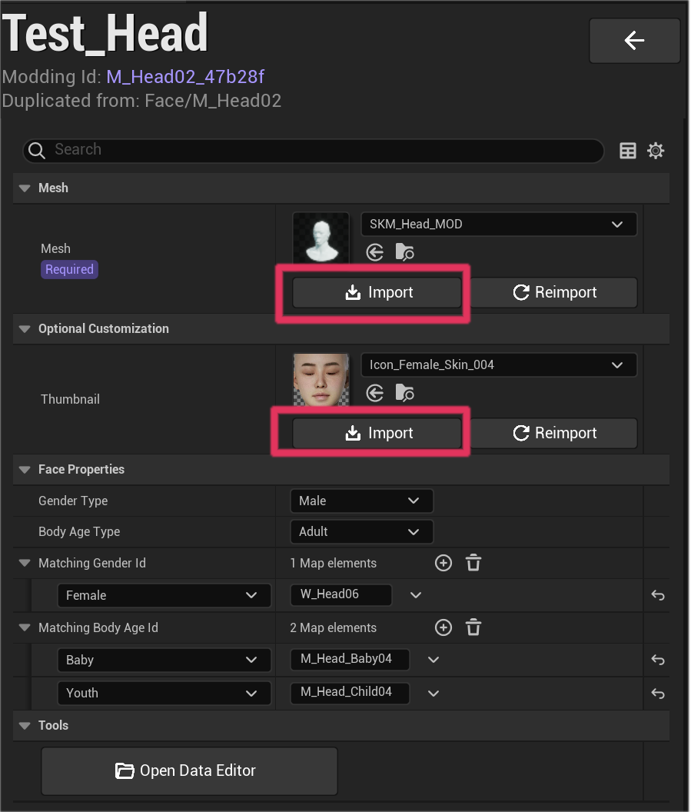
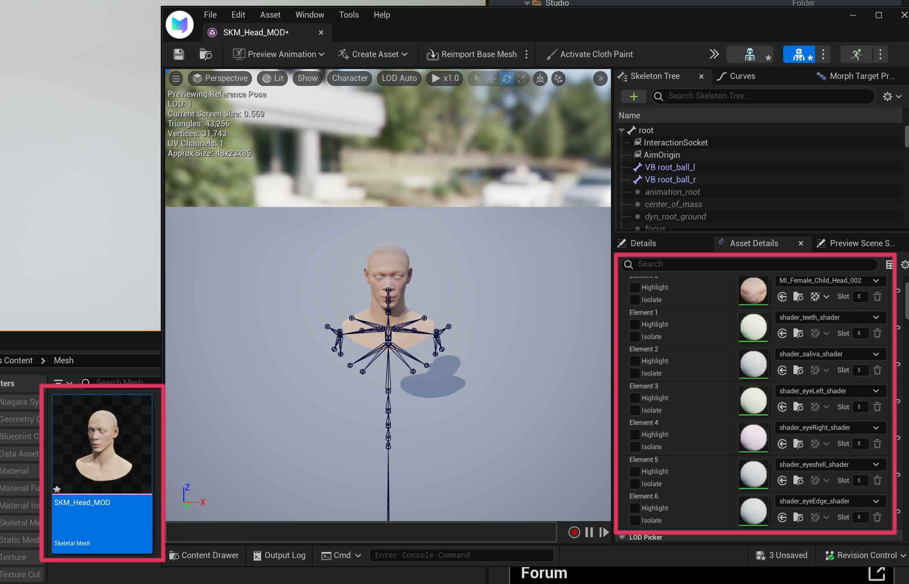
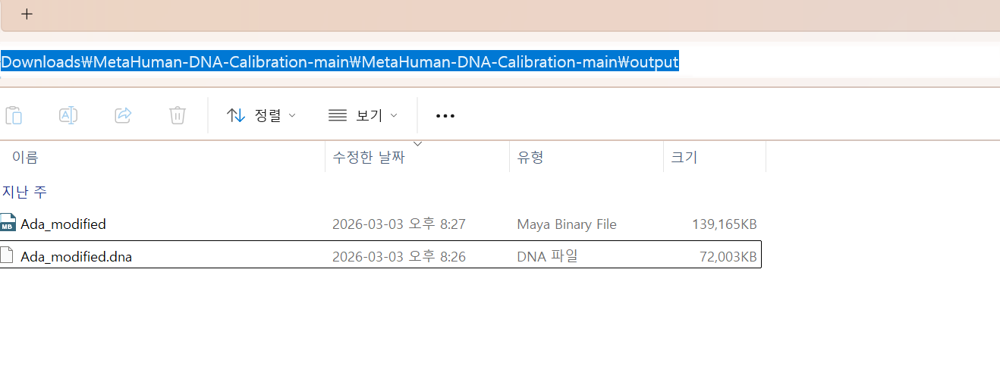
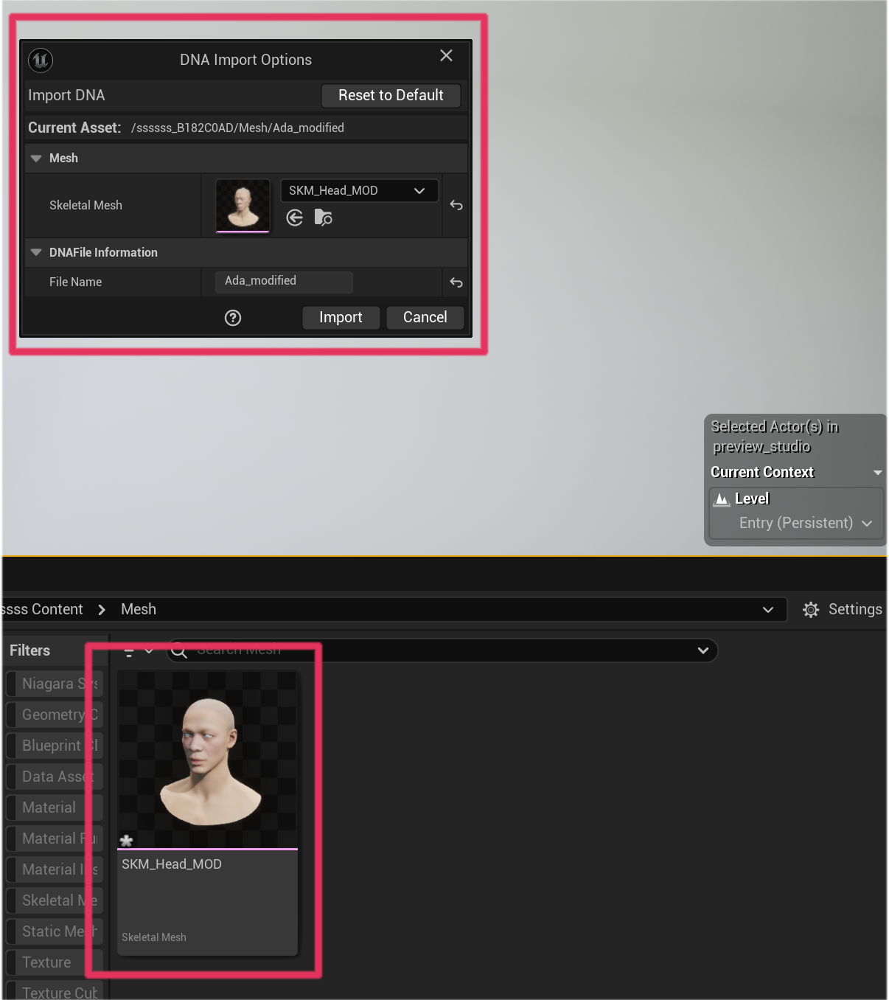
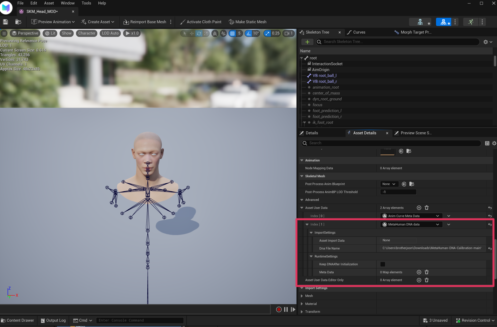

# ModKit

**6.1 CREATE A ZOI**

Open the ModKit editor and navigate to the following category.

CREATE A ZOI  
CAZ → Face

{ width="600" loading="lazy" }

---

**6.2 Create New Mod Project**

Select the base face and choose **Create new mod project**.

{ width="600" loading="lazy" }

---

**6.3 Mod Project Creation**

Enter the project information and click **Create**.

Example configuration

- Mod Name : Test_Head  
- Workspace Display Name : Test_Head  
- Author : Tester  
- Description : Test_Head  

{ width="600" loading="lazy" }

---

**6.4 Import Mesh and Thumbnail**

Import the mesh and thumbnail assets.

Mesh : required  
Thumbnail : optional

{ width="600" loading="lazy" }

---

**6.5 Assign Materials**

Open the imported skeletal mesh editor and assign the required materials.

{ width="600" loading="lazy" }

---

**6.6 Import Modified DNA**

Locate the modified DNA file generated earlier.

Example path

C:\...\Downloads\MetaHuman-DNA-Calibration-main\MetaHuman-DNA-Calibration-main\output

Select the following file.

Ada_modified.dna

{ width="600" loading="lazy" }

---

**6.7 Import DNA into ModKit**

Drag and drop the skeletal mesh into the ModKit editor.

The **DNA Import Options** window will appear.  
Click **Import** to apply the DNA data.

{ width="600" loading="lazy" }

---

**6.8 Verify DNA Data**

If the import succeeds, **MetaHuman DNA Data** will appear in the asset settings.

This indicates that the DNA data has been successfully applied.

{ width="600" loading="lazy" }

---

**6.9 Package the Mod**

Once the setup is complete, proceed with the packaging process.

Refer to the packaging guide:

[Packaging](https://mod-docs.playinzoi.com/ModKit/export/curseforge.html){ .md-button }

---

[‹ Previous](05FinalExport.md){ .md-button .md-button--primary .prev-btn }