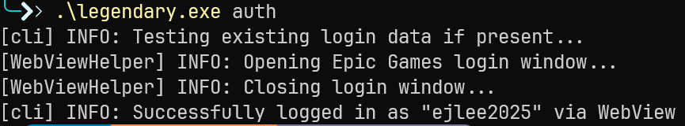
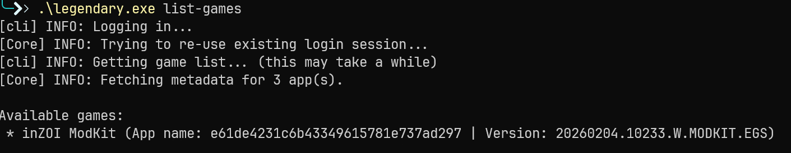
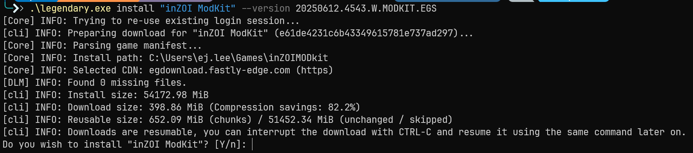
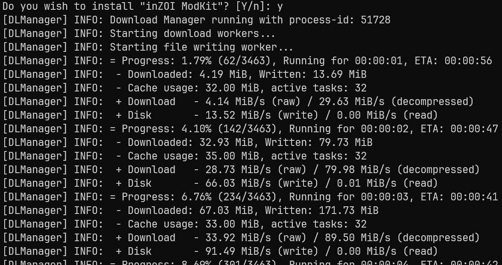

# Legendary

**Prerequisites**

The following items must be prepared in advance.

---

**0.1 Create an Epic Games Account**

[https://www.epicgames.com](https://www.epicgames.com){ .md-button }

1. Click **Sign In** in the top right corner  
2. If you do not have an account, proceed with **Sign Up**  
3. Complete email verification  

!!! note
    Legendary is a CLI tool that uses the Epic Games API, so an **Epic Games account is required.**

---

**0.2 Install Epic Launcher (Recommended)**

[https://store.epicgames.com](https://store.epicgames.com){ .md-button }

1. Install the Launcher  
2. Log in with your Epic account  
3. Confirm that **inZOI ModKit** is added to your account library

!!! warning
    If the ModKit is not in your library, the download may not be available.

---

**0.3 Recommended: Use PowerShell**

It is recommended to use Windows PowerShell or Windows Terminal.

---

## 1. Install Python 3.9

---

**1.1 Download**

Download the Python 3.9 installer from the official website.  
(Legendary recommends using Python 3.9.)

Official page:

[ Python Release Python 3.9.25](https://www.python.org/downloads/release/python-3925/){ .md-button }

Download item:

- **Windows installer (64-bit)**

---

**1.2 Required Installation Options**

Installation screen:

```text
✓ Add Python 3.9 to PATH
✓ Install launcher for all users
```

If these options are not checked, subsequent commands may not work properly.

---

**1.3 Verify Installation**

```powershell
python --version
py -0
```

Expected output:

```text
Python 3.9.x
Installed Pythons:
- 3.11-64
- 3.9-64
```

---

## 2. Virtual Env (Python 3.9)

---

**2.1 Create a Working Directory**

```powershell
mkdir C:\legendary_env
cd C:\legendary_env
```

---

**2.2 Create a Python 3.9 Virtual Environment**

On Windows, use the Python Launcher (`py`) instead of `python3.9`:

```powershell
py -3.9 -m venv venv
```

---

**2.3 Activate the Virtual Environment**

```powershell
venv\Scripts\activate
```

Make sure `(venv)` appears at the beginning of the command prompt.

Verify the Python version:

```powershell
python --version
```

→ Python 3.9.x

---

## 3. Install Legendary

---

**3.1 Update pip**

```powershell
python -m pip install --upgrade pip
```

---

**3.2 Install Legendary**

```powershell
pip install legendary-gl
```

Verify the installation:

```powershell
legendary --version
```

---

## 4. Epic Account Auth (Required Step)

Legendary requires authentication at least once.

```powershell
legendary auth
```

When your browser opens, log in with your Epic account.

Upon successful authentication:

{ width="600" loading="lazy" }

- The authentication token is stored locally.
- Re-authentication is not required afterward.

---

## 5. Check Available Games

```powershell
legendary list-games
```

Example output:

{ width="800" loading="lazy" }

!!! note
    Make sure to use the exact **App name** displayed in the `list-games` output.

---

## 6. Download inZOI ModKit

---

**6.1 Basic Installation**

```powershell
legendary install inzoi_modkit
```

---

**6.2 Install a Specific Version**

```powershell
legendary install "inZOI ModKit" --version [version_name]
```

Example output:

{ width="800" loading="lazy" }

---

Press **Y** to continue when prompted.

{ width="800" loading="lazy" }

---

**6.3 Verify Installed Items**

```powershell
legendary list-installed
```

---

## 7. Launching the ModKit

Navigate to the installation directory and run the executable file directly.

Or use:

```powershell
legendary launch inzoi_modkit
```

---

## 8. Troubleshooting

---

**❌ python3.9 not recognized**

On Windows, the following command may not exist:

```powershell
python3.9
```

Instead, use:

```powershell
py -3.9
```

---

**❌ No saved credentials**

```text
ValueError: No saved credentials
```

Solution:

```powershell
legendary auth
```

Authentication must be completed first.

---

**❌ Microsoft Store Python conflict**

Go to:

Settings → Apps → Advanced app settings → App execution aliases

Disable the following:

- `python.exe`
- `python3.exe`

---

**❌ Mixing administrator and normal permissions**

Legendary stores authentication credentials in the user directory.

- Running `auth` in Administrator PowerShell
- Running `list-games` in normal PowerShell

→ May result in a "no credentials" error.

Always use the same permission level consistently.

---

## 9. Reuse Virtual Env

When working again later:

```powershell
cd C:\legendary_env
venv\Scripts\activate
```

To deactivate:

```powershell
deactivate
```

---

## 10. Command Summary

```powershell
py -3.9 -m venv venv
venv\Scripts\activate
python -m pip install --upgrade pip
pip install legendary-gl
legendary auth
legendary list-games
legendary install inzoi_modkit
```