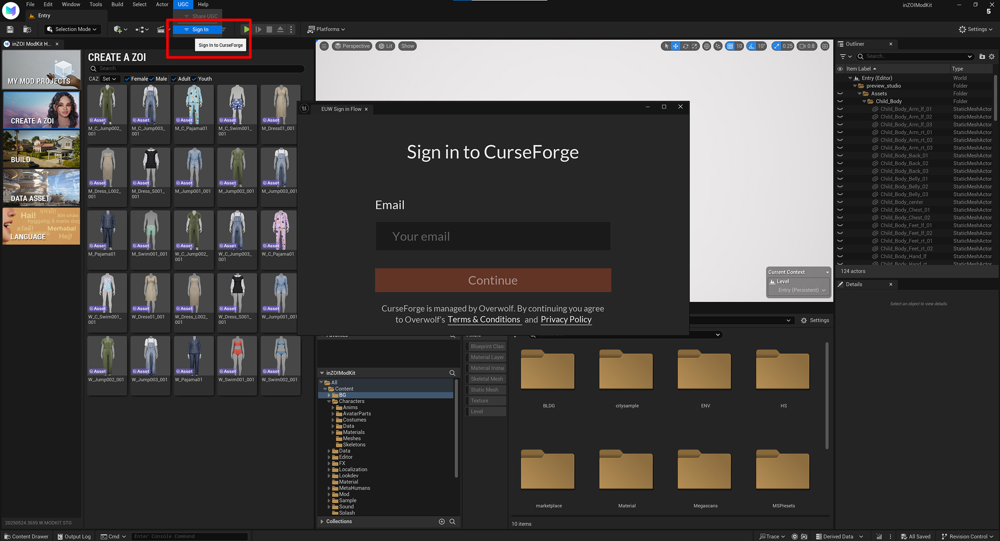
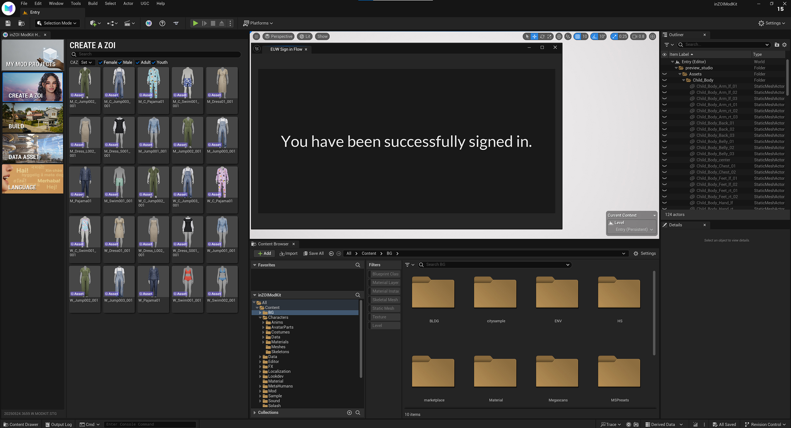
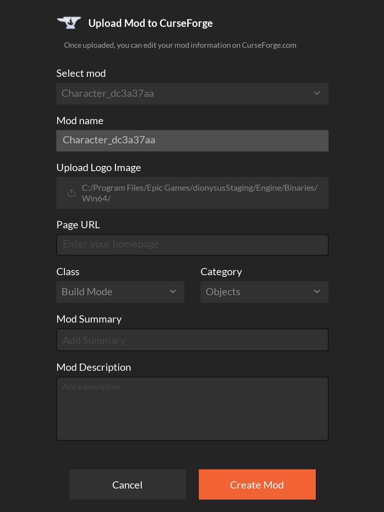
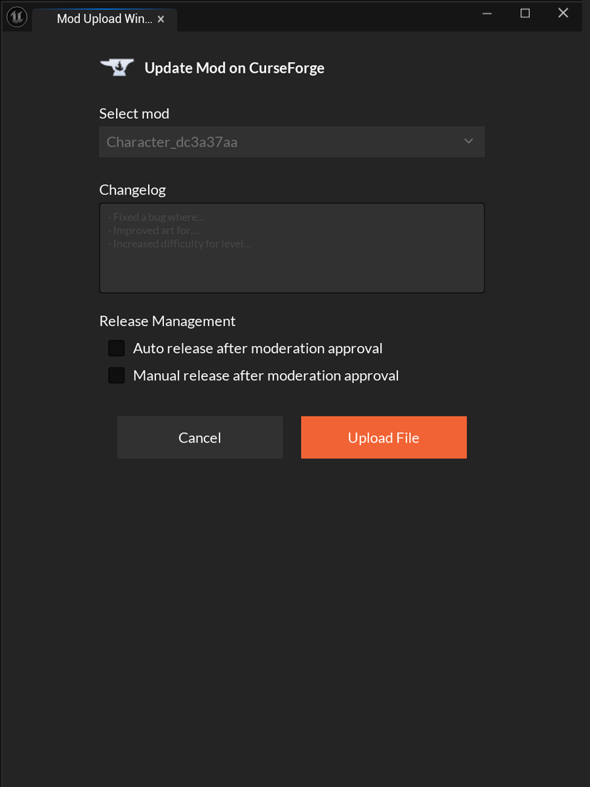
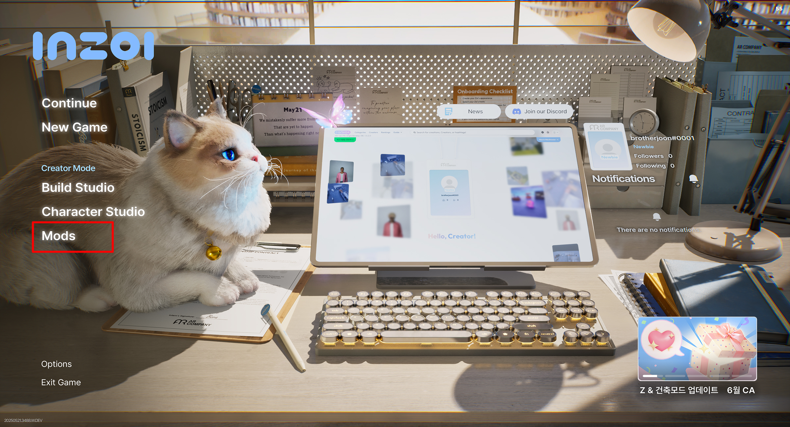
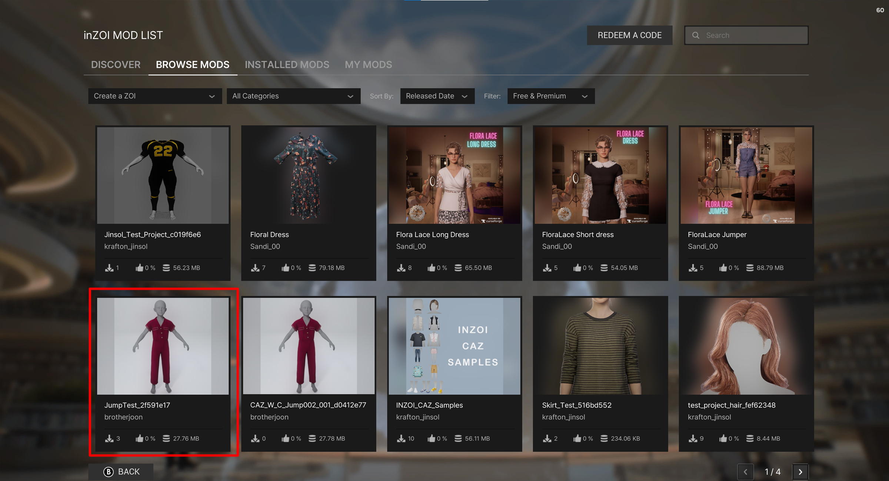
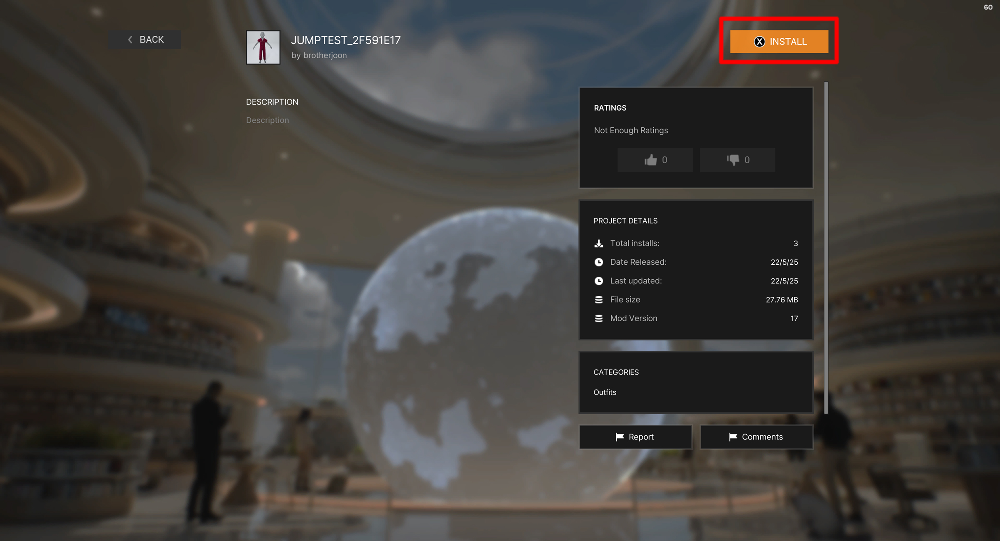
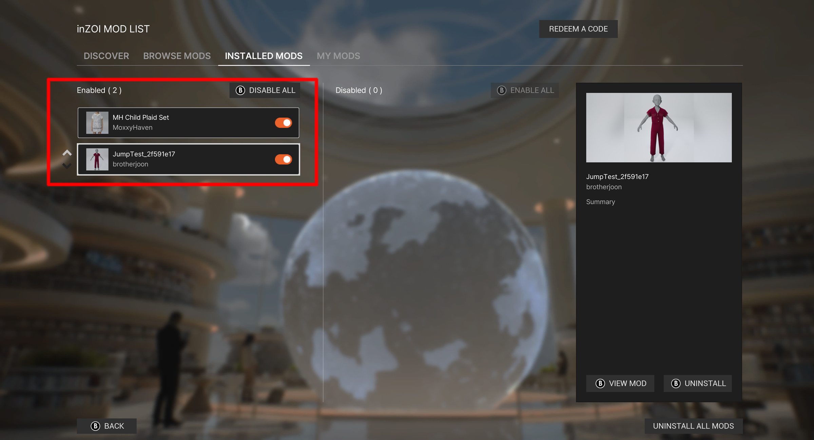
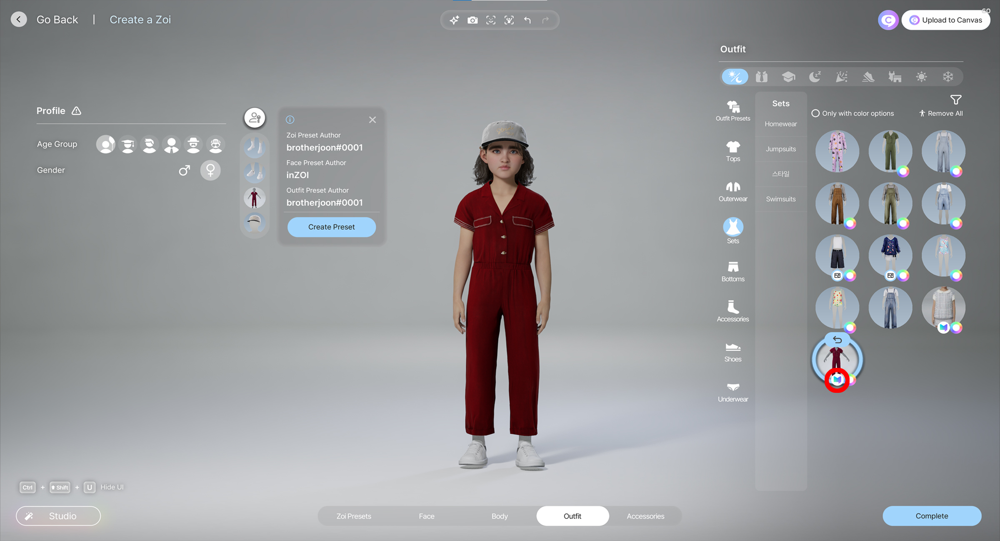

# CurseForge

This guide explains the steps to upload your inZOI mod to CurseForge.
Follow the instructions below to complete the registration successfully without any errors.

---

## 01. Sign Up on CurseForge  
Go to [https://www.curseforge.com/](https://www.curseforge.com/) and create an account.

---

## 02. Open Sign-In in Modkit  
Go to **UCC → Sign In** in the inZOI Modkit.

---

## 03. Log In  
Enter your registered email and password to log in.

---

## 04. Open Share UGC menu
Go to **UCC → Share UGC** in the inZOI Modkit.

---

## 05. Click "Create Mod"
When you're ready to enter mod details, click **Create Mod**.

---

🔧 Upload Mod to CurseForge

**✔ Select mod**  
Select the `.mod` file from your current project to upload.

**✔ Mod name**  
The name that will be registered on CurseForge.  
_Default: Uses the name of the selected mod file._

**✔ Upload Logo Image**  
Upload a logo image (thumbnail) to be displayed on CurseForge.  
**Recommended size**: `512×512` or `256×256` (JPG/PNG)

**✔ Page URL (Optional)**  
A link to the mod’s homepage or info page.  
> e.g. GitHub, personal blog, forum page

**✔ Class**  
Choose the class your mod belongs to.

**✔ Category**  
Select a specific category based on the class.

**✔ Mod Summary**  
A short description shown in the mod listing.

**✔ Mod Description**  
A detailed explanation that appears on the mod’s page.  
You may include:
- Features  
- Usage instructions  
- Version history

---

## 06. Check Auto Package 
After registering the mod, check if a **Package** is automatically generated at the bottom.  
If it appears without errors, the upload was successful.

🛠️ Update Mod on CurseForge

**✔ Select mod**  
Choose the mod you want to update.  

---

**✔ Changelog**  
Enter the changes made in this update.  
Examples:  
- Fixed a bug where...  
- Improved art for...  
- Increased difficulty for level...

---

**✔ Release Management**  
Choose how the mod will be released after moderation.

- [ ] **Auto release after moderation approval**  
  → Automatically publishes the mod once approved.

- [ ] **Manual release after moderation approval**  
  → You must manually trigger the release after approval.

---

## 07. Moderation

  1. Send the finished mod to moderation (done via the CF author's console)
  2. Wait for moderation approval
  3. Depends on what you selected in the "Release management" option
    1. Either mod is going live after approval
    2. Or the author will publish it manually

---

## 08. Launch inZOI (Steam)

Launch inZOI from Steam and open the **Mods** menu.

---

## 09. Choose Your Mod

In the **My mods**, double-click the mod file you created.

---

## 10. Click "Install"

Click the **INSTALL** button to install the selected mod.

---

## 11. Enable & Go to Lobby

In **INSTALLED MODS**, enable the installed mod and click **Back** to return to the lobby screen.

---

## 12. Confirm in Studio

Once you're back in the lobby screen, check the mod in **Character Studio** or **Build Studio**.  
If the installation was successful, a **Modkit icon** will appear at the bottom of the screen.

