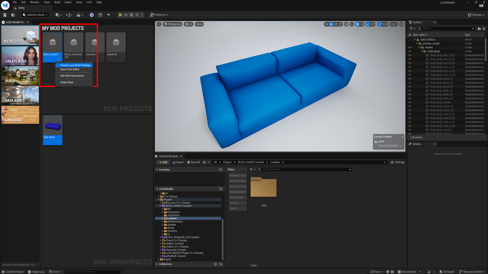
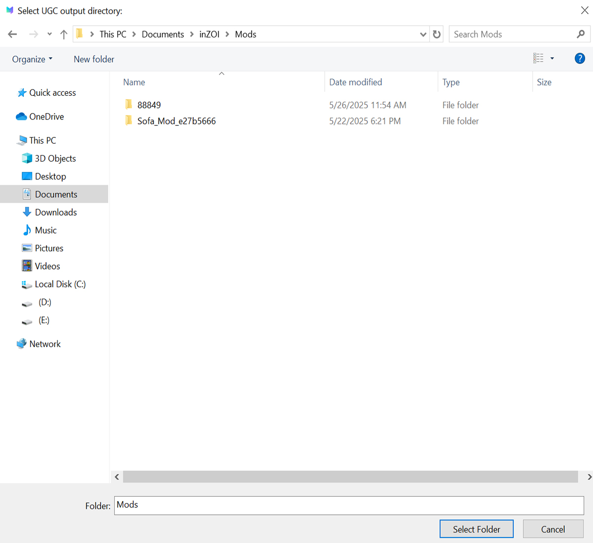
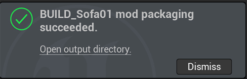
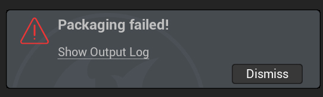

# Local

Export your inZOI mod using the "Create Local Mod Package" feature to test or share it locally.

---

## 01. Local Mod Package

Click on **Create Local Mod Package**.

---

## 02. Choose save location

Set the path to `This PC > Documents > inZOI > Mods`

---

## 03. Confirm success

If you see a message in the bottom right corner of the screen saying “Packaging successful,” the process is complete.

---

## 04. Verify In-Game

Launch the game and check Build Studio to see if the created furniture has been applied correctly.

## 05. Packaging failed!

If you see the Packaging failed! message, it most likely means that one or more required assets are missing.

    Make sure that at least one of the following is properly assigned: Mesh, Material, or Texture.

If any of these assets are missing, the packaging process cannot be completed successfully.
Please double-check in the Content Editor to ensure that each element is correctly linked.

