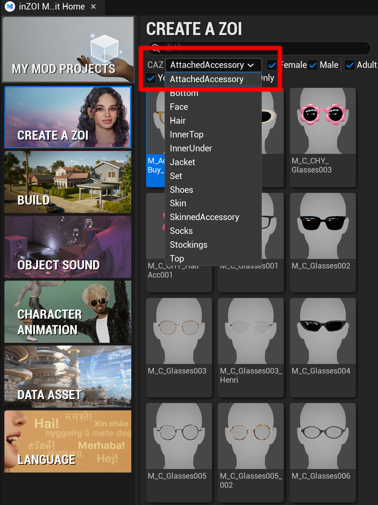
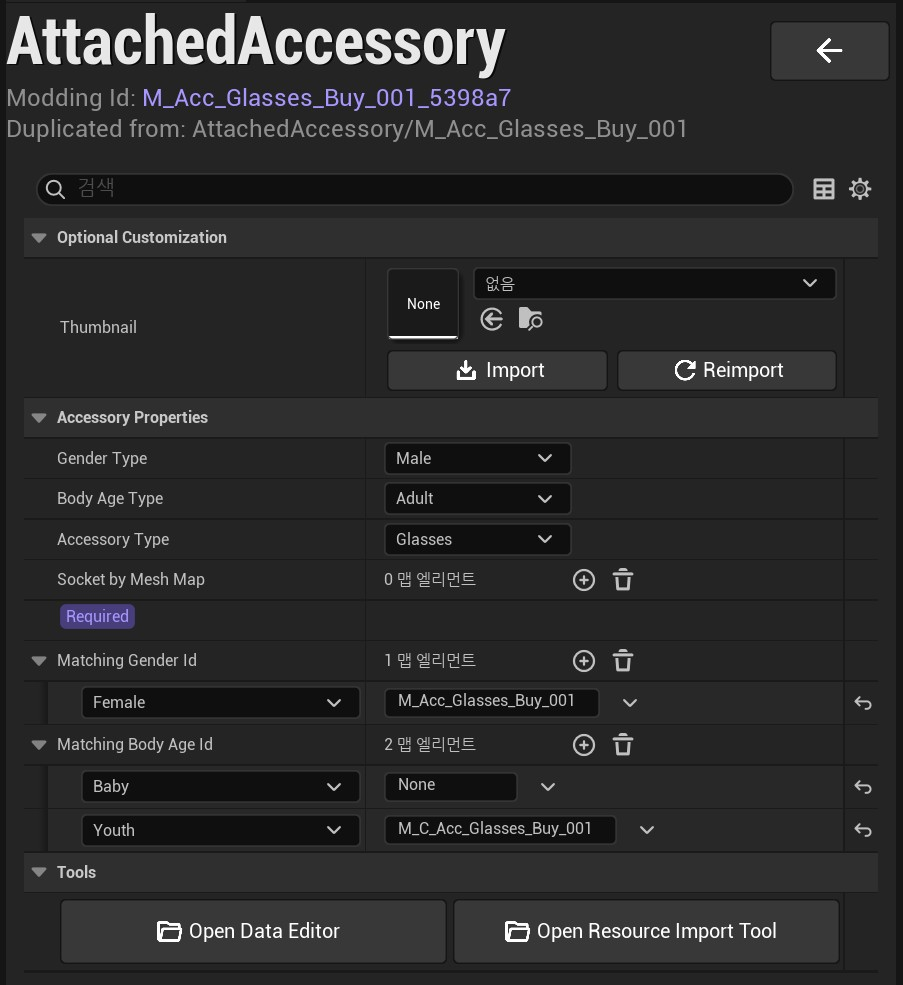

# 01. Overview

First, select the following item in the ModKit.

- Click **Character → AttachedAccessory**

{ width="500" loading="lazy" }

---

After selecting it, the **AttachedAccessory configuration panel** will open as shown below.

{ width="500" loading="lazy" }

---

**Optional Customization**

- **Thumbnail**
  - Registers the thumbnail image for the item

---

**Accessory Properties**

- **Gender Type**
  - Defines which gender can use the item  
  - Example: `Male`, `Female`

- **Body Age Type**
  - Defines the age group for the item  
  - Example: `Adult`, `Child`

- **Accessory Type**
  - Selects the accessory category

  Types:

  - `Glasses` : Glasses  
  - `Earring` : Earrings  
  - `HairAccessory` : Hair accessories  
  - `Piercing` : Piercings  
  - `CraftingMaterial` : Processed gem (content-related)

---

**Socket by Mesh Map**

- Connects static mesh assets to specific socket positions  
- Click the `+` button to add entries

**Socket Positions**

- **Head**
  - Top of the head (used for hair accessories)

- **Nose Upper**
  - Nose bridge (used for glasses – Adult Female / Children)

- **Glasses**
  - Nose bridge (used for glasses – Adult Male)

- **L Ear 4 / R Ear 4**
  - Lower ear (used for earrings)

- **L Ear 3 / R Ear 3**
  - Middle ear (used for earrings)

- **L Ear 2 / R Ear 2**
  - Upper ear (used for earrings)

- **Facial Root**
  - Center of the face (used for hair accessories)

- **L Forehead Out / R Forehead Out**
  - Eyebrow (used for eyebrow piercings)

- **Nostril**
  - Nose (used for nose piercings)

- **Lip Lower**
  - Lip (used for lip piercings)

---

**Matching Gender Id**

- Defines which item ID is displayed when the gender is changed in CAZ

---

**Matching Body Age Id**

- Defines which item ID is displayed when the age group is changed in CAZ

---

**Tools**

- **Open Data Editor**
  - Opens the data editor for advanced configuration

- **Open Resource Import Tool**
  - Opens the resource import tool

---

!!! tip
    Make sure to select the correct socket based on the accessory type.  
    Incorrect socket selection may result in misaligned or improperly attached items in-game.