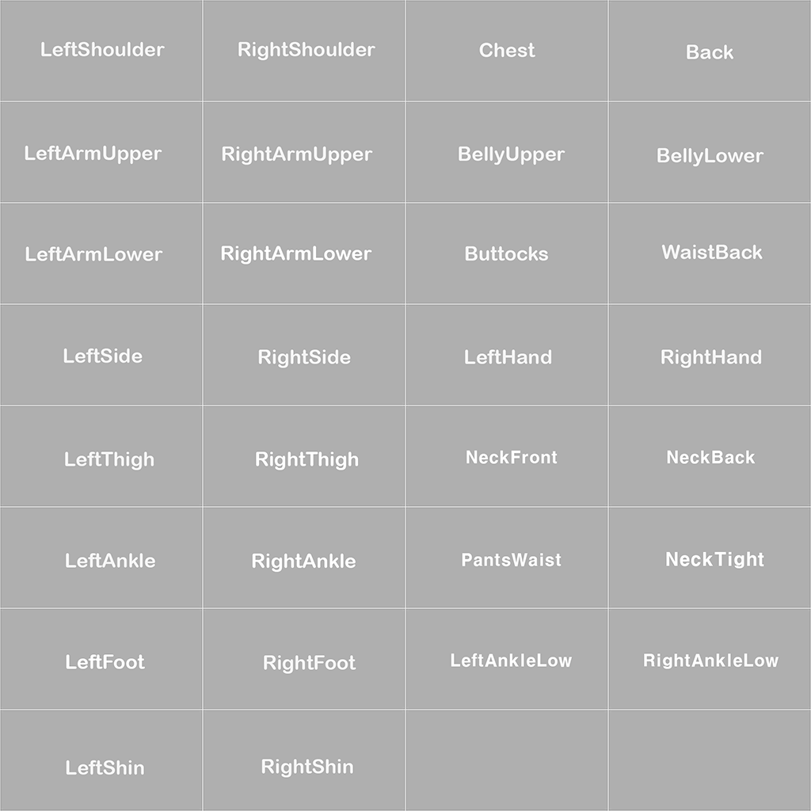
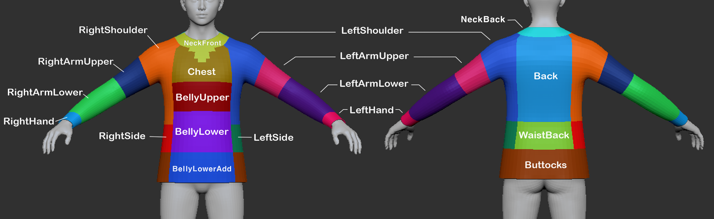
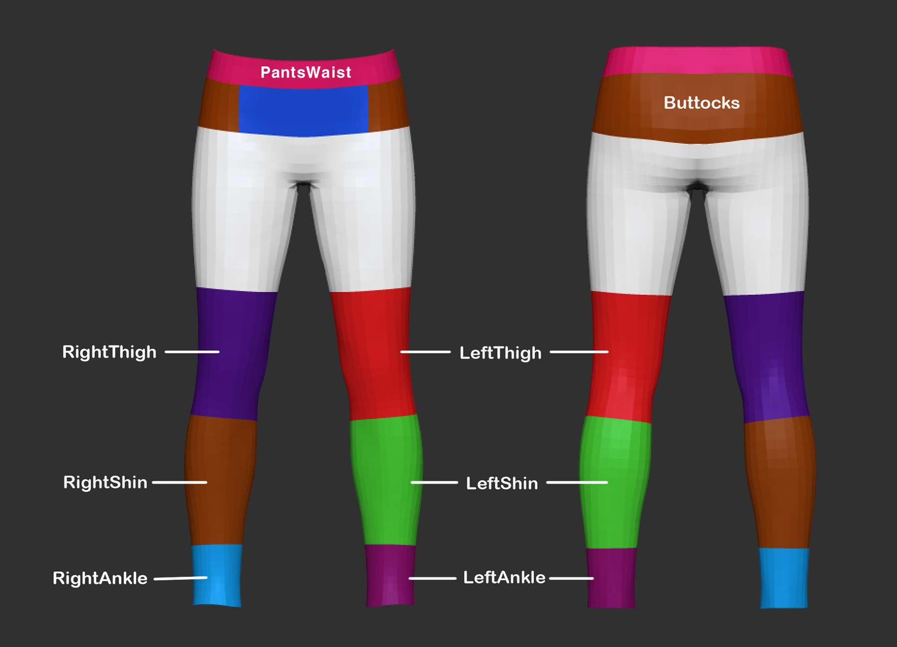
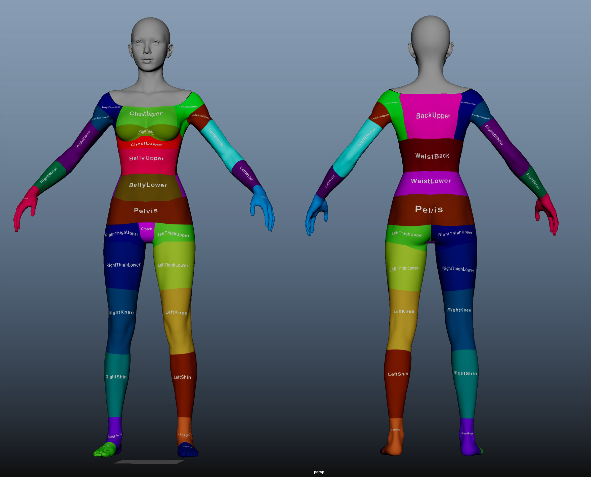
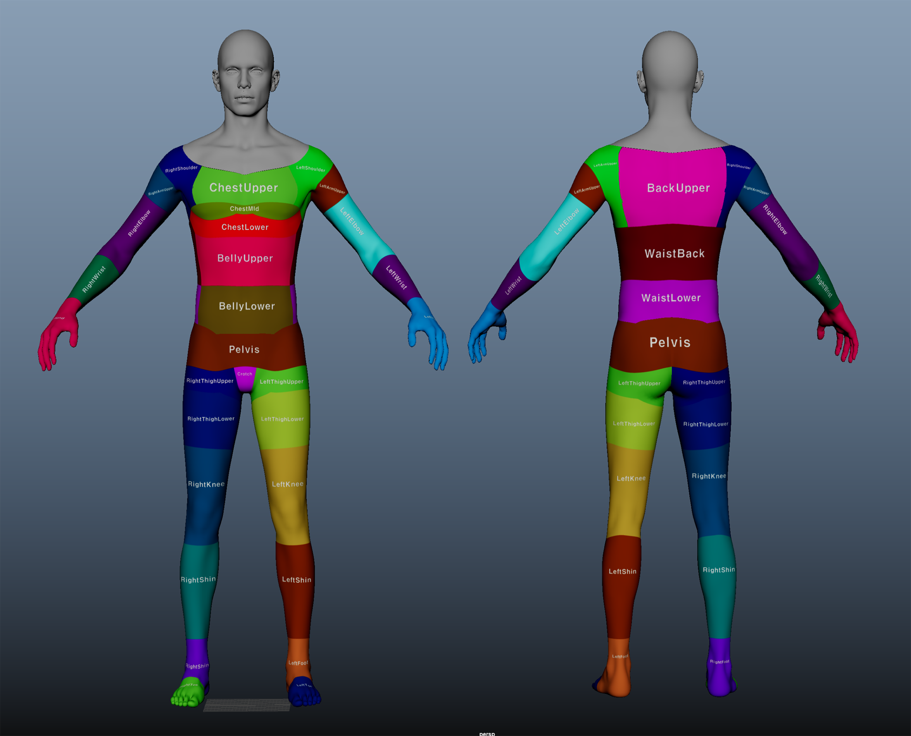


**Purpose**

When an outfit is equipped on a character:

- It should naturally hide the character's body mesh, and  
- Enable proper layer combinations without visual conflicts.  

To achieve this, you must correctly understand and apply  
**Drawing Regions**, **Covering Regions**, and **Body Regions**.

---

**Why the Masking System Is Needed**

- A single outfit works fine by itself,  
- But when **combined with other outfits**, or  
- **Overlaps the body mesh**,  

→ Visual issues like **mesh clipping or intersection** may occur.

To prevent this:

- Define **which areas of your outfit should be masked** (Drawing Regions)  
- Specify **which lower-layer outfit parts should be hidden** (Covering Regions)  
- Hide **specific parts of the character’s body** (Body Regions)

---

**Masking System Overview**

| System Type       | Description                          | How to Apply                            |
|-------------------|--------------------------------------|------------------------------------------|
| Drawing Regions   | Areas of the outfit to be masked     | Place UVs in designated regions on UV Channel 2 |
| Covering Regions  | Parts of lower-layer outfits to hide | Assign Covering Region IDs              |
| Body Regions      | Body parts to hide when equipped     | Assign Body Region IDs                  |

---

**1. Drawing Regions**

**- Description**  
- Set mask regions using **UV Channel 2**.  
- Place UV shells into the designated region areas.

**- UV Channel 2 Workflow**

1. Create UV Channel 2  
2. Move UV shells to the correct Region ID areas  
3. Use guides to avoid overlap between different regions

**- Example Region IDs**

| Region ID       | Description        |
|------------------|--------------------|
| Chest            | Chest area         |
| BellyUpper       | Upper abdomen      |
| LeftArmUpper     | Left upper arm     |

**- UV Channel 2 Region Guide**

**- Upper Layer Masking Region Guide**

**- Lower Layer Masking Region Guide**

---

**2. Covering Regions**

**- Description**

- Use this when your outfit should hide another outfit in a lower layer.  
- Example: If a long top covers the waist of pants, set `PantsWaist` as a Covering Region.  
  - The pants must also have `PantsWaist` in their Drawing Regions, properly set in UV2.

**- Covering Region Workflow**

1. Add individual or group IDs in the `"Covering Regions"` field

---

**3. Body Regions**

**- Description**

- Defines which parts of the character’s **body mesh** should be hidden when wearing the outfit.  
- Used to prevent body parts from poking through shirts, pants, shoes, etc.

**- Body Masking Region Guide**

---

**Full ID List (Summary)**

| Drawing / Covering Regions (Clothing Parts) | Body Regions (Body Parts)    |
|---------------------------------------------|-------------------------------|
| LeftShoulder, RightShoulder                 | ChestUpper, BackUpper         |
| Chest, Back, BellyUpper                     | LeftArmUpper, LeftElbow       |
| LeftArmUpper, RightArmUpper                 | BellyUpper, BellyLower        |
| LeftThigh, RightThigh                       | WaistBack, Pelvis             |
| LeftShin, RightShin                         | LeftShin, RightShin           |
| LeftFoot, RightFoot                         | LeftFoot, RightFoot           |
| etc.                                        | etc.                          |

---

**Group ID System**

Group IDs allow bundling multiple Region IDs into a single convenient setting.

| Group ID Name   | Example Included Regions                          |
|------------------|--------------------------------------------------|
| UpperBodyClosed  | Chest, BellyUpper, Back, LeftArmUpper, RightArmUpper |
| BottomMid        | BellyLower, Buttocks, LeftThigh, RightThigh     |
| ArmsAll          | LeftArmUpper, LeftArmLower, RightArmUpper, RightArmLower |

- Beginners can use Group IDs for faster setup  
- Advanced users may add individual IDs for more control

---

**Common Mistakes & Fixes**

| Mistake                    | Cause                                                        | Solution                          |
|----------------------------|---------------------------------------------------------------|-----------------------------------|
| UV2 not set                | UV Channel 2 not included                                     | Make sure UV2 is exported         |
| My outfit isn’t masked     | - Incorrect UV2 setup - Missing Drawing Region ID - Missing matching Covering Region ID | - Fix UV2 - Add Region IDs     |
| Lower outfit not masked    | - Missing Covering Region ID - No matching Drawing Region on lower outfit | Fix Covering Region ID            |
| Body pokes through outfit  | Body Region not set                                           | Add the correct Body Region ID    |

---

**Chapter Summary

| Checklist                          | Done |
|------------------------------------|------|
| UV Channel 2 created and placed    | ✅    |
| Drawing Regions set                | ✅    |
| Covering Regions set               | ✅    |
| Body Regions set                   | ✅    |
| Group ID used if needed            | ✅    |

---

[‹ Previous](02.%20Deformed%20Mesh.md){ .md-button .md-button--primary .prev-btn }
[Next ›](04.%20Texture%20Creation.md){ .md-button .md-button--primary .next-btn }