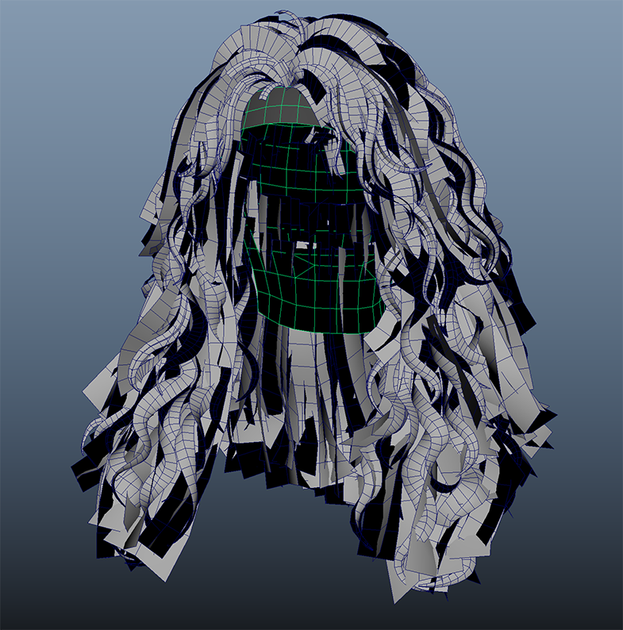
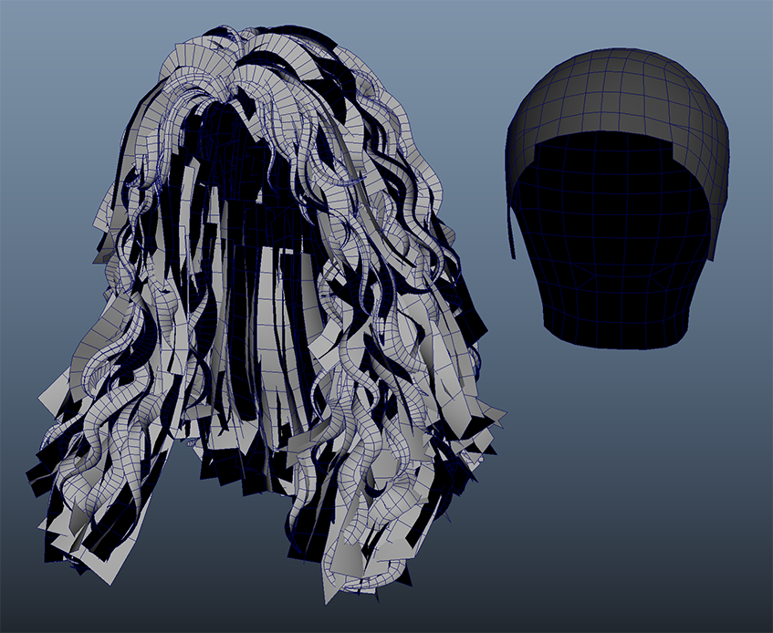
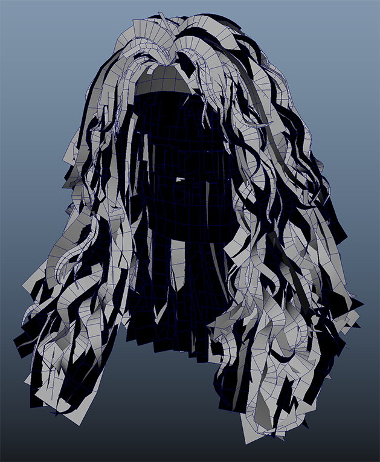
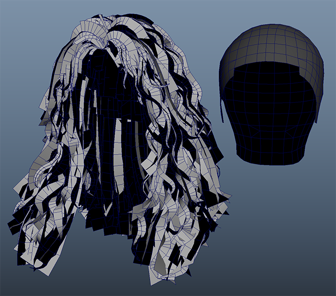
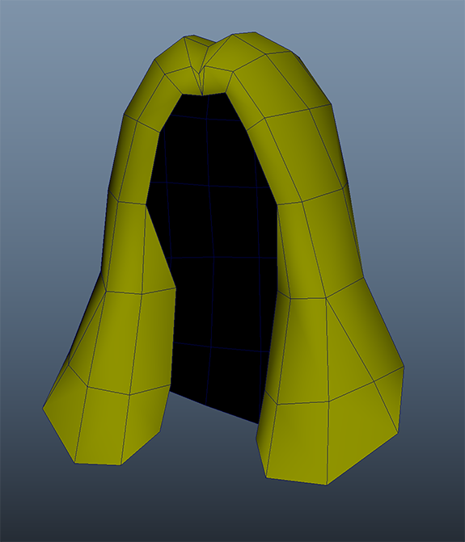

# 03.Structure

??? info "Purpose"
    In this step, you will learn about the **mesh composition** and **LOD (Level of Detail)** structure of inZOI hair.
    The hair is not a single mesh — it is divided into **HairCards** and a **Scalp**, each using its own material slot. It also includes multiple **LODs** for performance optimization.

---

**Composition Summary**

| component | explanation |
|---|---|
| Hair Mesh | The main **HairCard** mesh.   Includes a UV2 channel for customization, enabling tint, highlight, and hair length adjustment features. |
| Scalp Mesh | A supporting mesh that maintains scalp detail.   Uses the same skeleton as the HairCard mesh, but does **not** require a UV2 channel. |
| Material Slots | Separate material slots are used for HairCard and Scalp.   <ul><li>Slot 0: `MI_AssetName`</li><li>Slot 1: `MI_AssetName_Scalp`</li><li>Slot 2: `MI_AssetName_LOD`</li></ul> |
| LOD structure | Create **LOD0**, **LOD2**, and **LOD4**.   LOD1 = LOD0   LOD3 = LOD2   As such, LOD1 and LOD3 share the same meshes as LOD0 and LOD2, respectively. |

---

**LOD Step-by-Step Explanation**

| LOD steps | composition | use |
|---|---|---|
| LOD0 | Includes both Hair and Scalp meshes; highest quality version. | Used for customization view and close-up display |
| LOD2 | Includes Hair and Scalp, but with one-third of the HairCard density. | Used for general gameplay camera distance. |
| LOD4 | Hair only; simplified low-poly mesh (Scalp not included) | Used for distant rendering and performance mode. |

---

    <table>
        <thead>
            <tr>
                <th style="text-align: left;"></th>
                <th style="text-align: left;">HairCard + Scalp</th>
                <th style="text-align: left;">Example image for Scalp mesh check</th>
            </tr>
        </thead>
        <tbody>
            <tr>
                <td rowspan="2" style="vertical-align: top; text-align: left;"><strong>LOD0 example</strong></td>
                <td></td>
                <td></td>
            </tr>
            <tr>
                <td colspan="2" style="text-align: center;">Number of triangles - approximately 40,000</td>
            </tr>
            <tr>
                <td rowspan="2" style="vertical-align: top; text-align: left;"><strong>LOD2 example</strong></td>
                <td></td>
                <td></td>
            </tr>
            <tr>
                <td colspan="2" style="text-align: center;">Number of triangles - approximately 15,000</td>
            </tr>
            <tr>
                <td rowspan="2" style="vertical-align: top; text-align: left;"><strong>LOD4 example</strong></td>
                <td></td>
                <td></td>
            </tr>
            <tr>
                <td colspan="2" style="text-align: center;">Number of triangles - approximately 170</td>
            </tr>
        </tbody>
    </table>

---

* The number of triangles may vary depending on the hairstyle.
* Scalp is not included in LOD4

??? tip "💡 ModKit Standard:"
    LOD creation is **optional**.   You can build with just LOD0, and creating LOD2 and LOD4 will improve performance.

---

**Mesh naming conventions**

| item | rule | example |
|---|---|---|
| Final Skeletal Mesh | `SKM_[Gender]_Hair_[StyleID]` | `SKM_Female_Hair_L_007` |
| Hair mesh (by LOD) | `[Gender]_Hair_[StyleID]_LOD#` | <ul><li>`Female_Hair_L_007_LOD0`</li><li>`Female_Hair_L_007_Scalp_LOD0`</li><li>`Female_Hair_L_007_LOD2`</li><li>`Female_Hair_L_007_Scalp_LOD2`</li><li>`Female_Hair_L_007_LOD4`</li></ul>
| Scalp mesh (by LOD) | `[Gender]_Hair_[StyleID]_Scalp_LOD#` | <ul><li>`Female_Hair_L_007_Scalp_LOD0`</li><li>`Female_Hair_L_007_Scalp_LOD2`</li></ul> |

---

**Things to check**

| item | Things to check |
|---|---|
| Are HairCard and Scalp bound to the same Skeleton? | Check that HairCard and Scalp use separate material slots. |
| Does the Scalp mesh exclude the UV2 channel? | If the Scalp mesh contains a UV2 channel, remove it. |
| Is the Scalp mesh excluded from LOD4? | LOD4 should be created as a simplified single mesh without Scalp. |

---

**Mistake-avoidance tips**

| situation | cause | How to solve |
|---|---|---|
| UV2 channel exists on Scalp mesh | Unnecessary UV data included | Verify and remove UV2 before export |
| Scalp visible in LOD2 | Scalp mesh still included | Use the same Scalp mesh as LOD0 for LOD2 |

---

**Summary of this section**

| Checklist | Whether completed |
|---|---|
| Understanding Hair + Scalp Composition | ✅ |
| Understanding the LOD0 / LOD2 / LOD4 structure | ✅ |
| Check Material Slot Separation | ✅ |
| UV2 exists only in the Hair mesh | ✅ |

---

[‹ Previous](02.Import.md){ .md-button .md-button--primary .prev-btn }
[Next ›](04.UVCustomization.md){ .md-button .md-button--primary .next-btn }
