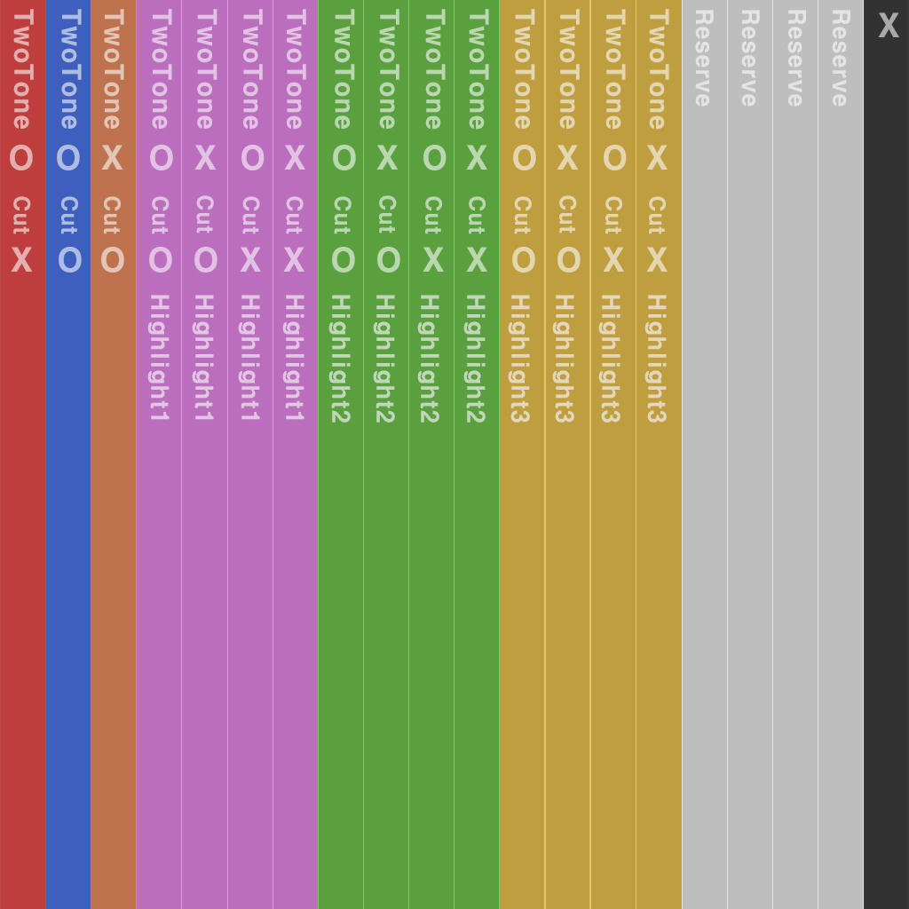

# 04.UVCustomization

??? info "Purpose"
    In this step, you will learn how the **UV2 channel structure** and **customization functions** operate in inZOI hair.
    
    The UV2 channel is a core data channel that controls **hair tint color**, **length adjustment**, and **highlight color**, but it is **not required for every hairstyle**.
    
    Even without UV2, basic hair meshes can still be registered normally as single-color hairstyles.

---

**Composition Summary**

| division | explanation |
|---|---|
| UV1 | Basic UVs for texture mapping.   Two DIRO/Flow textures are used. |
| UV2 | Data UV for customization features. Used only for Hair card meshes, not required for Scalp. |
| use | Control two-tone color, hair length adjustment, and Highlight color based on U/V area information of UV2. |
| Terms of Use | The feature is automatically activated based on the PartsId setting ( `AppearanceParts.Json` ) |

---

**UV2 channel structure**

| direction | role | explanation |
|---|---|---|
| V direction | Color interpolation criteria in the direction from Root to Tip | As you move from root to tip, apply a gradient from RootColor to TipColor. |
| U direction | Separation of data areas by function | Two-tone / cut / Highlight 1, 2, 3 / reserve areas arranged in order |

> The UV2 channel should only be present in the hair card mesh, and not in the Scalp mesh.

**UV2 Channel Area Guide**

* This is an area for customizing color and length, and is not included in Scalp.

---

**Hair that requires UV2 channel / Hair that does not require UV2 channel**

| division | Whether to use UV2 | Support features | PartsId | explanation |
|---|:---:|---|---|---|
| Basic hair   (single color) | ❌ | Single color only | Hair_00 | The simplest form of hair. Does not support two-tone, Highlight Color, or cut features. |
| Customizing Hair   (Extension) | ✅ | Two-tone /   Highlight Color /   Hair cutting function | Please refer to the PartsId table | Activate each function using the area information of the UV2 channel. |

---

**UV2 area by function**

| function | explanation | UV2 data area |
|---|---|---|
| TwoTone (two-tone color) | Color gradient between RootColor and TipColor | Refer to the UV2 channel area guide image |
| Cut (hair length adjustment) | Ability for users to adjust hair length with a slider in the customization menu | |
| Highlight Color 1~3 | Highlight color assignment (areas 1-3) | |
| Reserve | For future expansion | |

??? warning "Caution:"
    * `Cut` in UV2 is a "function to adjust the length in customizing."
    * The "Hair is automatically cut when wearing a hood" feature `Enable Hair Cut Height` is enabled by a setting in Hair Properties.

---

**Things to check**

| item | Things to check |
|---|---|
| Does the Hair card mesh have a UV2 channel? | Delete UV2 channel if two-tone, Highlight Color, or length adjustment is not necessary. |
| Scalp mesh doesn't have UV2 | Scalp mesh does not always require UV2 channel |
| Are the PartsIds assigned to the appropriate function (Hair_00 / Hair_01, etc.)? | Apply the appropriate ID by referring to the PartsID table.   * Editable in AppearanceHair.json in Data Editor |
| Are the UV2 areas positioned correctly and without overlapping? | Refer to the UV2 channel area guide image |

---

**Mistake-avoidance tips**

<table>
    <thead>
        <tr>
            <th style="text-align: left;">situation</th>
            <th style="text-align: left;">cause</th>
            <th style="text-align: left;">How to solve</th>
        </tr>
    </thead>
    <tbody>
        <tr>
            <td>Two-tone color is not applied</td>
            <td rowspan="3">UV2 is missing or PartsId not specified </td>           
            <td>Check for the presence of UV2</td>
        </tr>
        <tr>
            <td>Hair length adjustment function not working</td>
            <td>Check PartsId</td>
        </tr>
        <tr>
            <td>Only some of the Highlight colors are displayed</td>
            <td>Check the area within UV2</td>
        </tr>
    </tbody>
</table>

---

**Summary of this section**

| Checklist | Whether completed |
|---|---|
| Understanding UV1/UV2 Roles | ✅ |
| Scalp does not include UV2 | ✅ |
| Basic hair (Hair_00) can be registered without UV2 | ✅ |
| Familiarize yourself with the two-tone/Highlight Color/cut function activation conditions | ✅ |
| Check UV2 coordinates and direction | ✅ |

---

[‹ Previous](03.Structure.md){ .md-button .md-button--primary .prev-btn }
[Next ›](05.TextureSetup.md){ .md-button .md-button--primary .next-btn }