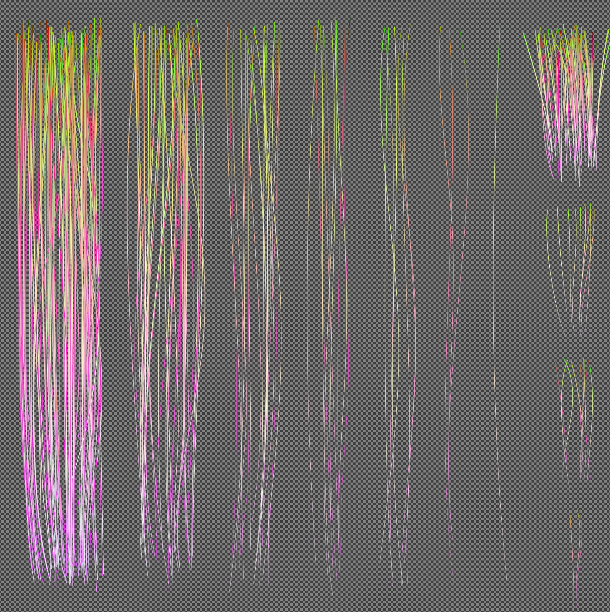
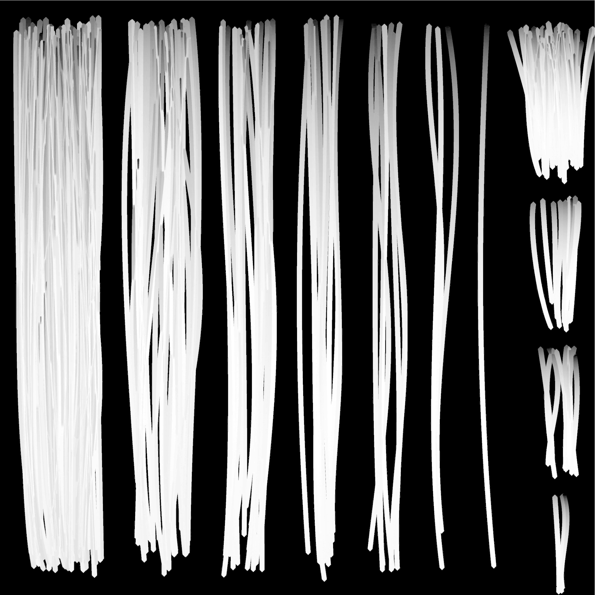
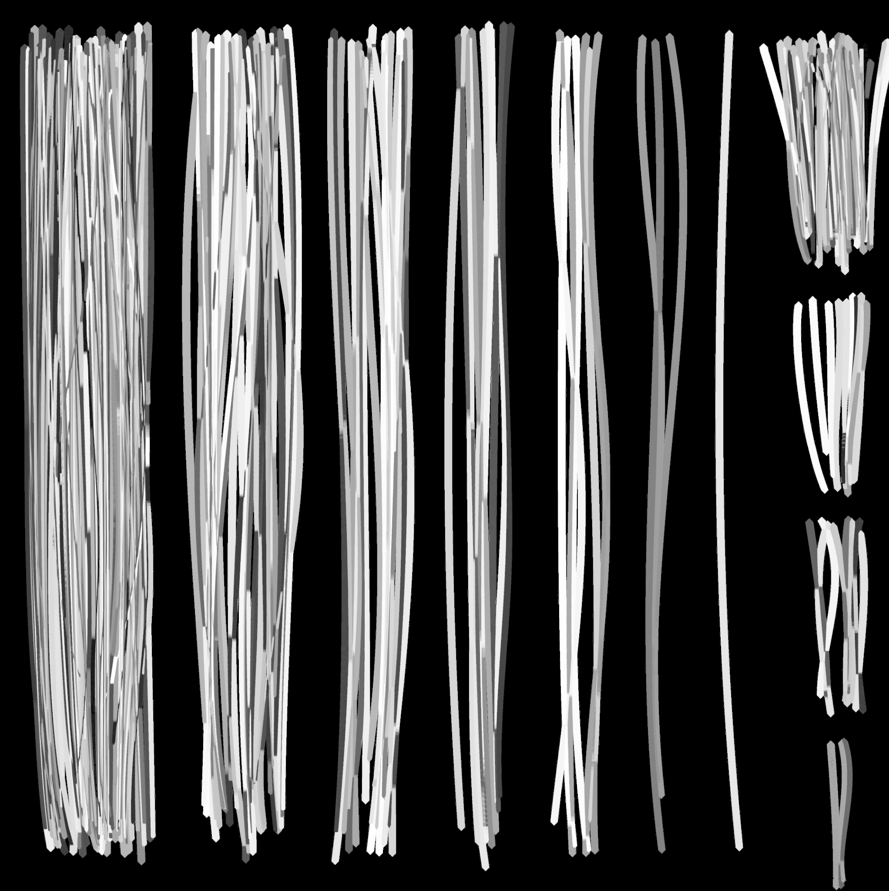
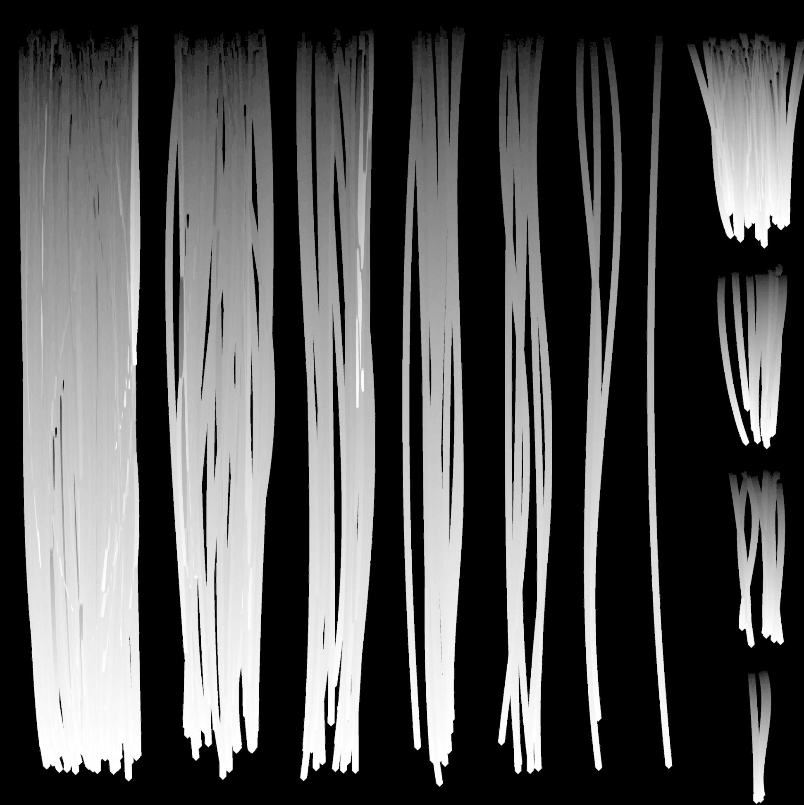
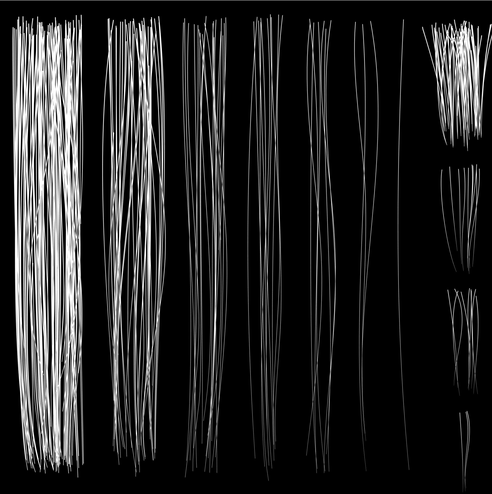
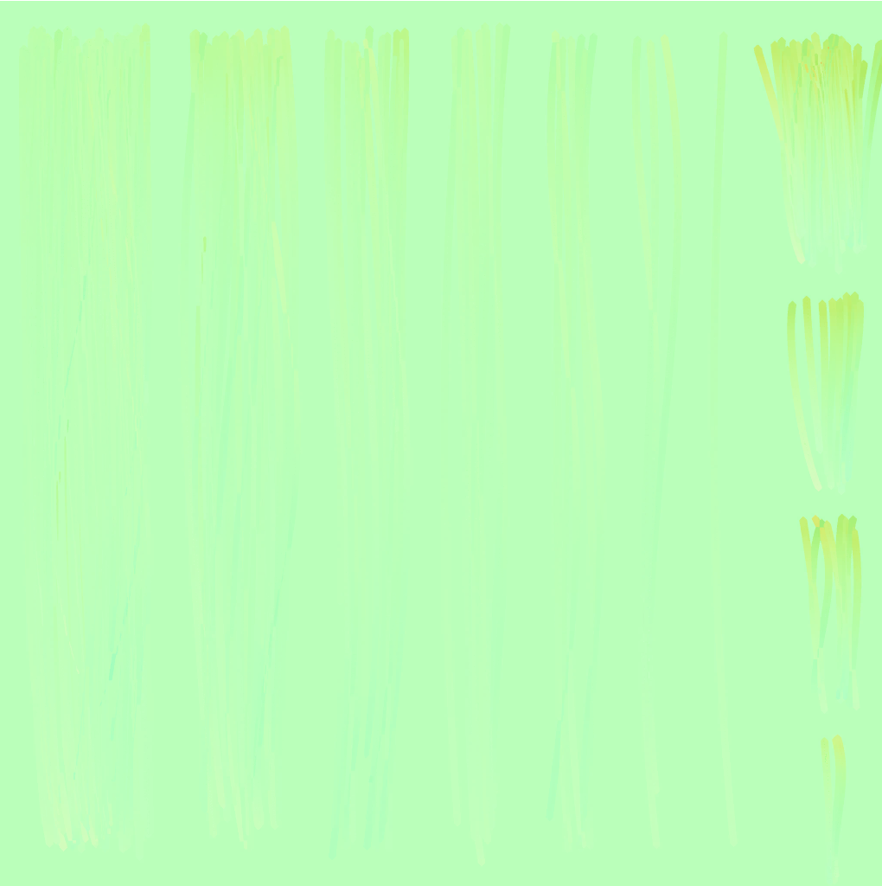
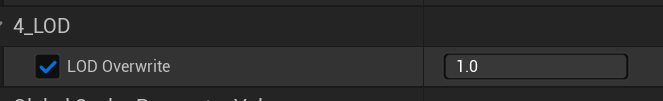

# 05.TextureSetup

??? info "Purpose"
    In this step, you'll understand the texture structure of synthetic hair and the role of each map. Hair's shine, directionality, and transparency are all expressed through two textures: a **DIRO map** and a **Flow map**. These maps are applied to the Hair/Scalp slots using the same master material.

---

**Texture Composition Summary**

| division | Example file name | Format | sRGB | explanation |
|---|---|---|---|---|
| DIRO map | `HairCard##_DIR0.tga` | TGA | OFF | Core texture with Depth/ID/Root/Opacity packed into RGBA channels |
| Flow map | `HairCard##_Flow.png` | PNG | OFF | Used for anisotropic expression by controlling hair direction |

---

**DIRO Map (Depth / ID / Root / Opacity)**

File rules: `.tga` , `sRGB OFF` , `RGBA 4-channel use`

| channel | name | role |
|---|---|---|
| R | Depth | Hair card depth and shading information expression |
| G | ID | Identification channel for highlight distinction   Also used to express aged gray hair |
| B | Root | Hair root color and gradient starting point data |
| A | Opacity | Hair Card Cutout (Transparency) Information |

??? tip "Tip:"
    The quality of the DIRO map determines the overall texture of the hair. If the color contrast between textures is too strong, the edges can become noticeable, so it is recommended to use a smooth gradient for the Depth and Root values.

**DIRO Map Example**

    

<table>
    <thead>
        <tr>
            <th style="text-align: center;">R Channel - Depth</th>
            <th style="text-align: center;">G Channel - ID</th>
            <th style="text-align: center;">B Channel - Root</th>
            <th style="text-align: center;">A Channel - Opacity</th>
        </tr>
    </thead>
    <tbody>
        <tr>
            <td></td>
            <td></td>
            <td></td>
            <td></td>
        </tr>
    </tbody>
</table>

---

**Flow Map (Directional Map)**

File rules: `.png` , `sRGB OFF`

| role | explanation |
|---|---|
| Direction | By controlling the light reflection direction of the hair card, highlights similar to the actual flow of light are expressed. |
| Anisotropy effect | Defines the direction in which the gloss increases along the flow direction. |
| Applicable location | Both Hair and Scalp are mapped based on the same UV1. |

??? tip "💡"
    Flow maps primarily represent the "texture" of hair cards.

**Flow Map Example**

    

---

**Material Instance Configuration**

| slot | Instance name | Usage map | explanation |
|---|---|---|---|
| **Slot 0: HairCard** | `MI_Hair` | DIRO + Flow | For main hair card expression |
| **Slot 1: Scalp** | `MI_Hair_Scalp` | DIRO + Flow | For scalp mesh (using the same master) |
| **Slot 2: HairCard_LOD** | `MI_Hair_LOD` | DIRO + Flow | <ul><li>Apply the same material as Slot0 <ul><li>If you need to be able to adjust the hair length</li></ul></li><li>A version of Slot0's material with the alpha value removed <ul><li>When hair length adjustment is not necessary</li></ul></li></ul> |

* If hair length adjustment is not necessary, change the LOD Overwrite value to 1 when connecting the LOD version of the material for LOD2~4 as shown below.

    

      
        
**Representative parameter examples:**

* **Tipcolor** — Basic dye color
* **2ndColor** — Two-tone color
* **Highlight Color1~3** — Highlight Color
* **Specular, Roughness** — light reflection/texture control

---

**Things to check**

| item | Things to check |
|---|---|
| Do both DIRO and Flow maps exist? | Make sure the two textures are set up with the correct structure. |
| Are the TGA/PNG format and sRGB settings correct? | Check format and detail options |
| Does the RGBA channel contain the correct information? | Check the appropriate information values for R/G/B/A channels |
| Does the same master material apply to Hair/Scalp? | Check the master material (Parents) of hair |
| Does the customizing UI respond normally when parameter values are changed? | Verify that it is working as intended |

---

**Mistake-avoidance tips**

| situation | cause | How to solve |
|---|---|---|
| Hair texture output is awkward | DIRO structural issues | Check if the appropriate texture is applied to each channel   Check if sRGB is off   Check if the hair strands in the Opacity Map are too thick or too thin |

---

**Summary of this section**

| Checklist | Whether completed |
|---|---|
| Understanding the DIRO map structure (R/G/B/A roles) | ✅ |
| Understanding how to apply flow maps | ✅ |
| Make sure to use the same master for both Hair and Scalp | ✅ |
| Check sRGB settings (OFF) | ✅ |
| Check the results by adjusting the parameters | ✅ |

---

[‹ Previous](04.UVCustomization.md){ .md-button .md-button--primary .prev-btn }
[Next ›](06.MaterialSettings.md){ .md-button .md-button--primary .next-btn }