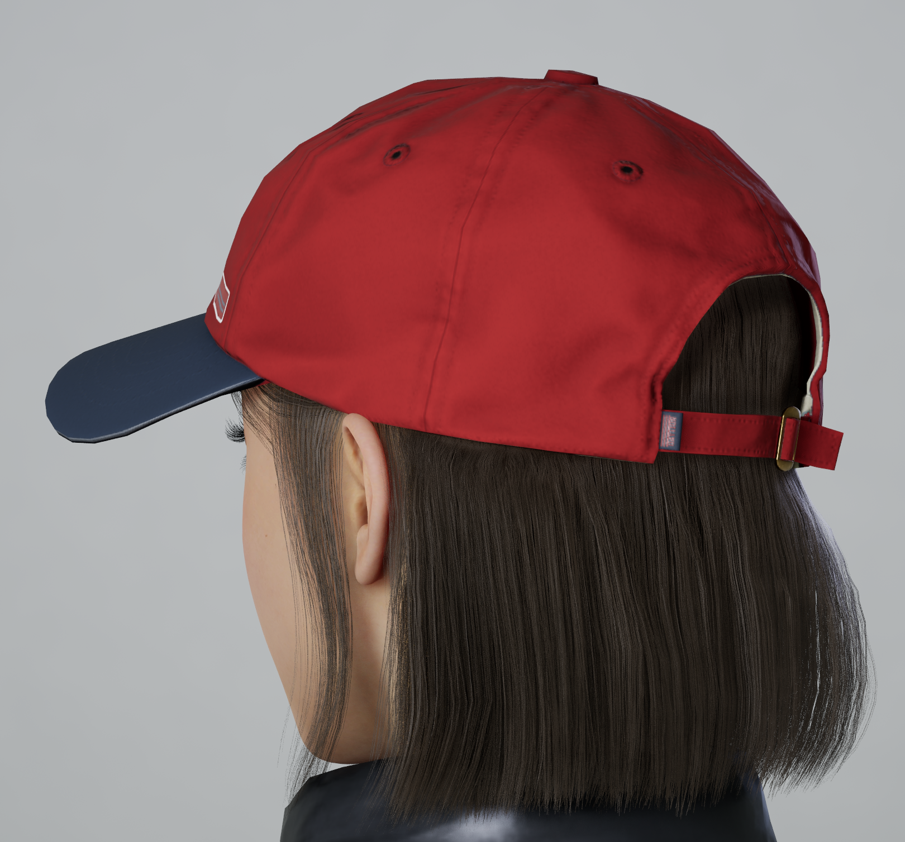
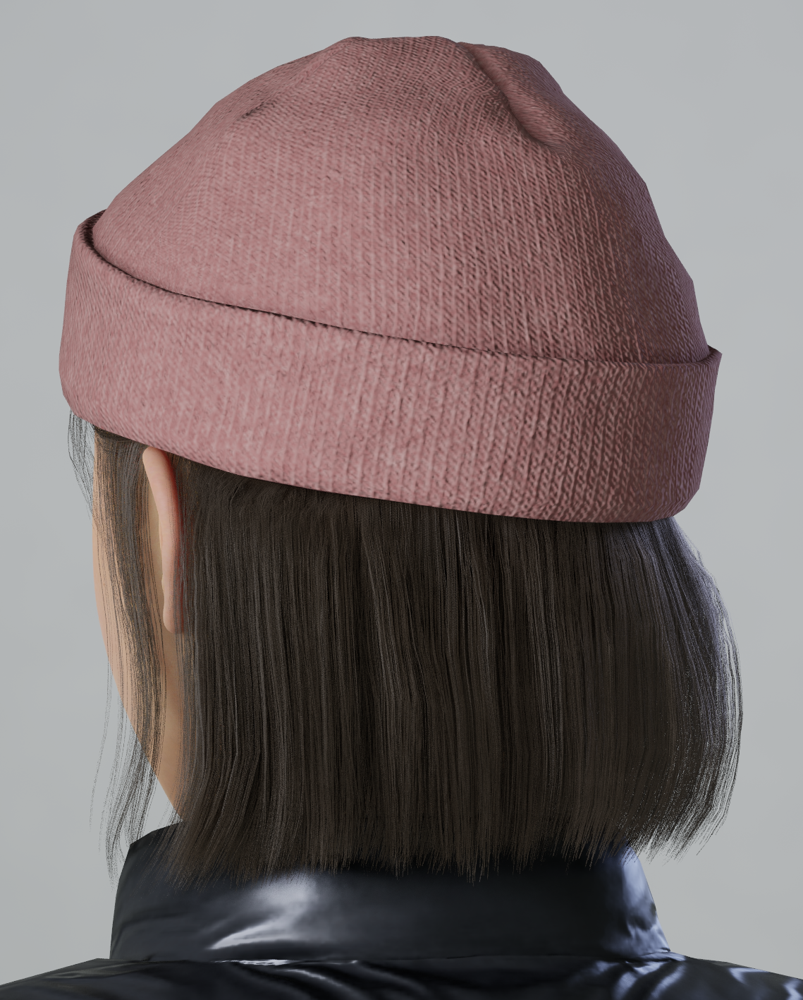
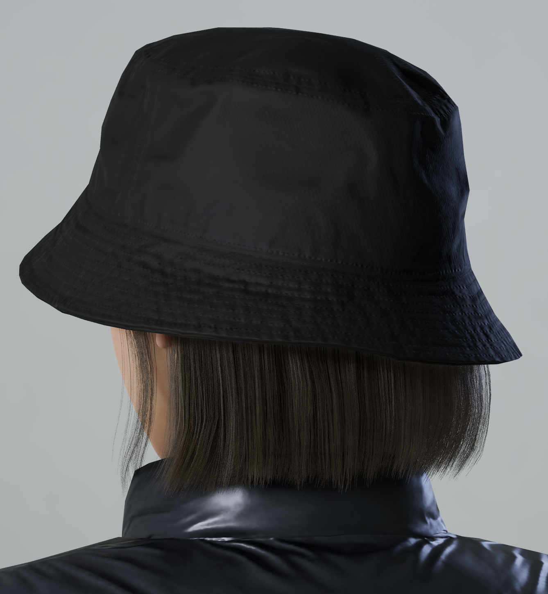
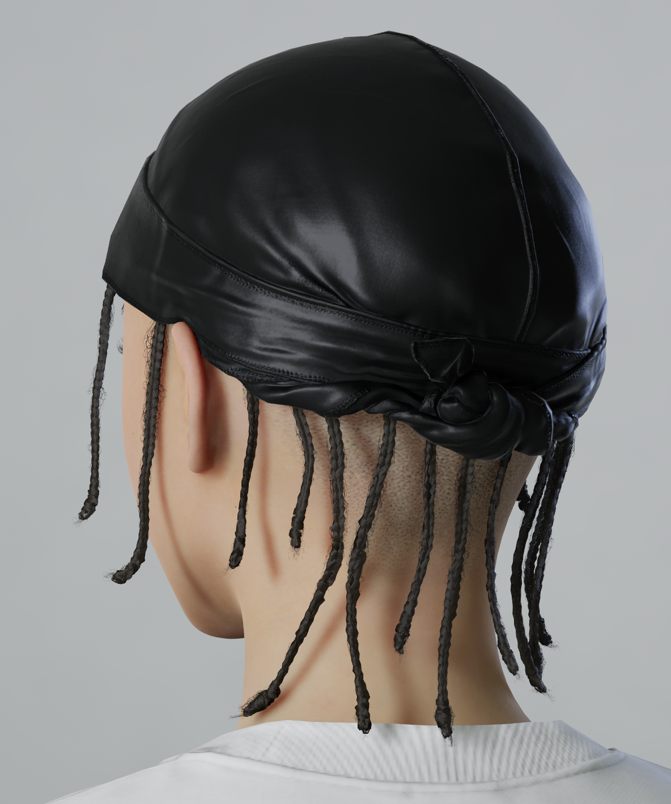
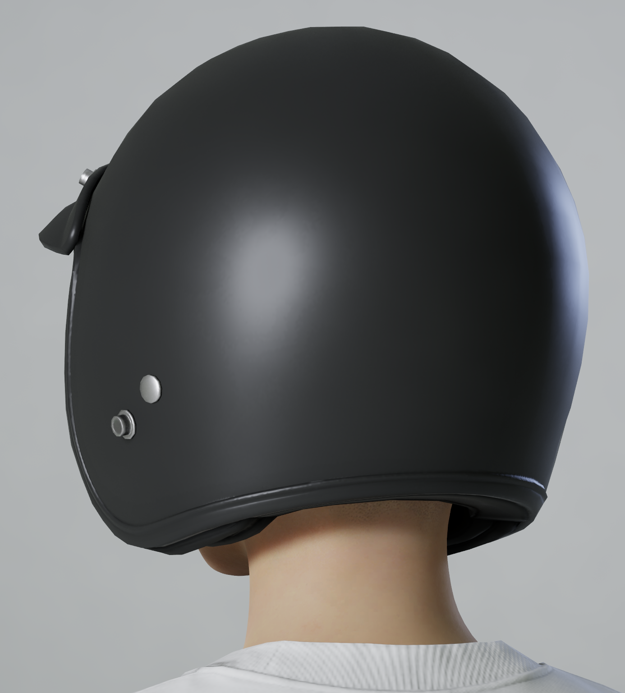
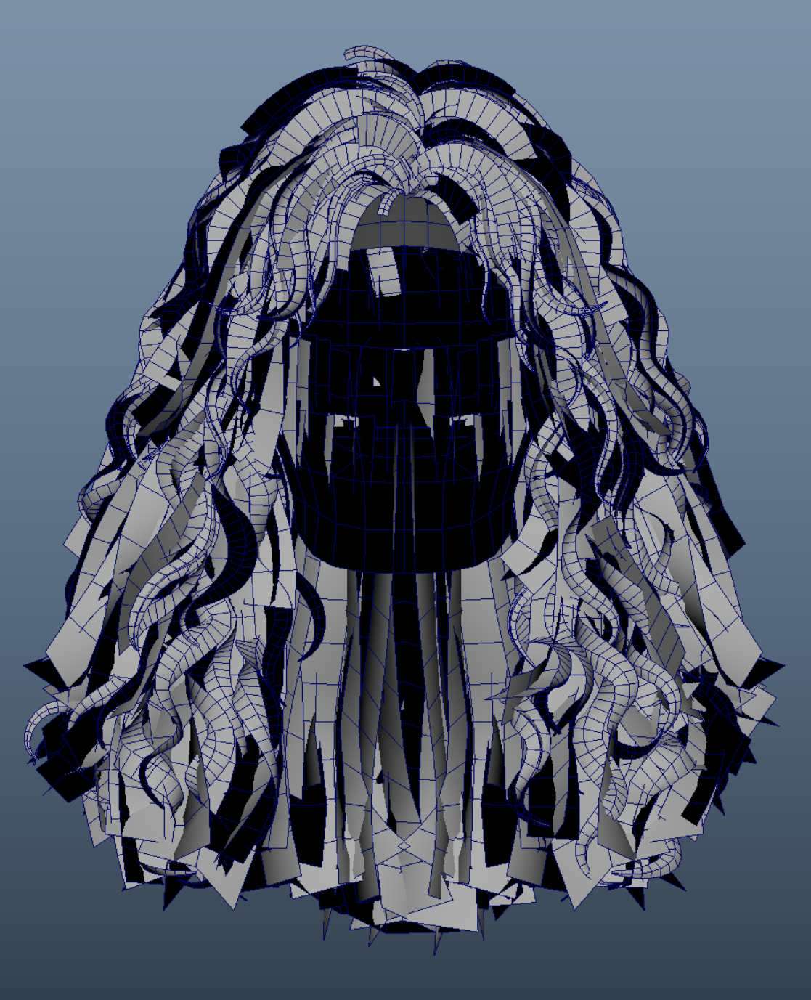
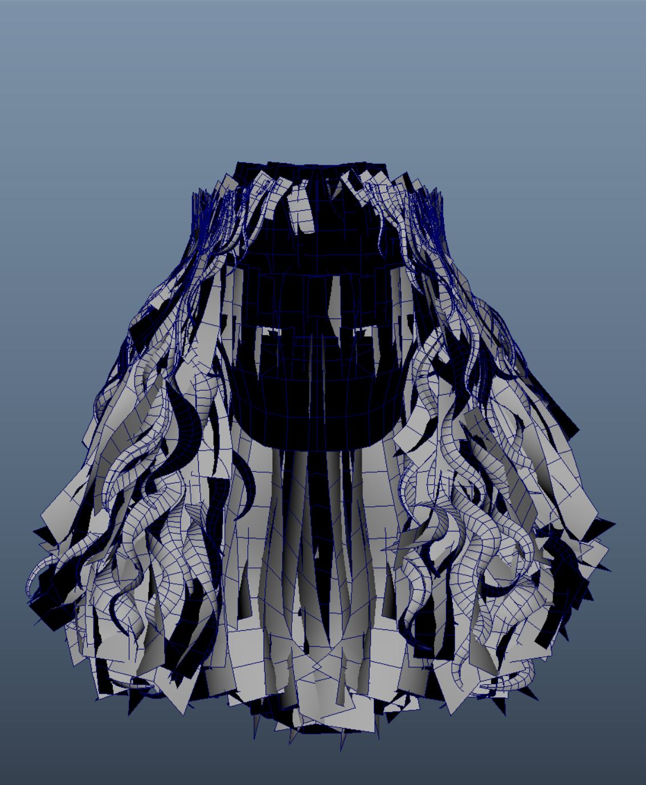

# 07.DataEditor

??? info "Purpose"
    In this step, we'll use ModKit's **Data Editor** to edit the hair's detailed data in more detail, and configure the hair in the customization menu to accurately display the intended information.
    
    This procedure is **an additional setting step** after basic hair creation, and it involves linking materials, meshes, and customization options (two-tone, Highlight Color, cut, etc.) to the data structure.

---

**Composition Summary**

| data table | role |
|---|---|
| AppearanceHairMesh.json | Register information about the actual hair resources (FBX, material, skeleton, hat correspondence, etc.) |
| AppearanceHair.json | Registering hair items displayed in the customizing UI (thumbnail, PartsId, subcategory, etc.) |
| AppearanceParts.json | PartsId Define a set of customizing features that are activated according to (two-tone, cut, Highlight Color, etc.) |

---

**Step-by-step detailed editing process**

**1. AppearanceHairMesh.j**

1.  Running **the Open Data Editor**
2.  `AppearanceHairMesh.json` Select tab
3.  Check the hair ID you are currently working on
4.  Check and correct the following items:

| item | explanation |
|---|---|
| Id | Hair Unique ID (Gender + Style combination) |
| Thumbnail | Preset icon image |
| Mesh | Imported Skeletal Mesh ( `SKM_AssetName` ) |
| Materials | Connected Material Instance ( `MI_AssetName` ) |
| GroupId | Bundle ID of hair presets of the same series |
| HatTypeMesh | Replacement mesh settings for each hat type |
| bEnableHairCutHeight | Whether the cut function is activated when wearing a hood |
| MatchingGenderId / MatchingBodyAgeId | Matching Hair ID by Gender/Age Group |

??? note "⚙️"
    This table manages the actual resource structure.
    If the input is incorrect, the customization items will be displayed, but the mesh will not load.

---

**List of hat types used in inZOI**

<table>
    <thead>
        <tr>
            <th style="text-align: left;">HatType ID</th>
            <th style="text-align: left;">Reference image</th>
            <th style="text-align: left;">Details</th>
        </tr>
    </thead>
    <tbody>
        <tr>
            <td><strong>Default</strong></td>
            <td></td>
            <td>
                Basically, the hat type can be applied as Default.
                 
                Additional Beanie/Fedora types may be required depending on your hairstyle.
                <ul>
                    <li>example
                        <ul>
                            <li>Regular hat - version with ponytail</li>
                            <li>Beanie - Ponytail Removed Version</li>
                        </ul>
                    </li>
                </ul>
            </td>
        </tr>
        <tr>
            <td><strong>Beanie</strong></td>
            <td></td>
            <td></td>
        </tr>
        <tr>
            <td><strong>Fedora</strong></td>
            <td></td>
            <td></td>
        </tr>
        <tr>
            <td><strong>Durag</strong></td>
            <td></td>
            <td>
                When wearing a durag type hat, it is recommended to change the hair to a bald type.
                 
                <code>SKM_Male_Hair_Bald_001</code>
            </td>
        </tr>
        <tr>
            <td><strong>Helmet</strong></td>
            <td></td>
            <td>
                When wearing a helmet type hat, it is recommended to replace the hair with a bald type.
                 
                <code>SKM_Male_Hair1Bald_001</code>
            </td>
        </tr>
    </tbody>
</table>

---

<table>
    <thead>
        <tr>
            <th style="text-align: center;">HairMesh</th>
            <th style="text-align: center;">Hat version HairMesh</th>
        </tr>
    </thead>
    <tbody>
        <tr>
            <td></td>
            <td></td>
        </tr>
    </tbody>
</table>

---

**2. Register AppearanceHair.json**

1.  `AppearanceHair.json` Select tab
2.  Add items for UI display
3.  Enter the following fields

| item | explanation |
|---|---|
| Id | Hair Unique ID (Gender + Style combination)   ID identical to the Group ID specified in AppearanceHairMesh |
| Thumbnail | Preset G |
| GenderType / BodyAgeType | Applicable gender and age group |
| SubCategories | Hair (Male/Female) Short   Hair (Male/Female) Medium   Hair (Male/Female) Long   Hair (Male/Female) Ponytail |
| PartsId | Select a custom feature set   ( `Hair_00` , `Hair_01` etc) |
| Variants | Hair Unique ID   When grouping color variations into a set, enter the variation ID in Variants. |

??? tip "💡"
    `PartsId` The UV2 feature set is automatically determined based on
    <ul>
        <li>`Hair_00`: Single color hair</li>
        <li>`Hair_None`: Hair with no function (e.g. bald type)</li>
    </ul>

---

**3. Register AppearanceParts.json (Optional/Advanced Settings)**

This step is only necessary when you want to have fine-grained control over customization features. For example, you might want to limit the number of Highlight colors or enable only certain cut features.

Rather than adding a new one, we recommend that you refer to the table below and select one of the currently registered IDs to use.

| PartsId | TipColor | 2ndColor | Highlight Color1 | Highlight Color2 | Highlight Color3 | HairCut | | 
|---|---|---|---|---|---|---|---|
| **Hair_00** | Base Color | • | • | • | • | • |
| **Hair_00_B** | Base Color | - | • | • | • | Cut |
| **Hair_01** | Base Color | Two-tone | Highlight 1 | Highlight 2 | Highlight 3 | Cut |
| **Hair_01_B** | Base Color | Two-tone | Highlight 1 | Highlight 2 | Highlight 3 | Cut |
| **Hair_01_C** | Base Color | Two-tone | Highlight 1 | Highlight 2 | Highlight 3 | |
| **Hair_02** | Base Color | - | Highlight 1 | - | - | - |
| **Hair_02_B** | Base Color | - | Highlight 1 | - | - | Cut |
| **Hair_02_C** | Base Color | - | Highlight 1 | • | • | • | Different version of numerical values in Hair_02 |
| **Hair_02_NoScalp** | Base Color | - | Highlight 1 | - | - | - |
| **Hair_03** | Base Color | Two-tone | Highlight 1 | - | - | Cut |
| **Hair_03_B** | Base Color | Two-tone | Highlight 1 | • | • | Cut |
| **Hair_04** | Base Color | Two-tone | • | • | - | Cut |
| **Hair_04_B** | Base Color | Two-tone | • | • | - | - |
| **Hair_05** | Base Color | Two-tone | Highlight 1 | Highlight 2 | - | Cut |
| **Hair_None** | - | - | • | • | • | • |

---

**Things to check**

| item | Things to check |
|---|---|
| Are the hair mesh and material correctly connected to the AppearanceHairMesh? | Basically, check if the default settings in the Modkit editor are applied properly. |
| Are Thumbnail, GenderType, and PartsId entered correctly in AppearanceHair? | Basically, check if the default settings in the Modkit editor are applied properly. |
| Does the PartsId match the feature set ( `Hair_00` / `Hair_01` etc.) | Refer to the PartsID list table to confirm that you have used an ID that has the desired function. |

---

**Mistake-avoidance tips**

| situation | cause | How to solve |
|---|---|---|
| Color change not working | PartsId error ( `Hair_00` optional) | `Hair_01` Change to the ideal set |
| Hair not replaced when wearing a hat | Missing HatTypeMesh | Register HatTypeMesh in AppearanceHairMesh.json |

---

**Summary of this section**

| Checklist | Whether completed |
|---|---|
| AppearanceHairMesh.json verification complete | ✅ |
| AppearanceHair.json verification complete | ✅ |
| Check thumbnail/material/mesh path | ✅ |
| Data Editor save and load test complete | ✅ |

---

[‹ Previous](06.MaterialSettings.md){ .md-button .md-button--primary .prev-btn }