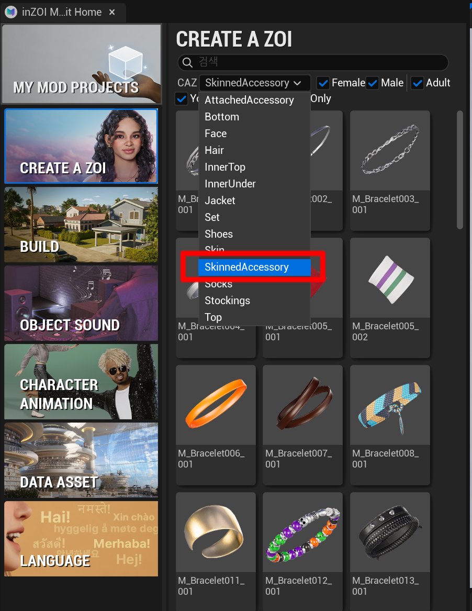
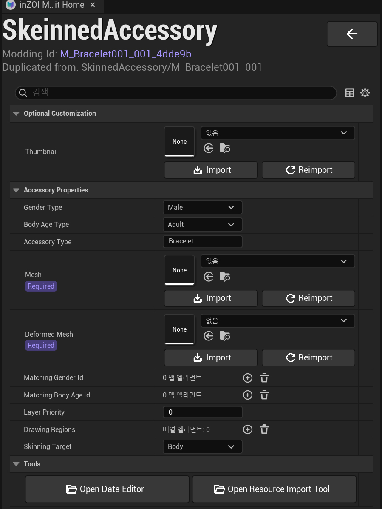
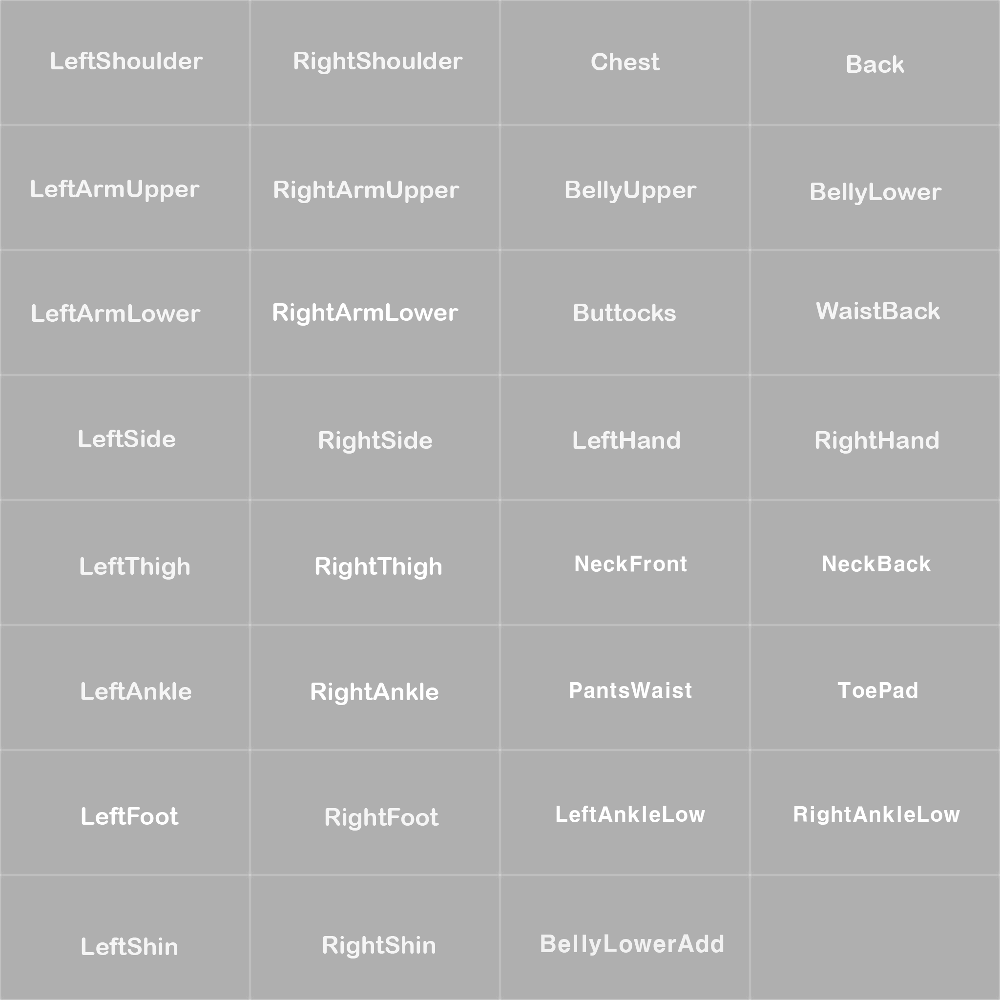

# 01. Overview

First, select the following item in the ModKit.

- Click **Character → SkeinnedAccessory**

{ width="500" loading="lazy" }

---

After selecting it, the **SkeinnedAccessory configuration panel** will open as shown below.

{ width="500" loading="lazy" }

---

**Optional Customization**

- **Thumbnail**
  - Registers the thumbnail image for the item

---

**Accessory Properties**

- **Gender Type**
  - Selects the gender for the item  
  - Example: `Male`, `Female`

- **Body Age Type**
  - Selects the body age group for the item  
  - Example: `Adult`, `Child`

- **Accessory Type**
  - Defines the accessory type

  Types:

  - `Necklace` : Necklace  
  - `Nail` : Nail  
  - `Ring` : Ring  
  - `Bracelet` : Bracelet  

---

**Mesh**

- Imports the accessory mesh

---

**Deformed Mesh**

- (Necklace only)  
- Imports a mesh that is slightly offset above clothing to prevent clipping

---

**Matching Gender Id**

- Defines the item ID shown when the gender is changed in CAZ

---

**Matching Body Age Id**

- Defines the item ID shown when the age group is changed in CAZ

---

**Layer Priority**

- Defines the clothing layer priority of the item  
- Recommended default value: `10`

---

**Drawing Regions**

(Used for Necklace and Bracelet)

- Defines regions where the item can be hidden by upper-layer clothing

- To use this feature, **UV1 must be properly set on the mesh**
  - UV1 = second UV channel

**Necklace UV1 Regions**

- `Chest`  
- `NeckFront`  
- `NeckBack`

**Bracelet UV1 Regions**

- `LeftHand`  
- `RightHand`

!!! warning
    The Deformed Mesh for necklaces does **not use UV1**.

---

**Skinning Target**

Defines which part of the character the item is skinned to.

- **Body**
  - Nail, Ring, Bracelet  
  - Necklace with physics simulation

- **Head**
  - Necklace

!!! warning
    Necklaces must be rigged to a joint hierarchy that includes the **Head bone**.

{ width="600" loading="lazy" }
