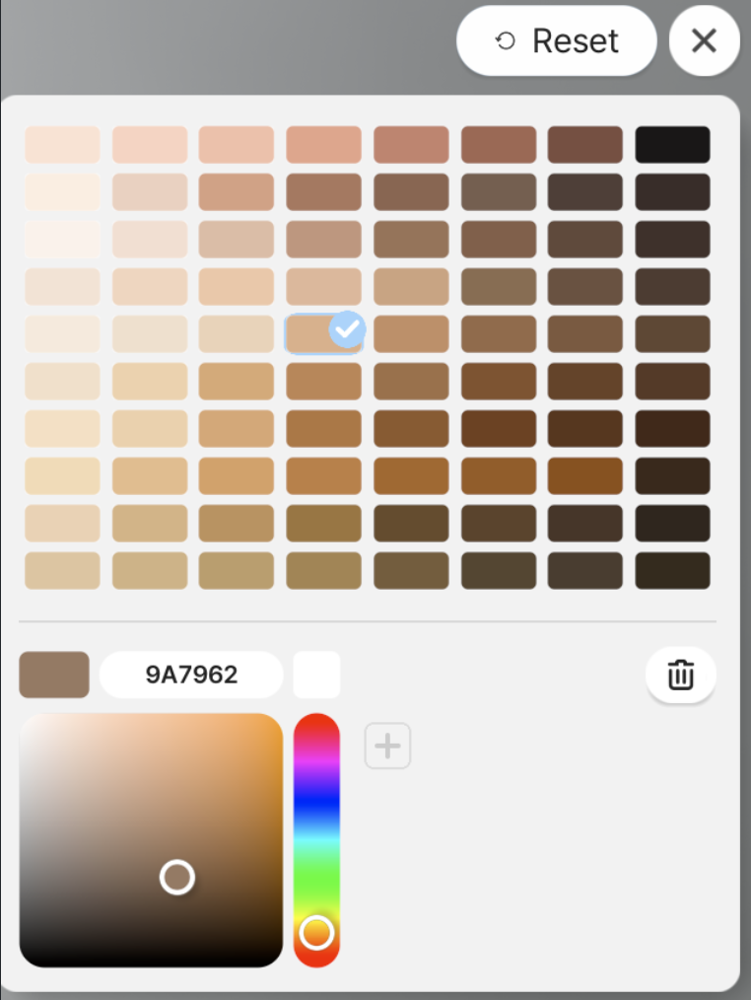
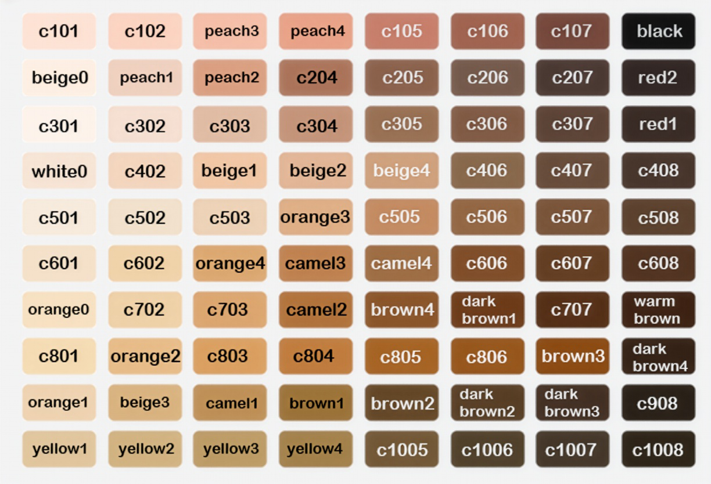

# 04. Skin Color ID

Below is the list of Skin Color IDs currently used by inZOI characters.
When importing a new Color Texture into the Skin Modkit for the first time, selecting Skin Color Reset will reset the skin to the default Skin Color ID, beige1.
It is generally recommended to define the character’s skin tone through the character customization system, rather than baking a fixed tone directly into the Color Texture. This ensures proper interaction with the in-game Skin Color system.

{ width="450" loading="lazy" }

If you want to express a specific skin color or tone regardless of the Skin Color ID, you may set it directly within the Color Texture.
In this case, when importing the Color Texture, choose whether to perform Skin Color Reset.

---

**Notes / Cautions**

If the Color Texture already includes a baked-in specific tone and you want to preserve it, be aware of the following:

- When selecting a different **Skin Color ID** during character customization  
- Or when adjusting the **skin color wheel**  

the final skin color may shift unexpectedly and may not match the intended tone embedded in the texture.

{ width="450" loading="lazy" }

---

[‹ Previous](03.Properties.md){ .md-button .md-button--primary .prev-btn }