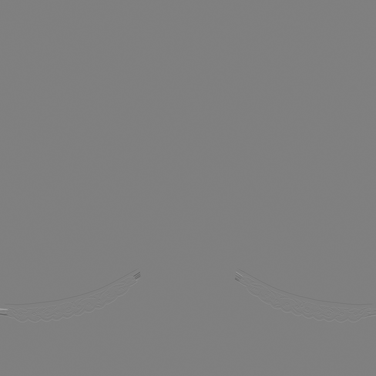
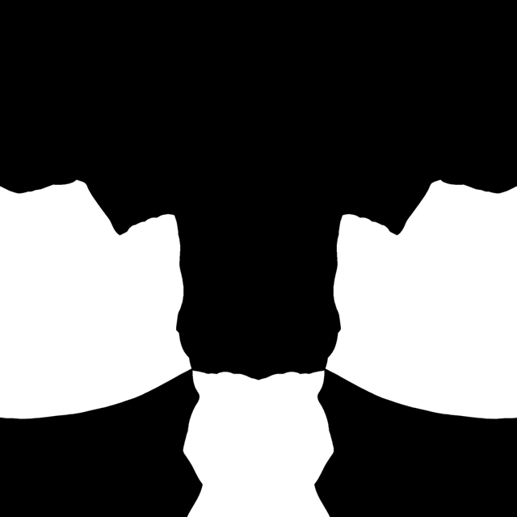
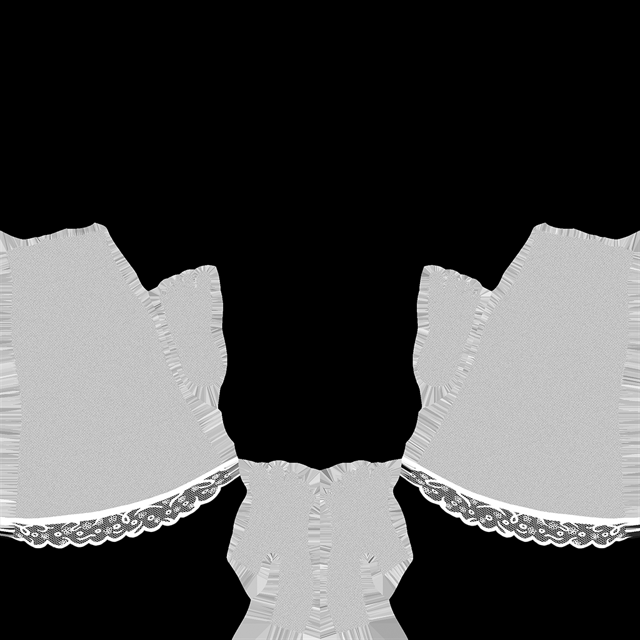

# 02. Texture

Stockings use a single TGA texture that contains both Normal information and Mask information.
This texture is sampled directly inside the Body Material and blended onto the skin.
Because of this structure, the accuracy and quality of each channel within the texture play a crucial role in achieving high-quality stocking visuals.

---

**2.1 Texture Specifications**

**Resolution**

- **1024 × 1024 pixels**
- This resolution is sufficient for expressing stocking patterns and general fabric detail, and is optimal for performance.

**Format**

- **TGA (32-bit, uses all RGBA channels)**
- Stored without compression, ensuring Alpha Mask edges and Normal channel details remain clean without loss.

**Import Settings**

- **sRGB must be Off**  
  Since Mask and Normal values operate in Linear color space, sRGB must be disabled.

---

**2.2 Texture Channel Configuration**

The stocking texture uses four RGBA channels, each serving a specific function.

**R/G Channels (Normal)**

- Use the R and G channels from a standard normal map.
- Represent the fine surface texture characteristic of thin stocking fabric.
- Excessively strong normals may look like rubber or thick material, so a subtle level is recommended.

**B Channel (Fresnel Mask)**

- Controls the bright rim region formed along the outer contour of the legs.
- Typically, the center is darker and the outer region becomes gradually brighter.
- This channel is essential for the characteristic contour highlight of stockings.

**A Channel (Alpha)**

- Determines where the stocking is applied and controls its opacity.
- **1.0:** Fully opaque stocking  
- **0.0:** No stocking applied  
- **Gray values:** Natural sheer transparency
- Forms the foundation for lace, patterns, and thigh-high bands.

---

**2.3 Notes for Texture Creation**

**Do not include color information in the texture**  

- Stocking color is defined using the Stocking Color option inside Modkit.
- The texture should contain only Normal and Mask data.

**Maintain clean Alpha boundaries**  

- Alpha edges should be softened using feathering.
- Hard edges result in unnatural blending and appear like printed graphics rather than real stockings.

**Use subtle Normal intensity**  

- Real stockings have extremely fine surface detail; overly strong Normal values look unnatural.
- Keep Normal intensity low for the most realistic result.

**Combine Fresnel Mask and Alpha Mask**  

- For thigh-high stockings, define the band pattern in Alpha, then control the outer highlight effect with the Fresnel Mask to achieve a more realistic look.

| 채널 | 이미지 | 설명 |
|------|--------|-------|
| **R** |  | **Normal Map R Channel**  - R channel from the normal map texture. |
| **G** |  | **Normal Map G Channel**  - G channel from the normal map texture. |
| **B** |  | **Fresnel Area Mask**  - Enhances stocking depth.  - Center is darker, outer contour is brighter. |
| **A** |  | **Alpha Mask**  - Defines stocking coverage and opacity.  - Used for lace, patterns, thigh-high bands. |

---

[‹ Previous](01.%20Overview.md){ .md-button .md-button--primary .prev-btn }
[Next ›](03.%20Optional%20Customization.md){ .md-button .md-button--primary .next-btn }