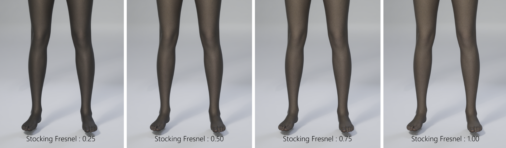
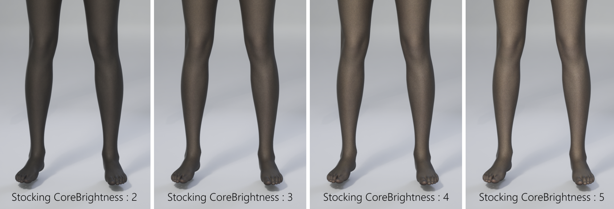
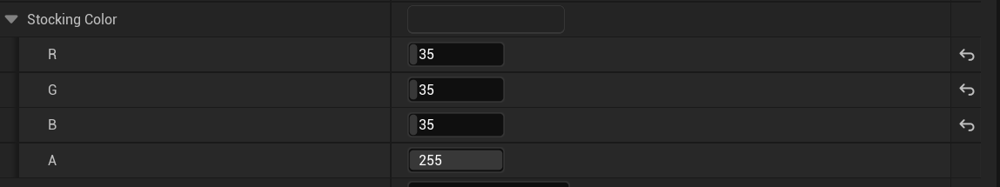

# 03. Optional Customization

- The Optional Customization settings allow you to adjust visual characteristics of the stocking based on the texture.
- These options can be modified directly in the Modkit, enabling adjustments to color, surface quality, brightness, and highlight intensity.
- They allow a single texture to be used for a wide variety of stocking styles.

---

**3.1 Thumbnail**

A preview image used to identify the stocking item.

- Displayed in the customization UI and the outfit selection UI.
- A solid-color or transparent background is recommended.
- Recommended resolution: **256 × 256 pixels**
- Recommended format: **PNG**

---

**3.2 Stocking Roughness**

Controls the roughness and reflectivity of the stocking surface.

- Lower values result in a smoother surface with increased specular reflection.
- Higher values make the surface appear more matte with reduced reflection.

---

**3.3 Stocking Fresnel**

Adjusts the range of rim lighting applied to the outer contour of the stocking.

    
 

---

**3.4 Stocking Core Brightness**

Controls the overall brightness intensity of the stocking.

    

---

**3.5 Stocking Color**

Defines the final color of the stocking.  
Since the texture does not contain color information, the stocking’s color is determined entirely by this option.

**Components**

- **R:** Red value  
- **G:** Green value  
- **B:** Blue value  

    

---

**Notes**

- The stocking color remains consistent regardless of skin tone changes, as the final appearance is always calculated based on the Color parameter.
- A wide range of looks can be achieved, from black stockings to pastel-toned styles.

---

**3.6 Gender Type**

Specifies the applicable gender for the current stocking ID.

- Prevents the item from being shown on the wrong gender.
- Used by the in-game category filtering system.

---

**3.7 Body Age Type**

Specifies the applicable age group for the current stocking ID.

- Ensures correct compatibility with different body meshes across age groups.

---

[‹ Previous](02.%20Texture.md){ .md-button .md-button--primary .prev-btn }