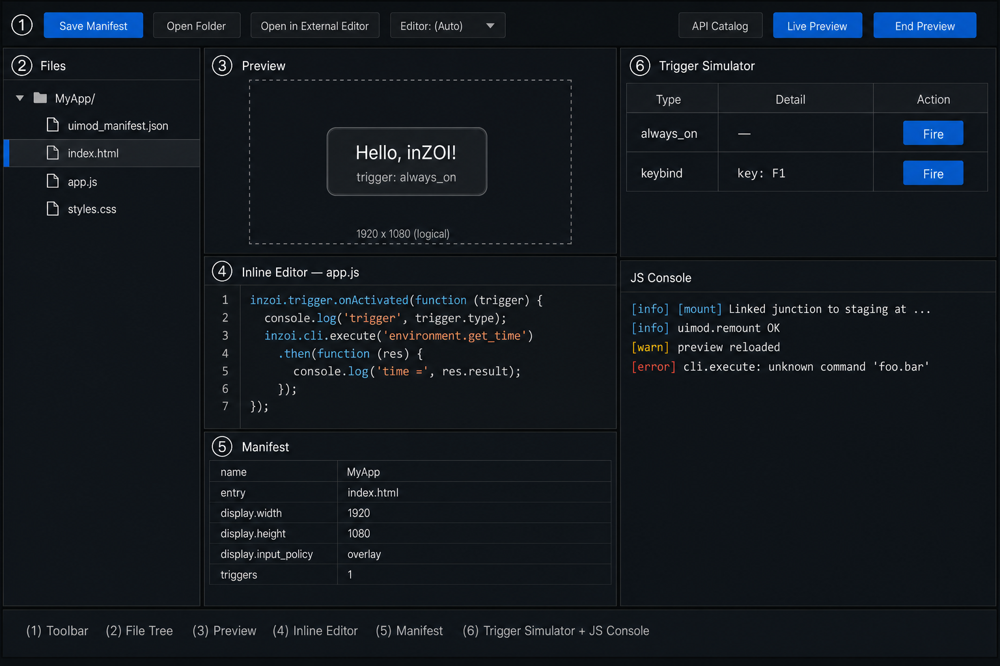

# UI

### 01. What is a UI?

A **UI** is a small web app (HTML + CSS + JavaScript) that ModKit
loads on top of inZOI. It is exactly like a webpage, except its "browser"
is the running game and it can talk to the game through a built-in
JavaScript SDK.

If you have ever written a webpage, you already know most of what a UI
needs. The new parts are:

* **A manifest** — a tiny JSON file that tells the game *when* your
  panel should appear and *how* it should behave (size, transparency,
  input).
* **A trigger** — the condition that wakes your panel up
  (always on, a keybind, a chat command, etc.).
* **The `inzoi` SDK** — a global object available in your scripts that
  lets you call game commands and read game state.

> **Mental model**
>
> *Your UI is a webpage.
> The manifest decides when it opens.
> Your `app.js` reacts to the game and asks the game to do things.*

---

### 02. What you can build

A UI is best for **small, focused panels** that read or change game
state. Real examples shipped in `inZOIModKit/Mods`:

| Mod | What it does | Trigger | Key SDK calls |
|---|---|---|---|
| **Clock Widget** | A transparent on-screen clock that ticks while you play. | `always_on` | (none — pure DOM) |
| **Mood Panel** | A small panel with buttons that change the current Zoi's mood. | `keybind: Ctrl+M` and `command: mood_panel.toggle` | `inzoi.cli.execute('zoi.setMood', { mood })` |
| **Event Toast** | Pops a toast when a specific game event fires. | `game_event: ...` | listens to triggers, no game writes |
| **Tools Demo** | A developer dashboard that demonstrates most SDK surfaces at once. | multiple | `inzoi.data.query`, `inzoi.cli.list`, ... |

You do **not** need a UI for things the base game already handles:
new clothing or hair belongs in **CAZ**, new placeable objects belong
in **Build**, balance tweaks belong in **DataAsset**. UIs sit on
top of those — they are the *windows and buttons* layer.

---

### 03. The ModKit workspace

When you open a UI project in ModKit, you get this six-panel layout:

| # | Panel | What it is for |
|:--:|---|---|
| 1 | **Toolbar** | Save the manifest, open the mod folder, open files in your editor of choice, view the CLI catalog, or push the mod into a running game. |
| 2 | **File Tree** | The files that make up the currently selected app (`uimod_manifest.json`, `index.html`, `app.js`, `styles.css`). |
| 3 | **Preview** | A live in-editor browser that renders your HTML. Reloads when you save. |
| 4 | **Inline Editor** | A built-in text editor for quick tweaks. For real work, use an external editor (set it from the toolbar). |
| 5 | **Manifest** | A form view of `uimod_manifest.json`. Edit here or in the file — they stay in sync. |
| 6 | **Trigger Simulator + JS Console** | Fire any trigger declared in the manifest without launching the game, and read your `console.log` output. |

The next pages walk through each of these in detail.

---

### 04. Where to go next

1. **[Files](02.%20Files.md)** — what `uimod_manifest.json`, `index.html`, `app.js`, and `styles.css` are each for, and the full manifest schema.
2. **[Workspace](03.%20Workspace.md)** — how to use each panel of the editor, and what **Live Preview** does under the hood.
3. **[Scripting](04.%20Scripting.md)** — a step-by-step "Hello inZOI" walkthrough, the trigger flow, and the SDK reference.

If you just want a reference of every game command you can call from
your scripts, jump straight to the
[CLI Catalog](../../../Wiki/CLI/index.md).
