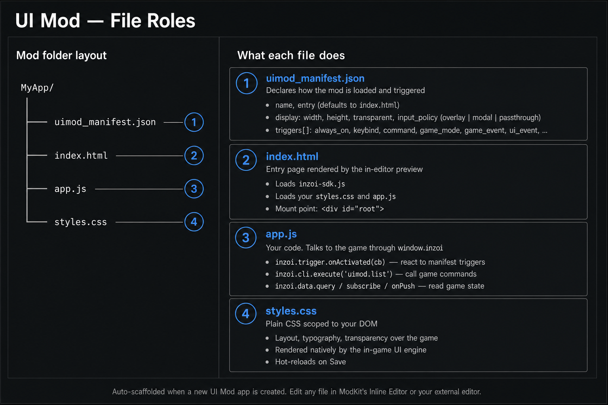

# Files

A UI is just four files in a folder. ModKit creates them for you
the first time you add an app to your project.



---

### 01. The four files at a glance

| File | One-line role |
|---|---|
| `uimod_manifest.json` | The "settings card" — when does this UI open, how big is it, can it click through to the game? |
| `index.html` | The HTML page the game renders. The visible structure of your panel. |
| `app.js` | Your JavaScript. Reacts to triggers and talks to the game. |
| `styles.css` | Plain CSS. Controls how your panel looks. |

> **Term: "app"**
>
> One mod can contain *multiple* UI apps (e.g. a `clock_widget` and a
> `mood_panel`). Each app is its own folder with its own four files.
> Picking which app is active is what the **File Tree** in the workspace
> does.

---

### 02. `uimod_manifest.json` — the settings card

This is the only file the game *requires* in order to load your panel.
It is tiny. Here is the manifest from the shipped `Clock Widget` sample:

```json
{
    "name": "Clock Widget",
    "entry": "index.html",
    "display": {
        "width": 1920,
        "height": 1080,
        "transparent": true,
        "input_policy": "passthrough"
    },
    "triggers": [
        { "type": "always_on" }
    ]
}
```

And here is `Mood Panel`, which is opened on a keybind and also
through a chat command:

```json
{
    "name": "Mood Panel",
    "entry": "index.html",
    "display": {
        "width": 1920,
        "height": 1080,
        "transparent": true,
        "input_policy": "overlay"
    },
    "triggers": [
        { "type": "keybind", "key": "Ctrl+M" },
        { "type": "command", "command": "mood_panel.toggle" }
    ]
}
```

#### 02-1. Top-level fields

| Field | Meaning | Default |
|---|---|---|
| `name` | Human-readable name of the app. Shown in lists. | required |
| `entry` | The HTML file the game opens first. | `"index.html"` |
| `display` | How the panel is sized and how it handles input. | see below |
| `triggers` | When your panel wakes up. At least one entry. | required |

#### 02-2. `display`

| Sub-field | What it does |
|---|---|
| `width`, `height` | The *logical* size of your panel in pixels. Internally always treated as a 1920x1080 canvas — scale your CSS accordingly. |
| `transparent` | `true` lets the game show through anywhere you don't draw. |
| `input_policy` | How your panel handles mouse/keyboard. See the term box below. |

> **Term: `input_policy`**
>
> * **`overlay`** — *I want clicks on me, but the game keeps running.*
>   Best default for panels with buttons, drag handles, sliders, or
>   scroll areas (e.g. `Mood Panel`).
> * **`modal`** — *I want clicks on me, and the game should pause behind me.*
>   For full-screen dialogs.
> * **`passthrough`** — *I never want clicks. Anything the user clicks
>   should hit the game.* For passive HUDs and decoration like
>   `Clock Widget`. Do not use this for interactive panels.

#### 02-3. `triggers`

A trigger is the condition that opens your panel. Each entry is
`{ "type": "...", ...extra fields... }`.

| `type` | Extra field(s) | When it fires |
|---|---|---|
| `always_on` | — | The panel is always visible. Best with `passthrough`. |
| `keybind` | `key` (e.g. `"F1"`, `"Ctrl+M"`) | Player presses the key. |
| `command` | `command` (e.g. `"mood_panel.toggle"`) | Player types the chat/cheat command. |
| `game_mode` | `mode` (string or array of mode names) | The game enters one of the listed modes. |
| `interaction_menu` | `label_key` | A matching interaction is selected. |
| `game_event` | `event` (e.g. `"zoi.mood_changed"`) | The game emits the named event. |
| `ui_event` | `event` | Another UI emits the named UI event. |
| `ui_injection` | advanced runtime fields | The game asks for UI to be injected at a known spot. Use only when the target slot contract is known. |
| `manual` / `auto` | — | Reserved for tooling. Use the explicit types above first. |

When you edit the manifest through ModKit's manifest panel or
`modkit_write_uimod_manifest`, trigger `id` values are generated on
save if you leave them blank. If you write `uimod_manifest.json`
directly as a raw file, every trigger must include a unique `id`;
the game-side parser rejects triggers without one.

> **Important: `game_mode` uses `mode`, not `modes`.**
>
> The game-side manifest parser reads only the field named `mode`.
> Use either a single string:
>
> ```json
> { "type": "game_mode", "mode": "gameplay" }
> ```
>
> or an array:
>
> ```json
> { "type": "game_mode", "mode": ["TopView", "ShoulderView", "Vehicle"] }
> ```
>
> Do **not** write `"modes": []`. The game ignores that field, so the
> trigger will never match and the UI will stay hidden. The `"gameplay"`
> alias expands to the common in-world modes: `TopView`, `ShoulderView`,
> and `Vehicle`.

Use these values for `game_mode`:

| Value | Meaning |
|---|---|
| `gameplay` | Recommended default alias. Expands to `TopView`, `ShoulderView`, and `Vehicle`. |
| `TopView` | Zoi control in top-view mode. |
| `ShoulderView` | Zoi control in shoulder-view mode. |
| `Vehicle` | Vehicle control. |
| `Photo` | Photo mode. |
| `FreeCamera` | Free camera mode. |
| `Build` | Build Studio. |
| `CharacterCustomize` | Character Studio. |
| `Map` | City/map mode. |
| `None` | Common/lobby/no active gameplay mode. |

#### Trigger Recipes

Use `always_on` for HUDs that should exist immediately:

```json
{ "type": "always_on" }
```

Use `keybind` when the player should press a key to open or toggle the
panel:

```json
{ "type": "keybind", "key": "F1" }
```

Use `command` when the player or another tool should open it by command:

```json
{ "type": "command", "command": "mood_panel.toggle" }
```

Use `game_event` / `ui_event` only when you know the event name emitted
by the game or another UI:

```json
{ "type": "game_event", "event": "zoi.mood_changed" }
```

Use `interaction_menu` for advanced menu injection. The label field is
`label_key`, not `label`:

```json
{ "type": "interaction_menu", "target": "character", "label_key": "My Action" }
```

Your JavaScript receives the trigger through one callback:

```js
inzoi.trigger.onActivated(function (t) {
    if (t.type === "keybind" && t.key === "F1") {
        // Open, close, or run your UI action here.
    }
});
```

You can declare *multiple* triggers in the same manifest. `Mood Panel`
uses both `keybind` and `command` so the player can choose how to open
it.

---

### 03. `index.html` — the page

A UI's `index.html` is a regular HTML page. The only conventions:

* It should load the SDK so `window.inzoi.*` is available in your
  scripts.
* It usually ends with `<script src="app.js"></script>` so your code
  runs after the DOM is ready.

Minimal example (this is exactly what ModKit scaffolds):

```html
<!DOCTYPE html>
<html>
<head>
    <meta charset="utf-8">
    <title>My App</title>
    <link rel="stylesheet" href="styles.css">
    <script src="coui://inzoi/cohtml.js"></script>
    <script src="coui://inzoi/mod/inzoi-sdk.js"></script>
</head>
<body>
    <div id="root">Hello, inZOI</div>
    <script src="app.js"></script>
</body>
</html>
```

> **Why these two `coui://` scripts?**
>
> `coui://` is the in-game UI engine's equivalent of `https://`. Both
> files live next to the game — you do not bundle them, you just
> reference them.
>
> - `cohtml.js` boots the engine binding (`engine` global, view
>   lifecycle callbacks). **Required**: without it the view stays in
>   `Loading` state and never receives input.
> - `inzoi-sdk.js` exposes the high-level `window.inzoi` API
>   (`inzoi.cli`, `inzoi.trigger`, `inzoi.view`, …) on top of `engine`.
>
> Always load them in this order, before your own scripts. In the
> editor preview, ModKit injects equivalent mocks so your code behaves
> identically.

---

### 04. `app.js` — your code

`app.js` is where you actually *do* things. The pattern in every
shipped sample is the same:

1. Get references to your DOM elements.
2. Wire up DOM events (button clicks, mouseenter, etc.).
3. Subscribe to UI triggers with `inzoi.trigger.onActivated`.
4. Call game commands with `inzoi.cli.execute`.

You will see this pattern in detail on the
[Scripting](04.%20Scripting.md) page.

---

### 05. `styles.css` — appearance

This is plain CSS. The in-game UI engine renders it natively, so all
the usual properties work — flexbox, transitions, custom properties,
etc.

Two things to keep in mind:

* The canvas is treated as 1920x1080. If you want pixel-perfect
  results, design your CSS against that size.
* If `display.transparent` is `true`, the body background should also
  be transparent (`background: transparent;` or just no background) so
  the game shows through.

---

### 06. Multiple apps in one mod

If your mod ships more than one app, ModKit also creates a small
**`uimod_apps.json`** at the `ui/` root that lists them:

```json
{
    "apps": [
        { "name": "clock_widget", "default": true,  "enabled": true },
        { "name": "mood_panel",   "default": false, "enabled": true }
    ]
}
```

You almost never edit this by hand. ModKit updates it when you add or
remove apps from the workspace.
