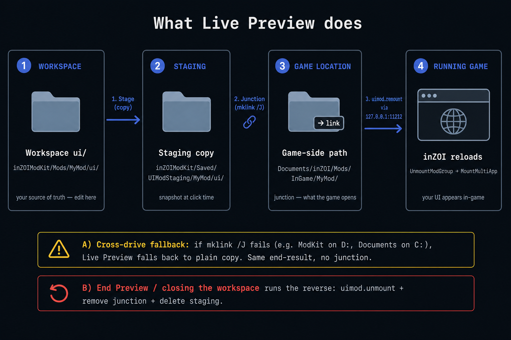

# Workspace

The workspace is where you actually build a UI. It bundles a file
tree, a live preview, an editor, a manifest form, and a way to test
triggers — so you can change a file, see the result, and even fire
events at your script without ever launching the game.

---

### 01. The toolbar

Across the top of the workspace.

| Button | What it does | When you reach for it |
|---|---|---|
| **Save Manifest** | Writes the current manifest form back to `uimod_manifest.json`. The preview also reloads. | After tweaking fields in the **Manifest** panel. |
| **Open Folder** | Opens the mod's `ui/` folder in your OS file explorer. | When you want to use Git, drop in assets, or share the folder. |
| **Open in External Editor** | Opens the mod folder in whichever editor you picked from the dropdown next to this button (VS Code, Sublime, etc.). | For real coding work — the inline editor is for quick edits only. |
| **Editor: (Auto)** | Picks which external editor opens. **Auto** finds the first one installed on your system. | One-time setup. |
| **API Catalog** | Opens the [CLI command reference](../../../Wiki/CLI/index.md) in your browser. | Any time you forget what a command is called or what parameters it takes. |
| **Live Preview** | Stages your `ui/` folder into ModKit's `Saved/UIModStaging/` and exposes it to the running game (via a junction into `Documents/inZOI/Mods/InGame/<mod_id>/`), then asks the game to (re)load the mod. Safe to press repeatedly while iterating. | When you want to see your mod inside inZOI instead of just the preview. |
| **End Preview** | Tells the game to unload this mod and removes both the staging copy and the game-side link. | When you are done iterating. Closing the workspace or the editor also runs this automatically. |

---

### 02. (2) File Tree

A list of every app folder under your mod's `ui/`, with the files
inside each one. Click a file to open it in the **Inline Editor** to
the right.

What it shows you:

* Which app is currently active for the **Preview** and **Manifest**
  panels.
* The exact filenames you would see in your file explorer — no
  abstraction over the real folder structure.

You do not need to use this panel to edit files — you can also open the
folder in your external editor and work from there. ModKit watches the
folder either way.

---

### 03. (3) Preview

A live in-editor browser, running the same UI engine the game uses. It
renders your `index.html` exactly as the game will.

* It reloads automatically when you save a file.
* `console.log` and friends go to the **JS Console** panel, not your
  browser's devtools.
* The dotted boundary represents the **1920x1080 logical canvas**. Lay
  your CSS out against that size.

> **Term: "logical canvas"**
>
> The game always thinks your UI is 1920x1080, regardless of the
> player's monitor. The game UI engine then scales the whole thing to
> the real screen for you. If something looks tiny at 4K, that's
> expected — design for 1920x1080.

---

### 04. (4) Inline Editor

A built-in text editor for the file you selected in the tree.

This is for **quick edits** — a typo, a one-line tweak, a CSS color
change. For anything bigger:

1. Pick your editor in the toolbar dropdown.
2. Click **Open in External Editor**.
3. Edit there — ModKit will pick up the changes.

---

### 05. (5) Manifest

A form view of `uimod_manifest.json` for the currently selected app.
Edit fields here, click **Save Manifest**, and ModKit writes them back
to the JSON file.

You can also edit `uimod_manifest.json` directly in any editor — both
views stay in sync.

The fields you see in this panel match the manifest schema described
on the [Files](02.%20Files.md) page.

---

### 06. (6) Trigger Simulator and JS Console

Both panels live in the right-hand column.

#### 06-1. Trigger Simulator

A small table with one row per trigger declared in your manifest. Each
row has a **Fire** button.

When you click **Fire**, ModKit pretends the game just satisfied that
trigger:

* `keybind` → fires as if the player pressed that key.
* `command` → fires as if the player typed the command.
* `game_mode` → fires only when it matches the preview's current mode.
* `game_event` → fires as if the game emitted that event.
* `ui_event` → fires as if another UI emitted that event.
* `interaction_menu` → fires as if the menu item was selected.
* `always_on` → fires once on demand (in practice, `always_on` is
  already active and you rarely need to simulate it).

The simulator follows the game-like preview rules. For example, a
`game_mode` trigger for `Vehicle` will not show the panel while the
preview mode is `TopView`; the JS Console logs a warning instead. This
helps catch "it appears in ModKit but not in game" mistakes before Live
Preview.

This is how you iterate without launching inZOI: declare the trigger in
the manifest, click **Fire**, then watch your
`inzoi.trigger.onActivated(...)` callback and JS Console output.

#### 06-2. JS Console

Anything your script writes via `console.log`, `console.warn`,
`console.error`, or `inzoi.debug.log` shows up here, color-coded by
severity.

If your panel does not behave the way you expect, this is the first
place to look.

---

### 07. Live Preview

The **Live Preview** button is what takes your work-in-progress out of
the editor and into the running game. Think of it as a hot-reload —
not an install.

What it actually does, step by step:

1. **Stages** every file under your mod's `ui/` folder into ModKit's
   per-mod staging directory at
   `<ModKit>/Saved/UIModStaging/<mod_id>/ui/`. This is the "intermediate"
   the real files now live in — your workspace `ui/` is the source, the
   staging copy is what the game actually reads.
2. **Links** that staging directory into the game's per-user mods
   location at `Documents/inZOI/Mods/InGame/<mod_id>/` using a Windows
   directory junction. The game opens that path and never realises it is
   a link, so no game-side change is needed.
   * If a junction cannot be created (e.g. ModKit and `Documents` are on
     different drives), Live Preview falls back to a plain file copy and
     logs `Junction unavailable (different drive?). Fell back to copy`
     in the JS Console.
3. **Sends a remount request** to the running game over a local
   connection (`http://127.0.0.1:11212`). The game unloads any previous
   instance of this mod and re-mounts it from the freshly linked
   staging dir.
4. **Confirms** with a dialog. The JS Console also gets `[info] [mount]`
   lines showing whether the path was *Linked* or *Copied*.

> **Game not running?**
>
> The staging step still succeeds. The remount call will time out
> gracefully, and the next time you launch the game, the new files
> will be picked up automatically.

You can press Live Preview as often as you want — each call refreshes
the staging copy and re-uses (or re-creates) the junction.

#### Ending the preview

You have two ways to tear the preview down:

* **End Preview button.** Asks for confirmation, calls `uimod.unmount`
  on the game so the in-game UI disappears cleanly, then removes both
  the staging dir and the game-side junction.
* **Closing the workspace tab or the editor.** Same cleanup, run
  automatically and without prompting. Live Preview is an iteration
  affordance, not a persistent install, so it does not survive past the
  workspace that started it.

If ModKit ever crashes before it can clean up, you can either press
**Live Preview** + **End Preview** once on the same workspace to
re-establish and then tear down the link, or simply delete
`Documents/inZOI/Mods/InGame/<mod_id>/` by hand — it only contains the
junction.
