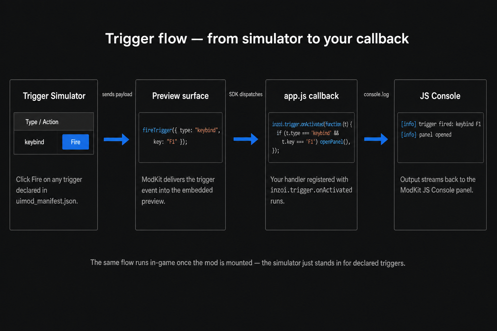

# Scripting

This page is about `app.js`: what you can do, how the game talks to
your code, and how your code talks back to the game.

If you are brand new to UIs, do the **Hello inZOI** walkthrough
first — it gets you a working panel in five short edits. The reference
sections after it explain why each piece works.

---

### 01. Walkthrough — "Hello inZOI" in five steps

You will end up with a small panel that opens on **F1**, asks the game
what time it is, and prints the result.

#### Step 1 — Create the app

In ModKit, add a new UI app called `hello_inzoi`. ModKit creates a
folder with four starter files. Open them in the **Inline Editor** or
your external editor.

#### Step 2 — Set the trigger in the manifest

Replace the contents of `uimod_manifest.json` with:

```json
{
    "name": "Hello inZOI",
    "entry": "index.html",
    "display": {
        "width": 1920,
        "height": 1080,
        "transparent": true,
        "input_policy": "overlay"
    },
    "triggers": [
        { "type": "keybind", "key": "F1" }
    ]
}
```

Click **Save Manifest**.

#### Step 3 — Lay out the page

Replace `index.html`:

```html
<!DOCTYPE html>
<html>
<head>
    <meta charset="utf-8">
    <title>Hello inZOI</title>
    <link rel="stylesheet" href="styles.css">
    <script src="coui://inzoi/cohtml.js"></script>
    <script src="coui://inzoi/mod/inzoi-sdk.js"></script>
</head>
<body>
    <div id="panel">
        <h1>Hello, inZOI</h1>
        <p id="time">Press F1 to ask the game what time it is.</p>
    </div>
    <script src="app.js"></script>
</body>
</html>
```

> Load `cohtml.js` **before** `inzoi-sdk.js`. The first boots the
> engine binding, the second exposes `window.inzoi`. Skipping
> `cohtml.js` is a common cause of the view never receiving clicks
> (see [Troubleshooting](#06-troubleshooting)).

#### Step 4 — Style it

Replace `styles.css`:

```css
body { background: transparent; color: #fff; font-family: sans-serif; }
#panel {
    width: 360px;
    margin: 80px auto;
    padding: 24px;
    background: rgba(20, 20, 20, 0.85);
    border-radius: 8px;
}
h1 { margin: 0 0 12px; font-size: 24px; }
```

#### Step 5 — Write the script

Replace `app.js`:

```js
(function () {
    const timeEl = document.getElementById("time");

    inzoi.trigger.onActivated(function (t) {
        if (t.type !== "keybind" || t.key !== "F1") return;

        inzoi.cli.execute("environment.get_time")
            .then(function (result) {
                timeEl.textContent = "Game time: " + JSON.stringify(result);
            })
            .catch(function (err) {
                timeEl.textContent = "Failed: " + err.message;
            });
    });

    console.log("[hello_inzoi] ready");
})();
```

#### Step 6 — Try it

* In the **Trigger Simulator** panel, click **Fire** next to the
  `keybind` row. The **Preview** should update to show the result.
* In the **JS Console**, you should see `[info] [hello_inzoi] ready`.

When you are happy, click **Live Preview** and press F1 in inZOI.

---

### 02. The trigger flow

Here is what happens between you clicking **Fire** in the simulator
(or pressing F1 in the game) and your function running:



1. The **Trigger Simulator** (or the running game) decides one of your
   declared triggers has been satisfied and assembles a payload like
   `{ type: "keybind", key: "F1" }`.
2. ModKit sends that payload into the **Preview Surface** (the
   embedded browser).
3. The SDK dispatches it to every callback registered via
   `inzoi.trigger.onActivated`.
4. Your callback runs. Anything you `console.log` ends up in the **JS
   Console**.

That is why the standard pattern is *"register one callback, then
switch on `t.type` and `t.key` / `t.command` / ..."* — your single
callback is the entry point for everything the game tells you.

> **Term: "callback"**
>
> A function you hand to someone else so they can call you later.
> `inzoi.trigger.onActivated(fn)` is you saying: *"Game, here is my
> phone number. Ring me whenever a trigger fires."*

---

### 03. The `window.inzoi` SDK

The SDK is exposed as a single global `inzoi` (also `window.inzoi`).
It has these areas:

| Area | Purpose | Highlights |
|---|---|---|
| `inzoi.trigger` | React to UI triggers. | `onActivated(cb)` |
| `inzoi.cli` | Run game commands from JS. | `execute(command, params?)`, `list(category?)`, `help(command?)` |
| `inzoi.data` | Read game state. | `query(domain, method, params?)`, `subscribe(domain, params, cb)`, `onPush(domain, cb)` |
| `inzoi.event` | Fire UI/game events. | `fire(eventName, params?)` |
| `inzoi.view` | Control your panel. | `show()`, `hide()`, `reload()`, `resize(w, h)`, `hover(bool)` |
| `inzoi.debug` | Logging without `console`. | `log(message)`, `echo(message?)` |
| `inzoi.types` | Enum-style string constants for inZOI domains (Emotion, Season, etc.). | constants only |
| `inzoi.config` | SDK-level config. | `setTimeout(ms)` |

Most calls return a **Promise** unless noted otherwise. Use `.then()`
/ `.catch()` or `async`/`await`.

#### 03-1. Triggers (`inzoi.trigger`)

```js
inzoi.trigger.onActivated(function (t) {
    // t.type is always present.
    // Extra fields depend on the trigger type. See "Files".
});
```

Most apps use one callback and branch by trigger type:

```js
inzoi.trigger.onActivated(function (t) {
    if (t.type === "keybind" && t.key === "F1") {
        togglePanel();
        return;
    }

    if (t.type === "command" && t.command === "mood_panel.toggle") {
        togglePanel();
        return;
    }

    if (t.type === "game_event" && t.event === "zoi.mood_changed") {
        refreshMood();
        return;
    }
});
```

Buttons inside your panel are normal DOM buttons. They do not need a
manifest trigger; wire them with `addEventListener`:

```js
document.getElementById("close").addEventListener("click", function () {
    inzoi.view.hide();
});

document.getElementById("refresh").addEventListener("click", function () {
    refreshMood();
});
```

So the split is:

* Manifest triggers decide **when the panel appears or receives an
  external event**.
* DOM button handlers decide **what happens after the player clicks
  inside your panel**.

#### 03-2. Game commands (`inzoi.cli`)

The full command catalog is published at
[**API Catalog**](../../../Wiki/CLI/index.md).

```js
// Fire-and-forget: change the current Zoi's mood.
inzoi.cli.execute("zoi.setMood", { mood: "happy" });

// With result handling: ask the game for the in-game time.
inzoi.cli.execute("environment.get_time")
    .then(function (result) { console.log("now", result); })
    .catch(function (err)   { console.warn("failed", err); });

// List every command in a category.
inzoi.cli.list("zoi").then(function (commands) { console.log(commands); });
```

#### 03-3. Game state (`inzoi.data`)

```js
// One-shot query.
inzoi.data.query("zoi", "getCurrent")
    .then(function (zoi) { console.log("current zoi", zoi); });

// Live subscription. Returns an object with .unsubscribe().
const sub = inzoi.data.subscribe("zoi", { id: "self" }, function (state) {
    console.log("zoi state changed", state);
});

// Stop listening:
sub.unsubscribe();
```

#### 03-4. Your panel (`inzoi.view`)

```js
inzoi.view.hide();             // close the panel
inzoi.view.show();             // open it again
inzoi.view.reload();           // re-run index.html
inzoi.view.resize(800, 600);   // logical pixels
inzoi.view.hover(true);        // tell the game we want clicks now
```

For interactive panels, use `input_policy: "overlay"` and call
`inzoi.view.hover(true)` on `mouseenter`, then `inzoi.view.hover(false)`
on `mouseleave`. This tells the game when the cursor is over your panel
so clicks should go to the UI instead of the world.

---

### 04. A real example — `mood_panel`

This is the actual `app.js` from the shipped **Mood Panel** sample.
It demonstrates four of the patterns above: DOM events, `inzoi.cli`,
`inzoi.view.hover`, and `console.log`.

```js
(function () {
    const currentEl = document.getElementById("current");

    function setMood(mood) {
        currentEl.textContent = mood;

        if (window.inzoi && window.inzoi.cli) {
            window.inzoi.cli.execute("zoi.setMood", { mood: mood })
                .then(function (result) {
                    console.log("[mood_panel] zoi.setMood ok:", result);
                })
                .catch(function (err) {
                    console.warn("[mood_panel] zoi.setMood failed:", err);
                });
        }
    }

    document.querySelectorAll("button[data-mood]").forEach(function (btn) {
        btn.addEventListener("click", function () {
            setMood(btn.getAttribute("data-mood"));
        });
    });

    // Capture pointer so the game knows we are interactive.
    const panel = document.getElementById("panel");
    panel.addEventListener("mouseenter", function () { window.inzoi && window.inzoi.view.hover(true); });
    panel.addEventListener("mouseleave", function () { window.inzoi && window.inzoi.view.hover(false); });

    console.log("[mood_panel] ready");
})();
```

The matching `uimod_manifest.json` (also shipped) opens this panel on
`Ctrl+M` or on the chat command `mood_panel.toggle`. The combination
is a complete, runnable UI in under 40 lines of script.

---

### 05. Troubleshooting <a id="06-troubleshooting"></a>

| Symptom | Likely cause | Fix |
|---|---|---|
| UI is visible but completely ignores clicks/drags in-game | `coui://inzoi/cohtml.js` is missing from `index.html`. Without it, cohtml never fires the view's ready callbacks and the view stays in `Loading` state forever. | Add `<script src="coui://inzoi/cohtml.js"></script>` **before** `inzoi-sdk.js` in `<head>`. |
| `window.inzoi missing — preview fallback active` shows in-game | Same as above — engine binding did not boot, so `window.inzoi` was never injected. | Same fix as above. |
| Nothing happens when I press my keybind | `keybind` not declared in `uimod_manifest.json`, or `t.key` does not match what you wrote. | Check the manifest, and `console.log(t)` inside `onActivated` to see what the game actually sends. |
| `inzoi.cli.execute(...)` rejects with "unknown command" | Command name typo, or the command lives in a different category. | Look it up in the [API Catalog](../../../Wiki/CLI/index.md). |
| My buttons receive clicks but the panel still steals input from the game | `input_policy` is `overlay` but you never tell the engine when the cursor leaves the panel. | Call `inzoi.view.hover(true)` on `mouseenter` and `inzoi.view.hover(false)` on `mouseleave` of your panel root. |
| Buttons don't receive clicks with `input_policy: "passthrough"` | `passthrough` is for passive display-only HUDs. | Switch the manifest to `input_policy: "overlay"` for buttons, drag handles, sliders, or scroll areas. |
| Drag handler fires once on press but doesn't follow the cursor | `pointerdown`/`pointermove`/`setPointerCapture` are unreliable inside the in-game cohtml view. | Use `mousedown` on the handle, then `mousemove`/`mouseup` on `document` (so the drag survives the cursor leaving the handle). |
| The whole page becomes click-through | Someone set `pointer-events: none` on `html` or `body`. | Don't. Set `pointer-events: none` only on **specific** decorative children (e.g. `.signboard-text`) and rely on `inzoi.view.hover(over)` to manage game input. |
| Preview is blank | Bad HTML or a syntax error in `app.js`. | Check the JS Console — errors show up there. |
| Changes are not reflected in-game | You forgot to **Live Preview** after saving. | Click **Live Preview**. |
