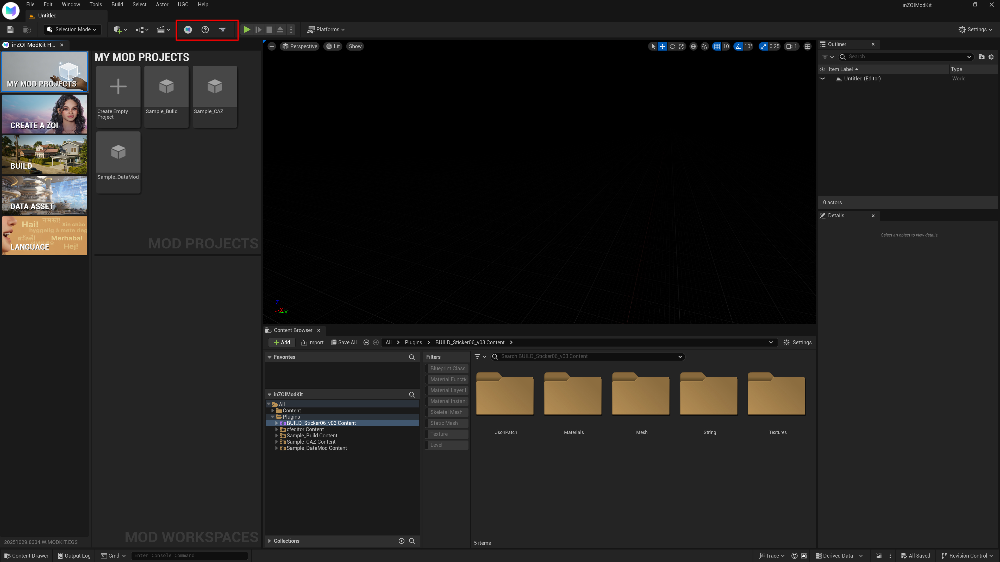
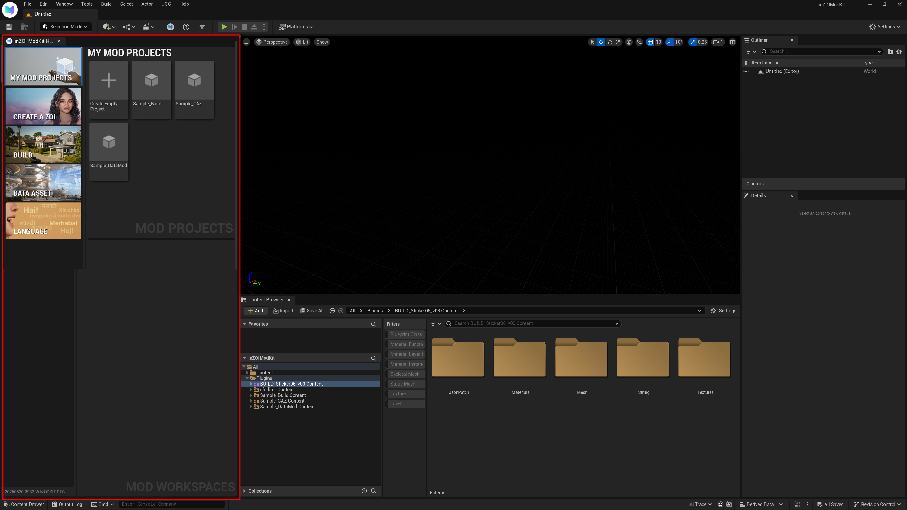
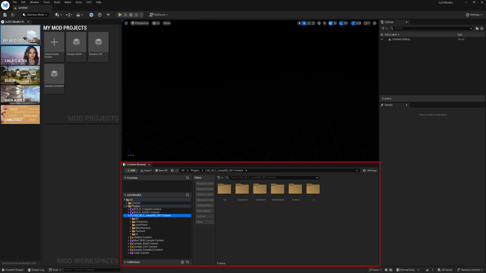

# inZOI Editor 

## ModKit Toolbar

Below is a description of key toolbar buttons available in the inZOI ModKit interface. 

---

**1. Open inZOI ModKit Home**  
- **Description**:  
  Opens the main ModKit hub inside the editor. This is the starting point for creators to manage mods, access tools, and explore modding features more easily.

---

**2. Open ModKit Documentation in default browser**  
- **Description**:  
  Launches the official inZOI ModKit documentation using the system’s default web browser. It contains detailed guides, references, and examples for mod creators.

---

**3. Upload UGC to CurseForge**  
- **Description**:  
  Opens the upload interface for publishing your mod (UGC: User Generated Content) directly to CurseForge, making it easier to distribute content to other players.

---

## ModKit Left Panel

The left panel of inZOI ModKit is dedicated to creating, browsing, and managing mods.  
Below is an explanation of each section and its purpose.

---

**Menu**

**1. MY MOD PROJECTS**  
- Displays a list of mod projects created by the user.  
- To start a new project, click "Create Empty Project."

---

**2. CREATE A ZOI**  
- Used to create character-based mods where you can customize Zoi characters including appearance, emotions, and outfits.

---

**3. BUILD**  
- A menu for creating build-based mods, allowing placement and configuration of furniture, objects, and architectural elements.

---

**4. DATA ASSET**  
- A menu for creating mods that modify in-game data such as stats, relationships, emotions, and jobs.  

---

**What is MOD PROJECTS?**  
- A mod project is a unit of content created or imported by the user.  
- Each project contains its own settings, assets, and data structure.  
- It connects with the main editor view, and any work is performed based on the selected project.

---

**What is MOD WORKSPACES?**  
- Displays the folder structure and content of the currently selected mod project.  
- Includes editable files such as `.uasset`, `.json`, materials, meshes, etc.  
- These are typically located under the `Plugins` folder and are integrated with the content browser.

---

## Content Browser

**Understanding the `Plugins` Folder in MOD WORKSPACES**

In inZOI ModKit, all mod-related content is organized under the `Plugins` folder.  
Each subfolder inside the `Plugins` directory corresponds to an individual mod project created in **MY MOD PROJECTS**.

---

**How it works**

- When a user creates a mod (such as CAZ, Build, or DataAsset),  
  a dedicated content folder is automatically generated at the following path:

---

- Inside this folder, you will find all the resources used for actual mod development:
- Skeletal Meshes  
- Static Meshes  
- Textures  
- Blueprints  
- Data Assets (`.uasset`, `.json`)  
- UI elements  

---

