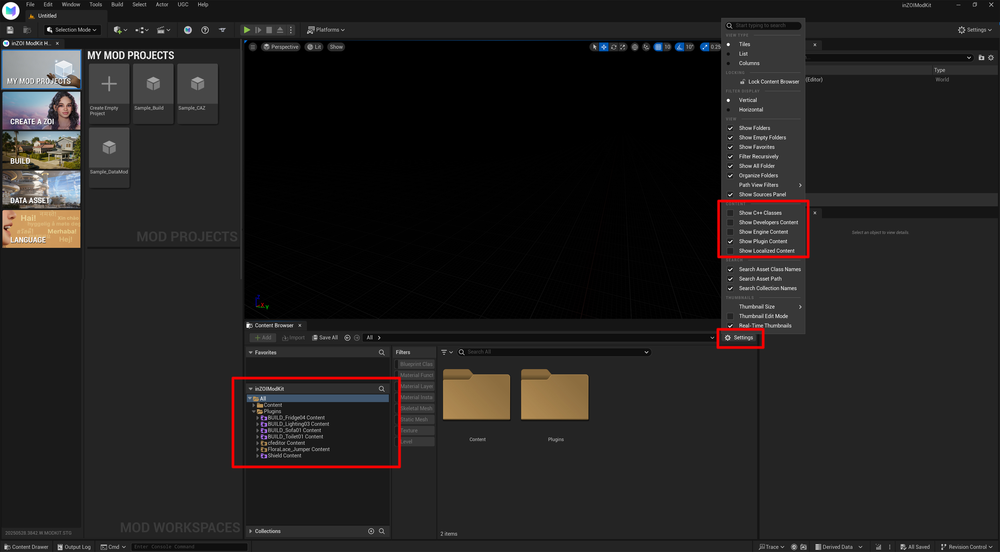
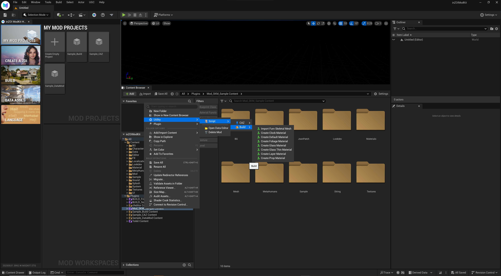

# Context Menu

**How to Enable It**

If the `Content` and `Plugins` folders under `inZOIModKit` are not visible in the **Content Browser**, follow these steps:

1. Click the `Settings` button at the top right of the **Content Browser**  
   - It's the gear icon.

2. In the settings menu, enable the following option:  
   ✅ **Show Plugin Content**

---

---

> Right-clicking a file in this area gives you access to features such as Utility Scripts.

---

**- Utility > Script > CAZ**  
A set of automated tools that help you configure character-related assets more easily.

- Import Skeletal Mesh: Import skeletal mesh for character bodies  
- Import Hair Skeletal Mesh: Import skeletal mesh for hair  
- Add Normal: Add normal map texture  
- Add ARM: Add Ambient Occlusion, Roughness, and Metallic maps  
- Add Base Color: Auto-link base color texture  
- Add RGB Mask: Add RGB mask texture  
- Create CAZ Material: Auto-generate character-specific material  
- Resource Import Tool: Meshes and textures are automatically configured when dragged or batch imported.

---

---

**- Utility > Script > Build**  
Tools for quickly creating material templates needed for furniture and object production.

- Import Furn Skeletal Mesh: Import skeletal mesh for furniture  
- Create Clock Material: Create material for clocks  
- Create Default Material: Create a basic material  
- Create Foliage Material: Create material for plants or leaves  
- Create Glass Material: Create material for regular glass  
- Create Glass Thin Material: Create material for thin glass  
- Create Layer Material: Create material for multi-layer blending  
- Create Prop Material: Create material for props and objects

---

