# Furniture

**Path:** `/All/Game/BG`

---

??? details "Bedroom (17 items)"
    | No. | Icon | Name | Asset ID |
    |:--:|:--:|:--|:--|
    | 1 | 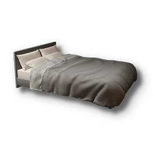 | Bed01 | Bed01 |
    | 2 | 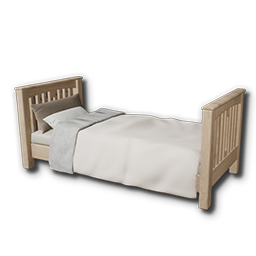 | Bed02 | Bed02 |
    | 3 | 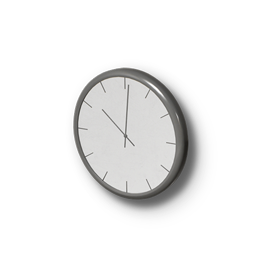 | Clock01 | Clock01 |
    | 4 | 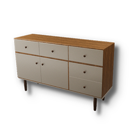 | DecoFloorShelf01_v03 | DecoFloorShelf01_v03 |
    | 5 | 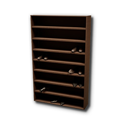 | DressShopShelf01_v02 | DressShopShelf01_v02 |
    | 6 | 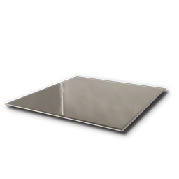 | FloorMirror01 | FloorMirror01 |
    | 7 | 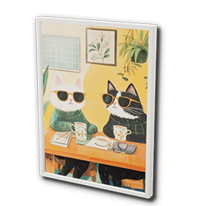 | Frame01 | Frame01 |
    | 8 | 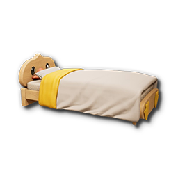 | KidBed02_v01 | KidBed02_v01 |
    | 9 | 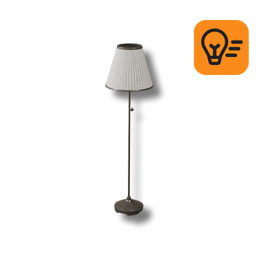 | Lighting01 | Lighting01 |
    | 10 | 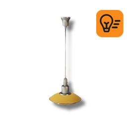 | Lighting02_v01 | Lighting02_v01 |
    | 11 | 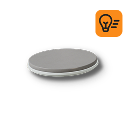 | Lighting02_v17 | Lighting02_v17 |
    | 12 | 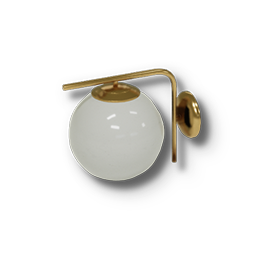 | Lighting03 | Lighting03 |
    | 13 | 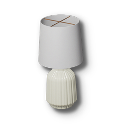 | Lighting04 | Lighting04 |
    | 14 | 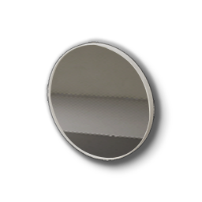 | Mirror01 | Mirror01 |
    | 15 | 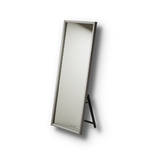 | Mirror04_v01 | Mirror04_v01 |
    | 16 | 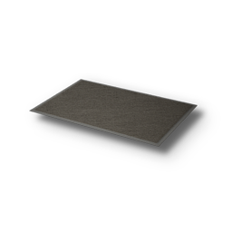 | Rug01_v04 | Rug01_v04 |
    | 17 | 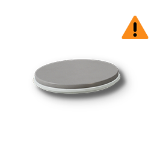 | Shadow_Lighting02_v17 | Shadow_Lighting02_v17 |

??? details "Living Room (14 items)"
    | No. | Icon | Name | Asset ID |
    |:--:|:--:|:--|:--|
    | 1 | 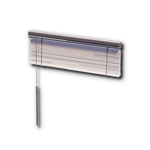 | Blind04_v03 | Blind04_v03 |
    | 2 | 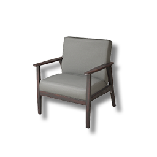 | Chair01 | Chair01 |
    | 3 | 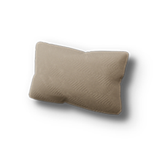 | Cushion01 | Cushion01 |
    | 4 |  | Lighting01 | Lighting01 |
    | 5 |  | Lighting02_v01 | Lighting02_v01 |
    | 6 |  | Lighting02_v17 | Lighting02_v17 |
    | 7 |  | Lighting03 | Lighting03 |
    | 8 |  | Lighting04 | Lighting04 |
    | 9 | 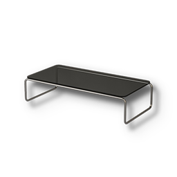 | LowTable02_v03 | LowTable02_v03 |
    | 10 | 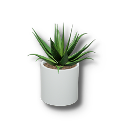 | Pot02_v07 | Pot02_v07 |
    | 11 |  | Rug01_v04 | Rug01_v04 |
    | 12 |  | Shadow_Lighting02_v17 | Shadow_Lighting02_v17 |
    | 13 | 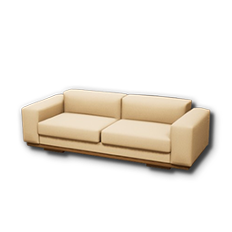 | Sofa01 | Sofa01 |
    | 14 | 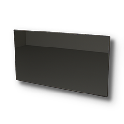 | WallTv01_v01 | WallTv01_v01 |

??? details "Kitchen (22 items)"
    | No. | Icon | Name | Asset ID |
    |:--:|:--:|:--|:--|
    | 1 | 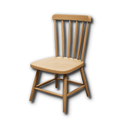 | Chair03_v03 | Chair03_v03 |
    | 2 | 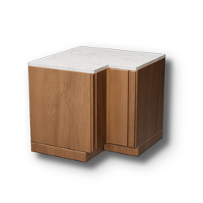 | D_CornerSink01 | D_CornerSink01 |
    | 3 | 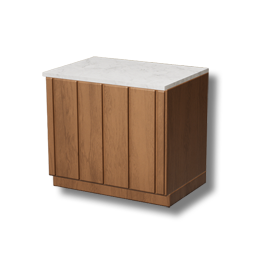 | D_Sink01 | D_Sink01 |
    | 4 |  | Frame01 | Frame01 |
    | 5 | 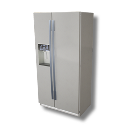 | Fridge01 | Fridge01 |
    | 6 | 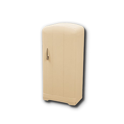 | Fridge04 | Fridge04 |
    | 7 |  | KitchenRange01_v03 | KitchenRange01_v03 |
    | 8 |  | Lighting01 | Lighting01 |
    | 9 |  | Lighting02_v01 | Lighting02_v01 |
    | 10 |  | Lighting02_v17 | Lighting02_v17 |
    | 11 |  | Lighting03 | Lighting03 |
    | 12 |  | Lighting04 | Lighting04 |
    | 13 | 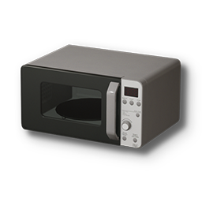 | Microwave01_v01 | Microwave01_v01 |
    | 14 | 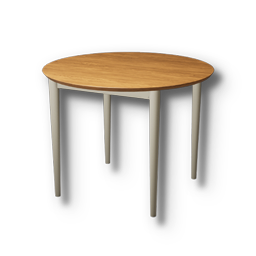 | RoundTable01_v01 | RoundTable01_v01 |
    | 15 |  | Shadow_Lighting02_v17 | Shadow_Lighting02_v17 |
    | 16 | 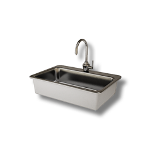 | SinkBowl01 | SinkBowl01 |
    | 17 | 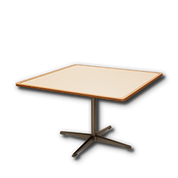 | SquareTable01 | SquareTable01 |
    | 18 | 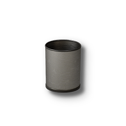 | TrashCan02_v01 | TrashCan02_v01 |
    | 19 | 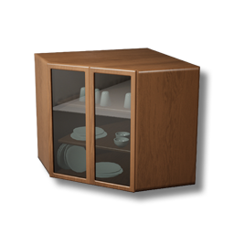 | U_CornerSink01 | U_CornerSink01 |
    | 20 | 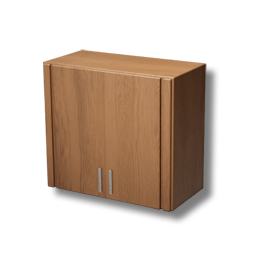 | U_Sink01 | U_Sink01 |
    | 21 | 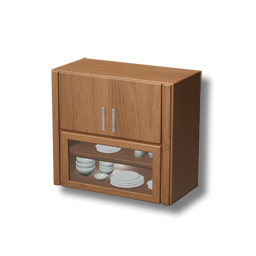 | U_Sink02 | U_Sink02 |
    | 22 | 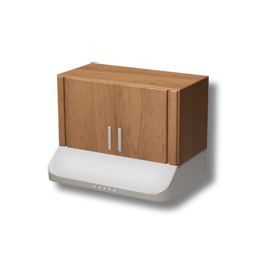 | U_Sink03 | U_Sink03 |

??? details "Bathroom (17 items)"
    | No. | Icon | Name | Asset ID |
    |:--:|:--:|:--|:--|
    | 1 | 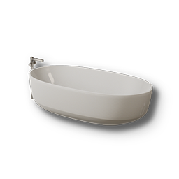 | Bath01_v01 | Bath01_v01 |
    | 2 |  | FloorMirror01 | FloorMirror01 |
    | 3 |  | Lighting01 | Lighting01 |
    | 4 |  | Lighting02_v01 | Lighting02_v01 |
    | 5 |  | Lighting02_v17 | Lighting02_v17 |
    | 6 |  | Lighting03 | Lighting03 |
    | 7 |  | Lighting04 | Lighting04 |
    | 8 |  | Mirror01 | Mirror01 |
    | 9 |  | Mirror04_v01 | Mirror04_v01 |
    | 10 |  | Pot02_v07 | Pot02_v07 |
    | 11 |  | Rug01_v04 | Rug01_v04 |
    | 12 |  | Shadow_Lighting02_v17 | Shadow_Lighting02_v17 |
    | 13 | 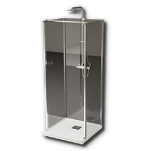 | Shower01 | Shower01 |
    | 14 | 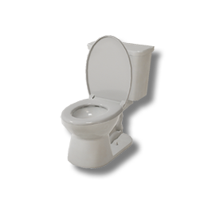 | Toilet01 | Toilet01 |
    | 15 | 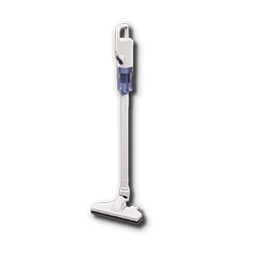 | VaccumLow01 | VaccumLow01 |
    | 16 | 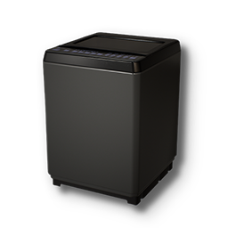 | WashingMachine01 | WashingMachine01 |
    | 17 | 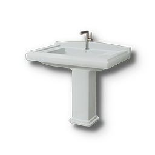 | Washstand01_v02 | Washstand01_v02 |

??? details "Home Office (15 items)"
    | No. | Icon | Name | Asset ID |
    |:--:|:--:|:--|:--|
    | 1 |  | Blind04_v03 | Blind04_v03 |
    | 2 | 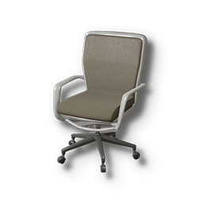 | Chair02 | Chair02 |
    | 3 |  | Clock01 | Clock01 |
    | 4 | 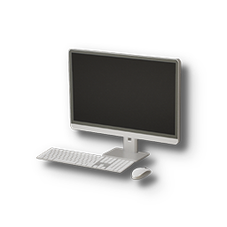 | Computer01 | Computer01 |
    | 5 |  | Frame01 | Frame01 |
    | 6 |  | Lighting01 | Lighting01 |
    | 7 |  | Lighting02_v01 | Lighting02_v01 |
    | 8 |  | Lighting02_v17 | Lighting02_v17 |
    | 9 |  | Lighting03 | Lighting03 |
    | 10 |  | Lighting04 | Lighting04 |
    | 11 |  | Pot02_v07 | Pot02_v07 |
    | 12 |  | Rug01_v04 | Rug01_v04 |
    | 13 |  | Shadow_Lighting02_v17 | Shadow_Lighting02_v17 |
    | 14 | 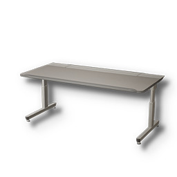 | Table02 | Table02 |
    | 15 |  | TrashCan02_v01 | TrashCan02_v01 |

??? details "Outdoors (7 items)"
    | No. | Icon | Name | Asset ID |
    |:--:|:--:|:--|:--|
    | 1 |  | Lighting01 | Lighting01 |
    | 2 |  | Lighting02_v01 | Lighting02_v01 |
    | 3 |  | Lighting02_v17 | Lighting02_v17 |
    | 4 |  | Lighting03 | Lighting03 |
    | 5 |  | Lighting04 | Lighting04 |
    | 6 |  | Pot02_v07 | Pot02_v07 |
    | 7 |  | Shadow_Lighting02_v17 | Shadow_Lighting02_v17 |