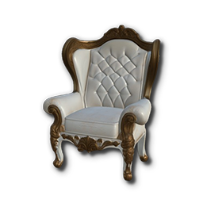
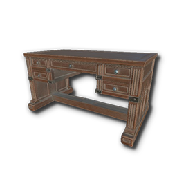
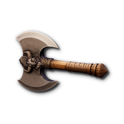
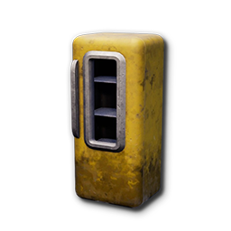
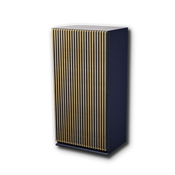
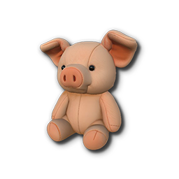
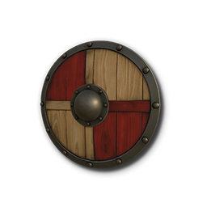

# Build Samples

**Path:** `/All/Plugins/Sample_Build`

| No. | Icon | Name |
|:--:|:--:|:--|
| 1 |  | Bath01_v01 | 
| 2 |  | Bed01 | 
| 3 |  | Bed02 | 
| 4 |  | Blind04_v03 | 
| 5 |  | Chair01 |
| 6 |  | Chair02 | 
| 7 |  | Chair03_v03 | 
 