# 🎬 Tutorials

<!-- 00. ModKit Overview -->

  <a href="https://inzoi.me/ModTutorial00" target="_blank">
    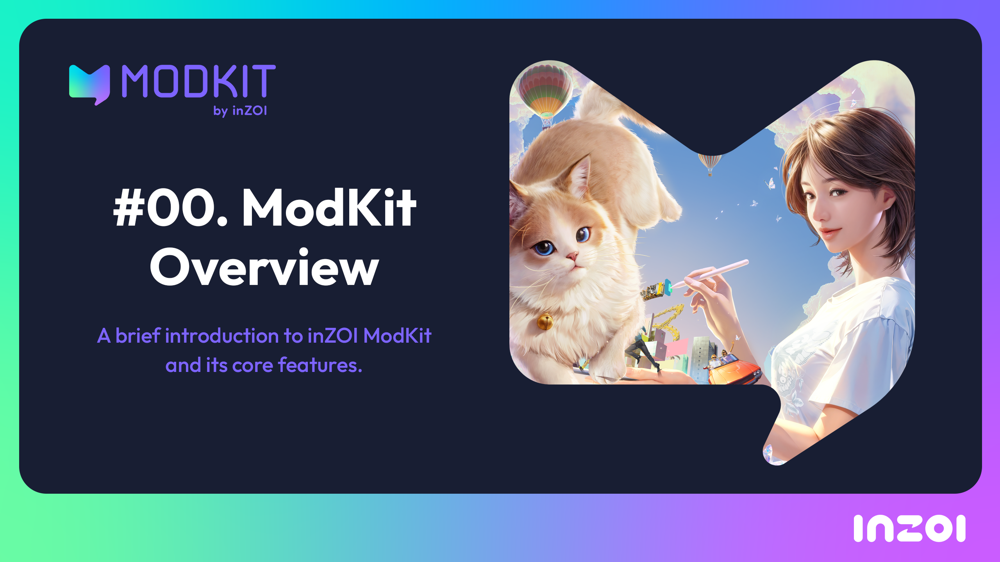
  </a>
  

    <h3 style="margin: 0 0 6px;">
      <a href="https://inzoi.me/ModTutorial00" target="_blank" style="color: #3f51b5; text-decoration: none;">00. ModKit Overview</a>
    </h3>
    
A brief introduction to inZOI ModKit and its core features.

  

<!-- 01. ModKit Transfer -->

  
  

    <h3 style="margin: 0 0 6px;">
      <a href="https://inzoi.me/ModTutorial01" target="_blank" style="color: #3f51b5; text-decoration: none;">01. ModKit Transfer</a>
    </h3>
    
Introduces a feature that helps easily import Zoi characters into DCC tools like Blender or Maya.

  

<!-- 02. Character Outfit Modding -->

  <a href="https://inzoi.me/ModTutorial02" target="_blank">
    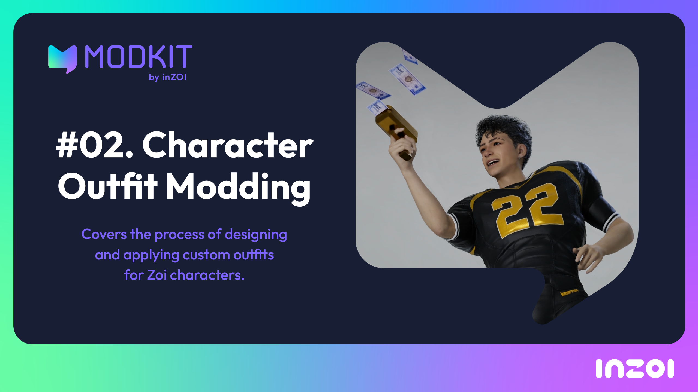
  </a>
  

    <h3 style="margin: 0 0 6px;">
      <a href="https://inzoi.me/ModTutorial02" target="_blank" style="color: #3f51b5; text-decoration: none;">02. Character Outfit Modding</a>
    </h3>
    
Covers the process of designing and applying custom outfits for Zoi characters.

  

<!-- 03. Character Data Modding -->

  <a href="https://inzoi.me/ModTutorial03" target="_blank">
    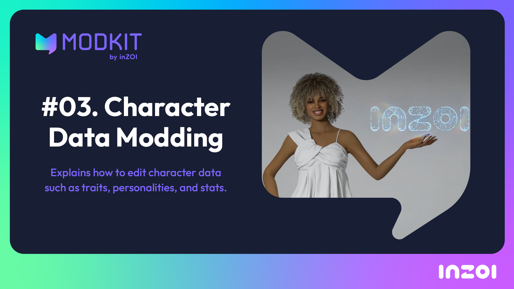

  </a>
  

    <h3 style="margin: 0 0 6px;">
      <a href="https://inzoi.me/ModTutorial03" target="_blank" style="color: #3f51b5; text-decoration: none;">03. Character Data Modding</a>
    </h3>
    
Explains how to edit character data such as traits, personalities, and stats.

  

<!-- 04. Build Object Modding -->

  <a href="https://inzoi.me/ModTutorial04" target="_blank">
    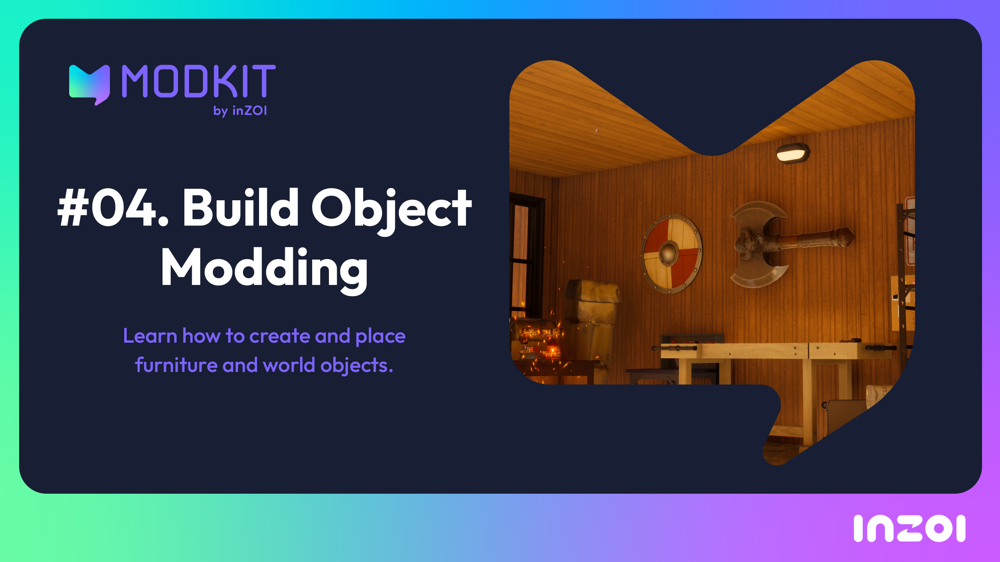
  </a>
  

    <h3 style="margin: 0 0 6px;">
      <a href="https://inzoi.me/ModTutorial04" target="_blank" style="color: #3f51b5; text-decoration: none;">04. Build Object Modding</a>
    </h3>
    
Learn how to create and place furniture and world objects.

  

<!-- 05. Build Data Modding -->

  <a href="https://inzoi.me/ModTutorial05" target="_blank">
    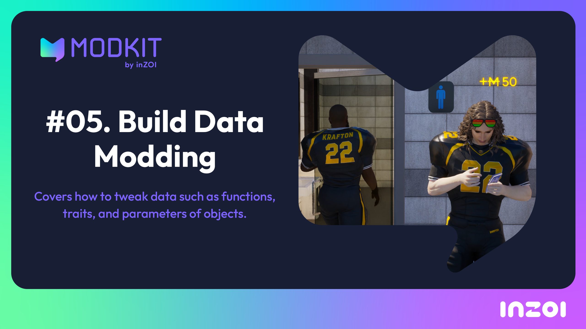
  </a>
  

    <h3 style="margin: 0 0 6px;">
      <a href="https://inzoi.me/ModTutorial05" target="_blank" style="color: #3f51b5; text-decoration: none;">05. Build Data Modding</a>
    </h3>
    
Covers how to tweak data such as functions, traits, and parameters of objects.

  

<!-- 06. Interaction Modding -->

  <a href="https://inzoi.me/ModTutorial06" target="_blank">
    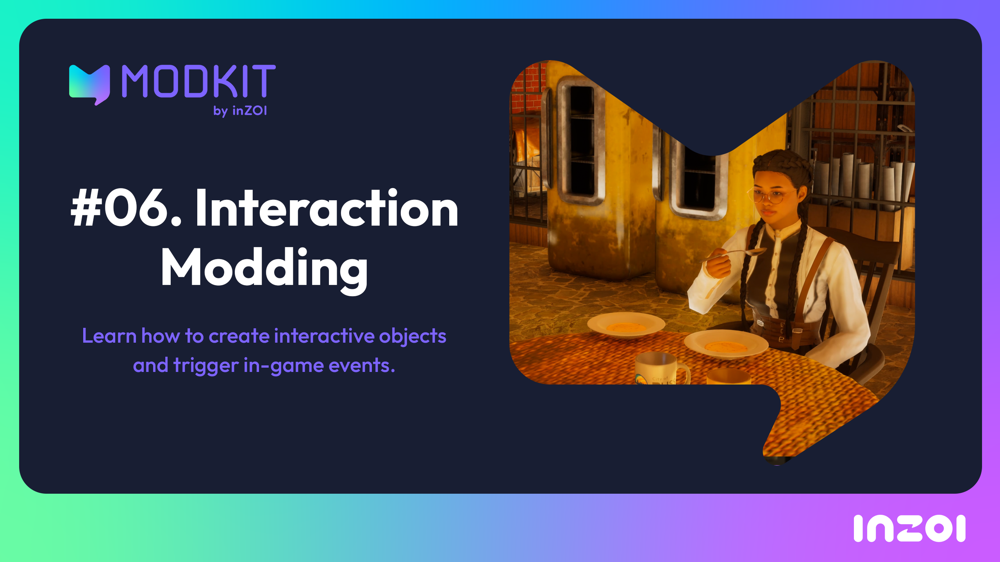
  </a>
  

    <h3 style="margin: 0 0 6px;">
      <a href="https://inzoi.me/ModTutorial06" target="_blank" style="color: #3f51b5; text-decoration: none;">06. Interaction Modding</a>
    </h3>
    
Learn how to create interactive objects and trigger in-game events.

  

<!-- 07. Create a Vase Mod -->

  <a href="https://www.youtube.com/watch?v=Q1hpB69e5nE&t=2s" target="_blank">
    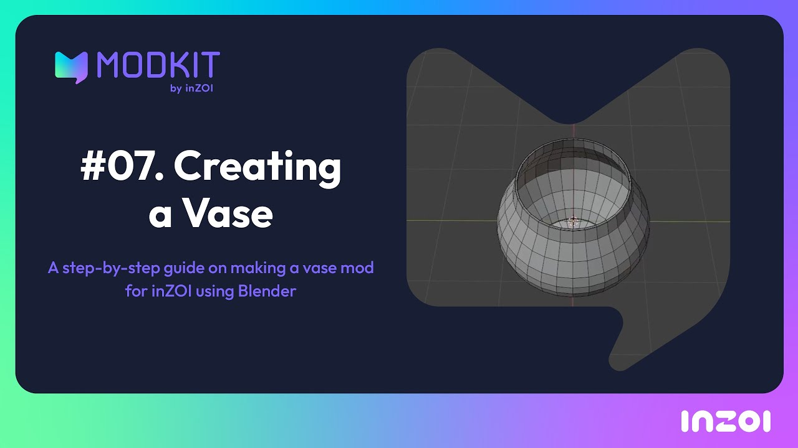
  </a>
  

    <h3 style="margin: 0 0 6px;">
      <a href="https://www.youtube.com/watch?v=Q1hpB69e5nE&t=2s" target="_blank" style="color: #3f51b5; text-decoration: none;">07. Create a Vase Mod</a>
    </h3>
    
Learn how to make a decorative vase mod and import it into the game.

  

<!-- 08. Create a Star Accessory -->

  <a href="https://www.youtube.com/watch?v=1UDL-oICoZk&list=PLQnomZjb2kX036iW-S0OtHfKvywQGdJ5K&index=10" target="_blank">
    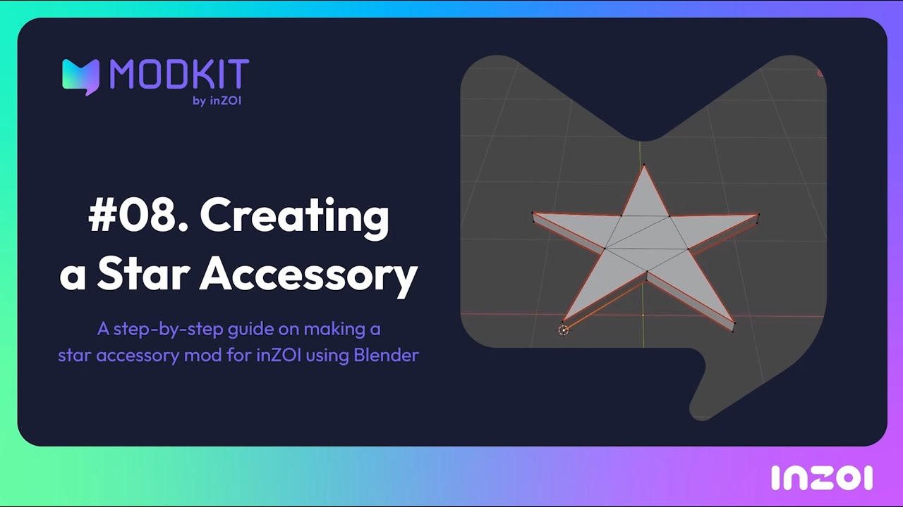
  </a>
  

    <h3 style="margin: 0 0 6px;">
      <a href="https://www.youtube.com/watch?v=1UDL-oICoZk&list=PLQnomZjb2kX036iW-S0OtHfKvywQGdJ5K&index=10" target="_blank" style="color: #3f51b5; text-decoration: none;">08. Create a Star Accessory</a>
    </h3>
    
Learn how to design and apply a custom star-shaped accessory mod.

  

<!-- 09. Modify Game Data -->

  
  

    <h3 style="margin: 0 0 6px;">
      <a href="https://www.youtube.com/watch?v=nst49ItTCmw&list=PLQnomZjb2kX036iW-S0OtHfKvywQGdJ5K&index=11" target="_blank" style="color: #3f51b5; text-decoration: none;">09. Modify Game Data</a>
    </h3>
    
Learn how to edit and manage in-game data files to change gameplay behavior.

  

<!-- 10. Modify Language Data -->

  <a href="https://www.youtube.com/watch?v=_ohQpsVtZPg&t=14s" target="_blank">
    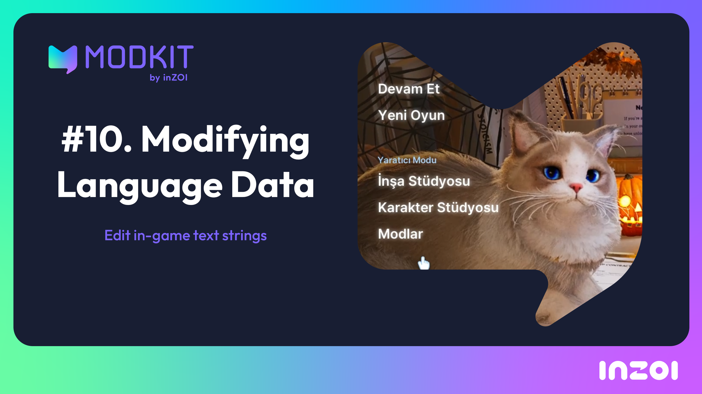
  </a>
  

    <h3 style="margin: 0 0 6px;">
      <a href="https://www.youtube.com/watch?v=_ohQpsVtZPg&t=14s" target="_blank" style="color: #3f51b5; text-decoration: none;">10. Modify Language Data</a>
    </h3>
    
Learn how to edit and manage in-game data files to change gameplay behavior.

  

<!-- 11. Hair Modify Part 1 -->

  <a href="https://www.youtube.com/watch?v=6o68Sd52Aa0&t=386s" target="_blank">
    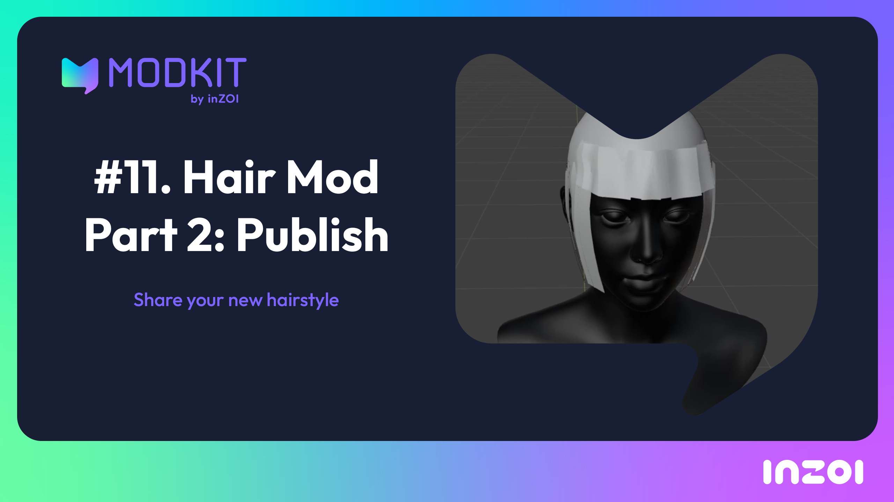
  </a>
  

    <h3 style="margin: 0 0 6px;">
      <a href="https://www.youtube.com/watch?v=6o68Sd52Aa0&t=386s" target="_blank" style="color: #3f51b5; text-decoration: none;">11. Hair Modify Part 1</a>
    </h3>
    
Learn how to edit and manage in-game data files to change gameplay behavior.

  

<!-- 12. Hair Modify Part 2 -->

  <a href="https://www.youtube.com/watch?v=dapicr9qq28&t=11s" target="_blank">
    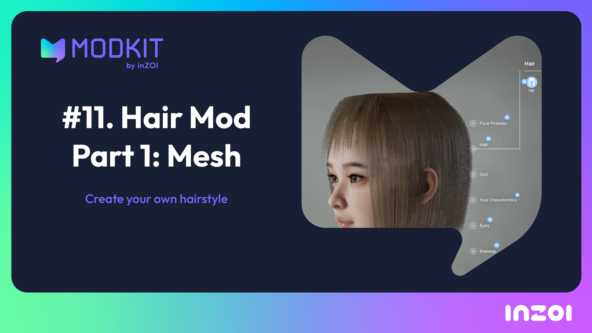
  </a>
  

    <h3 style="margin: 0 0 6px;">
      <a href="https://www.youtube.com/watch?v=dapicr9qq28&t=11s" target="_blank" style="color: #3f51b5; text-decoration: none;">12. Hair Modify Part 2</a>
    </h3>
    
Learn how to edit and manage in-game data files to change gameplay behavior.

  

