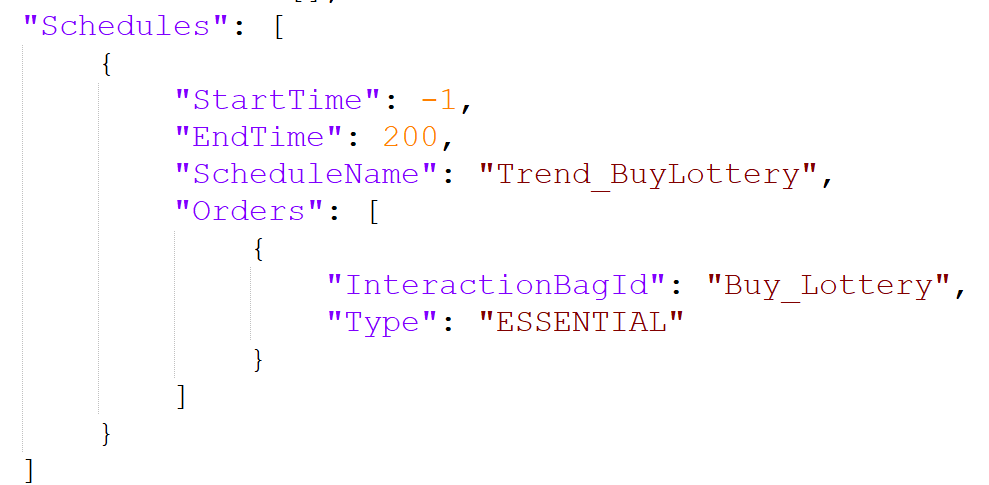

# [Exec]_ApplyOverrideTimelineTargetSite

Overview
==

* Applies an override timeline via script.  
* Regardless of the Site defined in the original timeline, the timeline will be applied to the Site of the specified TargetObject (Site), if provided.

Details
==

| Parameter | Description |
| --- | --- |
| Command | ApplyOverrideTimelineTargetSite |
| S1 | EventTimeline ID |

Example
==

| Example | BaseObject | Command | S1 | S2 | F1 | F2 | Prob |
| --- | --- | --- | --- | --- | --- | --- | --- |
| Apply the Trend_Advertise_Lottery schedule to myself | Self | ApplyOverrideTimeline | Trend_Advertise_Lottery |  |  |  |  |

EventTimeline Auto Time Adjustment Behavior
==========================

* When using this script to apply an override timeline, the following rules apply:
* The SiteId defined inside the EventTimeline.json is **ignored** and overridden by the Target's Site.

* The schedule’s `StartTime` is ignored. Instead, the schedule starts at the **next full hour + 2 hours** from the time the script is executed.  
  + Example: If executed at 13:24 → Schedule will span from 13:00 to 15:00

* The schedule’s `EndTime` can optionally be used to define the override schedule’s **duration**. It must be at least 2 hours.  
  + If shorter than 2 hours, the default duration is 2 hours.  
  + Example 1: EndTime = 130 (1 hour 30 mins) → Treated as 2-hour schedule  
  + Example 2: EndTime = 500 (5 hours) → 5-hour schedule  
  + Example 3: EndTime = 500, but schedule starts at 23:00 → Max duration is limited to 1 hour (until 24:00)

* Any timing values set within each Order in the timeline will be ignored. Orders will be automatically spaced using the following rule:  
  + The schedule duration is evenly divided by the number of Orders, assigning equal time slots to each.
  + Example 1: 2-hour duration, 3 Orders → Each Order gets 40 minutes  
  + Example 2: 4-hour duration, 4 Orders → Each Order gets 1 hour
