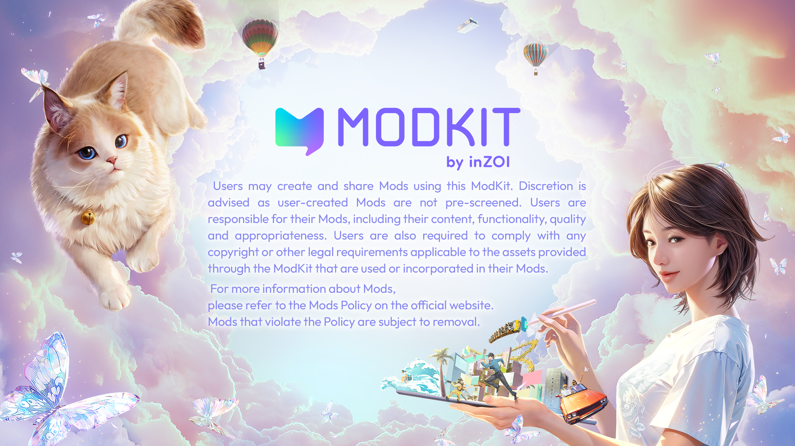

# Home

**inZOI ModKit** is a creative tool that allows users to recreate the vibrant world of inZOI through their own imagination.  
Build your own spaces, characters, and stories, bring them into the game, and share your experiences with other players.  
This guide is your first step on that journey.

---

### Release Notes
- [Latest Release Notes](./Release%20Notes/index.md)

---

### Getting Started
- [Start Guide](./ModKit/How-to/Getting-Started/01install.md)
- [Watch tutorial videos](./Videos/video.md)
- [Analyze sample mods](./Samples/index.md)

---

### Core Guides

- [Create a Zoi (CAZ)](<./ModKit/project/CAZ/Guide/01. Skeletal Mesh.md>)
- [Create furniture and objects (Build)](./ModKit/project/Build/01.%20build.md)

---

### Game Data Reference
- [Struct guide](./Wiki/StructGuide/index.md)
- [Script system - Conditions](./Wiki/script-condition/index.md)
- [Script system - Executions](./Wiki/script-execution/index.md)

---

### Tools 
- [Maya plugin](./Resources/dcc-tools.md#maya)
- [Blender plugin](./Resources/dcc-tools.md#blender)

---

### Community
- [Community](./Community/index.md)

---
 

  

  

   

          

© 2025 inZOI Studio, Inc. All rights reserved.
